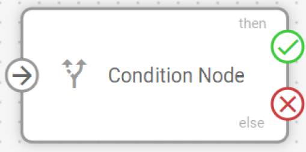
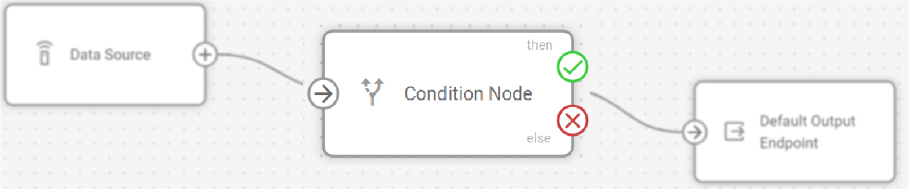
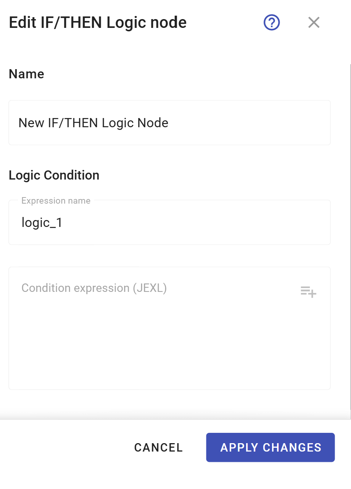
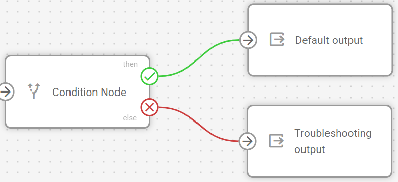
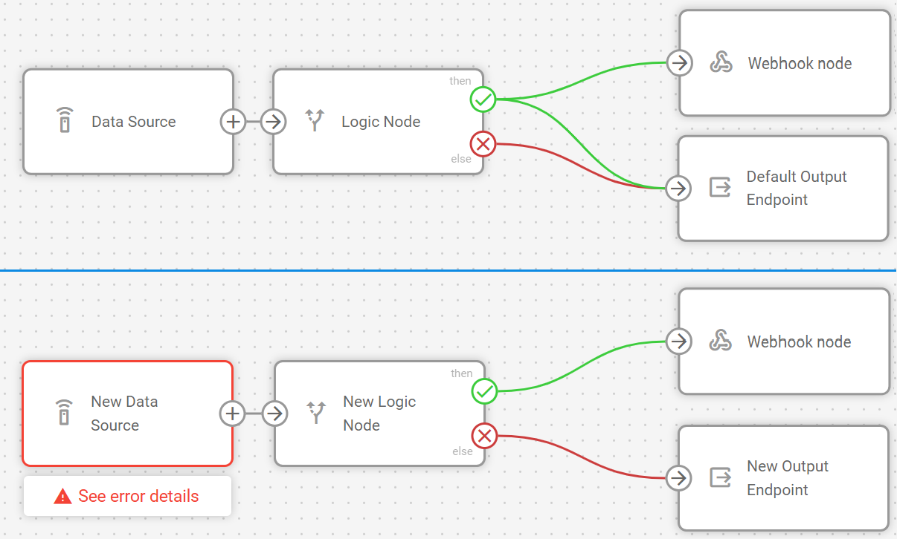
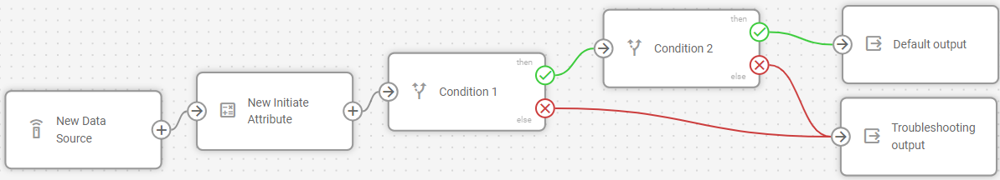

# IF/THEN Logic

## Technical overview and capabilities



The **IF/THEN Logic** node creates intelligent branching points that route incoming data down different paths based on logical conditions. It receives data from other nodes, validates it against your defined conditions, and routes the results down different paths based on whether the validation succeeds or fails. The node enables you to build IF->THEN/ELSE workflows where different actions occur automatically based on real-time data conditions.



<figure><figcaption></figcaption></figure>




The **IF/THEN Logic** nodes are configured separately for each flow in the Navixy platform UI. Each node contains only one logical formula, relying on [Navixy IoT Logic Expression Language](https://app.gitbook.com/s/tx3J5BxnWyPV0nP2xr0z/technologies/navixy-iot-logic-expression-language).\
For specific syntax options related to logical expressions, see [IF/THEN Logic expressions and syntax](logic-node-expressions-and-syntax.md).


<figure><figcaption></figcaption></figure>

### How IF/THEN Logic nodes work

When data first reaches an **IF/THEN Logic** node, the system creates a user-defined boolean attribute that stores the evaluation results. Each subsequent data packet is evaluated against your logical expression, updating this attribute's value and routing the data accordingly:

* **True results**: Data flows through the THEN connection (green) with the boolean attribute set to `true`
* **False results**: Data flows through the ELSE connection (red) with the boolean attribute set to `false`

This evaluation happens independently for each data packet, allowing different records from the same device to follow different paths based on real-time conditions.

### Flow architecture integration

The boolean attributes created by **IF/THEN Logic** nodes extend beyond flow routing and integrate with Navixy's broader monitoring capabilities. Since these are user-defined custom attributes, they can be:

* **Monitored in real-time**: View evaluation results in [Data Stream Analyzer](../../data-stream-analyzer.md) to troubleshoot conditions and verify logic
* **Added as custom sensors**: Integrate with Navixy's main interface for ongoing monitoring

As custom sensors, these attributes enable two key capabilities:

* **Triggering alerts**: You can create custom rules based on a sensor’s value to receive notifications in case of deviations. For details on rule creation, see [Rules and notifications](../../../../events-and-notifications/).
* **Monitoring entities**: You can add an attribute to the [Object list](../../../../tracking/objects-list/) widget to monitor its value along with other device readings. For details on how to create a custom sensor from an IoT Logic attribute, see [Displaying new calculated attributes on the Navixy platform](../initiate-attribute-node/displaying-new-calculated-attributes-on-the-navixy-platform.md).


The **IF/THEN Logic** node requires a connection to at least one preceding node (**Data Source** or other processing nodes) to receive input data for validation.


### Node capabilities

The **IF/THEN Logic** node offers:

* **Conditional data routing**: Create branching workflows that automatically direct data based on logical expressions returning true or false results.
* **Real-time validation**: Test incoming device data against business rules and operational thresholds as data arrives.
* **Complex condition support**: Combine multiple parameters using logical operators (AND, OR, etc.) for sophisticated decision-making.
* **Attribute creation**: Generate boolean attributes that record validation results for use in other node, Navixy's monitoring systems and 3rd-party services.
* **Flexible output paths**: Route data through THEN (true) and ELSE (false) connections to trigger different subsequent actions.

## Configuration options



The **IF/THEN Logic** node allows you to define conditional expressions that evaluate incoming data and create branching paths in your flow based on the results.



<figure><figcaption></figcaption></figure>



Let's see what elements this node uses and what you can configure when working with it.

### Configuration steps



#### **Specify node name**

Enter a descriptive name for this **IF/THEN Logic** node.

* Use a name that clearly identifies the validation purpose (e.g., _Temperature Alert Check_, _Speed Violation Detection_).
* This name will be displayed in the flow diagram for easy identification.



#### **Define expression name**

Enter the name for the boolean attribute that will store the validation result.

* This attribute will appear in [Data Stream Analyzer](../../data-stream-analyzer.md) and become available for use in subsequent nodes.
* Use descriptive names like _high\_temperature\_alert_ or speed\_violation\_detected.
* The system will auto-generate names like _logic\_1_, _logic\_2_ if not specified.



#### **Create a conditional expression**

Build your logical statement using the expression field.

* Use [logical operators according to Navixy Expression Language syntax](logic-node-expressions-and-syntax.md) to reference device parameters and calculated attributes.
* The expression must return a boolean value (true/false) for proper node operation.
* Use the [autocomplete feature](../initiate-attribute-node/managing-attributes.md#autofill-attribute-names) to select available attributes from connected data sources.



#### Save the node configuration

Click **Apply changes** to complete the node creation.



#### **Connect output paths**

After you configured the node, you need to establish connections for the validation results.

* **THEN connection** (green): Connects to nodes that should process data when the expression evaluates to true.
* **ELSE connection** (red): Connects to nodes that should process data when the expression evaluates to false or null.
* The THEN connection is mandatory, while the ELSE connection is optional.




When logical expressions cannot be evaluated due to null values, invalid data types, or syntax errors, the result is treated as `false`, and data flows through the ELSE path.


For detailed information on expression syntax, operators, and data flow behavior, see [IF/THEN Logic expressions and syntax](logic-node-expressions-and-syntax.md).

## Output connections and data flow

The **IF/THEN Logic** node creates two distinct output paths based on the expression evaluation results.

<figure><figcaption></figcaption></figure>

### THEN connection (<mark style="color:green;">green</mark>)

* **Activates when**: The logical expression returns `true`.
* **Connection requirement**: Mandatory — every IF/THEN Logic node must have at least one THEN output.
* **Multiple connections**: Can connect to multiple subsequent nodes for parallel processing.
* **Typical uses**: Triggering alerts, special processing, conditional calculations, or routing data to specific endpoints.

### ELSE connection (<mark style="color:red;">red</mark>)

* **Activates when**: The logical expression returns `false`, `null`, or encounters evaluation errors.
* **Connection requirement**: Optional — use only when you need to handle negative results.
* **Error handling**: Processes cases where expressions cannot be evaluated due to missing data or syntax errors.
* **Typical uses**: Logging failed validations, routing data through alternative processing paths, or continuing normal operations.

### **Terminal node requirement**

When connecting to terminal nodes ([Action](../action-node.md), [Webhook](../webhook-node.md)) that don't support outbound connections, create parallel connections to ensure both the terminal node and an Output Endpoint receive data:

<figure><figcaption></figcaption></figure>

**Why both branches need Output Endpoints:**

* Ensures data persistence and system visibility
* Enables flow validation
* Both branches can share the same Output Endpoint node


**Validation error:** Flows without Output Endpoints on all branches will fail to save with the error.


## Frequently asked questions

#### Can I use attributes created by other nodes in IF/THEN Logic expressions?

Yes. **IF/THEN Logic** nodes can reference any attributes available from connected data sources, including original device parameters and attributes calculated by preceding **Initiate Attribute** nodes. The autocomplete feature helps you select from all available attributes.

#### What happens if my expression contains syntax errors?

If an expression contains syntax errors or cannot be evaluated, the **IF/THEN Logic** node treats the result as `false` and routes data through the ELSE connection. Check the expression syntax and ensure all referenced attributes exist in your data stream.

#### Can I connect multiple nodes to the same IF/THEN Logic node output?

Yes. Both THEN and ELSE connections support multiple outgoing connections, allowing you to trigger several different actions based on the same logical condition. This enables parallel processing for complex business workflows.

#### How do I monitor IF/THEN Logic node results?

IF/THEN Logic node results appear as boolean attributes in the [Data Stream Analyzer](../../data-stream-analyzer.md) table. Select your devices and look for the attribute name you specified in the expression name field. The values will display as `true` or `false` based on the evaluation results.

#### Can I chain multiple IF/THEN Logic nodes together?

Yes. You can connect **IF/THEN Logic** nodes sequentially to create complex decision trees. Each **IF/THEN Logic** node can reference the boolean attributes created by previous **IF/THEN Logic** nodes, enabling sophisticated multi-stage validation workflows.

<figure><figcaption></figcaption></figure>

#### Why must IF/THEN Logic branches connect to Output Endpoints?

Every IF/THEN Logic branch must terminate in an Output Endpoint for data flow validation and system visibility. When using terminal nodes (Action, Webhook) that don't support outbound connections, create a parallel connection from the IF/THEN Logic node directly to an Output Endpoint. Both branches can share the same Output Endpoint if needed.
