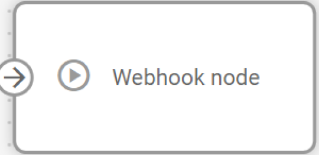
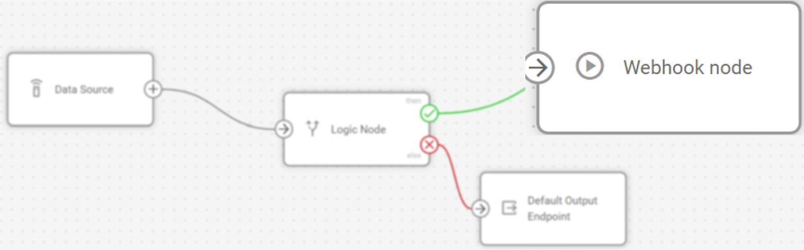

# Webhook node

## Technical overview and capabilities


{% column width="58.333333333333336%" %}
**Webhook** node enables real-time triggering of specific actions in external systems. It sends HTTP POST requests to specified endpoints upon receiving data from connected nodes. It then constructs custom JSON payloads with both static and dynamic attributes, and executes API calls to third-party services.&#x20;


{% column width="41.666666666666664%" %}
<figure><figcaption></figcaption></figure>



The node extends IoT Logic's capabilities beyond data processing and transmission, enabling direct integration with messaging platforms, ERM and CRM systems, and custom applications to initiate automated actions based on your flow configuration.


The webhook nodes are configured separately for each flow in the Navixy platform UI. Webhook nodes serve as terminal points in a flow and require at least one incoming connection to function. They cannot pass data to subsequent nodes.


<figure><figcaption></figcaption></figure>

### How Webhook nodes work

When data reaches a Webhook node through an incoming connection, it immediately executes an HTTP POST request to the configured endpoint. The node:

1. Collects current values for all attributes from connected upstream nodes
2. Replaces dynamic attribute references (e.g., `{{speed}}`) with actual values from the incoming message
3. Constructs the complete JSON payload preserving your defined structure
4. Sends the HTTP POST request with specified headers to the target endpoint
5. Continues without waiting for a response, allowing the flow to proceed immediately

The webhook fires once for each message that reaches it. If multiple parallel branches send data to the webhook, it fires separately for each incoming message. This execution happens independently without blocking other nodes in the flow, ensuring continuous data processing regardless of external system response times.

### Flow architecture integration

Webhook nodes function as termination points that convert processed device data into external API calls. Rather than continuously streaming all device data like Output Endpoint nodes, webhooks execute targeted API requests with precisely configured payloads. This architecture enables:

* **Event-driven automations**: Trigger external workflows based on device conditions, calculated metrics, or specific data patterns identified earlier in the flow
* **Selective data transmission**: Send only relevant attributes to external systems, reducing unnecessary data transfer and API costs
* **Parallel execution**: Operate alongside other output nodes, allowing simultaneous webhook triggers and continuous data streaming to different destinations
* **Multi-source integration**: Accept incoming connections from multiple parallel branches and access attributes from all connected nodes

### Node capabilities

The **Webhook node** offers:

* **HTTP POST execution**: Sends customized HTTP POST requests to any accessible endpoint using HTTP or HTTPS protocols (HTTPS recommended)
* **Dynamic payload construction**: Builds JSON request bodies combining static values with dynamic attributes from anywhere in the flow using `{{attribute_name}}` syntax
* **Custom header configuration**: Supports up to 10 user-defined HTTP headers for authentication, and API-specific requirements
* **Nested attribute support**: References complex attribute structures including nested objects and arrays within the JSON payload
* **Independent execution**: Fires without waiting for responses or blocking the flow, enabling reliable operation regardless of external system availability

## Configuration options

The Webhook node allows you to define how your flow will communicate with external systems through HTTP API calls.

<figure><figcaption></figcaption></figure>

Let's see what elements this node uses and what you can configure when working with it.

### Configuration steps



**Specify Node title**

Enter a descriptive name that identifies the webhook's purpose.

1. Use names that indicate the target service or action (e.g., "Slack Speed Alerts" or "CRM Ticket Creation")
2. This name appears in the flow diagram for easy identification



**Configure the endpoint URL**

Enter the complete URL where POST requests will be sent.

1. Include the protocol: `http://` or `https://` (HTTPS strongly recommended)
2. Ensure the URL points to a valid API endpoint that accepts POST requests
3. Example: `https://api.example.com/v1/webhooks/device-alerts`



**Define HTTP headers**

Add any headers required by your target API.

1. Click **Add new** to create header key-value pairs
2. All headers are user-configured, including Content-Type
3. Common headers include:
   1. `Content-Type: application/json` (required for JSON payloads)
   2. `Authorization: Bearer <token>` (for API authentication)
   3. Custom API keys or authentication headers per service requirements
4. Click the delete icon to remove individual headers


Maximum of 10 headers supported




**Build the request body**

Define the JSON structure that will be posted to the endpoint.

1. Enter valid JSON syntax in the Body field
2. Use `{{attribute_name}}` to reference any attribute from connected nodes
3. Supports nested JSON structures and arrays
4. Attribute references work with nested paths (e.g., `{{location.latitude}}`)
5. If a referenced attribute is null or doesn't exist, the value `null` will be sent in the JSON

**Example webhook body with dynamic attributes:**

```json
{
  "alert_type": "speed_violation",
  "device_id": "{{device_id}}",
  "current_speed": "{{speed_mph}}",
  "threshold_exceeded": 80,
  "location": {
    "lat": "{{latitude}}",
    "lng": "{{longitude}}"
  },
  "timestamp": "{{message_time}}",
  "driver": "{{hardware_key}}"
}
```



**Save your configuration**

Click **Apply** to store the webhook node settings.



## Webhook execution behavior

The webhook executes without waiting for responses from the external endpoint. Success or failure of the webhook request does not affect the flow's continued operation or block other nodes from processing data.


Currently, webhook execution does not include automatic retries, logging of failed attempts, or response handling. If an endpoint returns an error or times out, the webhook will fire again on the next incoming message. Future updates may include destination-defined rate limits and request queueing.


### Webhook vs continuous data streaming

**Webhook node** differs fundamentally from **Output Endpoint node** in purpose and execution pattern:

| Webhook node                                                                                                                                                                                | Output Endpoint node                                                                                                                                                                 |
| ------------------------------------------------------------------------------------------------------------------------------------------------------------------------------------------- | ------------------------------------------------------------------------------------------------------------------------------------------------------------------------------------ |
| Executes discrete API calls on each message, sending custom payloads you define. Ideal for triggering external actions, sending notifications, or transmitting selective data to REST APIs. | Maintains continuous data streams via MQTT, transmitting complete device data in Navixy Generic Protocol format. Designed for ongoing telemetry collection and real-time monitoring. |

Choose webhooks when you need to trigger external automations or send only specific attributes to API endpoints. Use output endpoints for continuous data feeds to analytics platforms or monitoring systems. Both can coexist in the same flow.

### Integration with external systems

Webhook nodes excel at triggering event-driven actions in systems that provide REST APIs. Common integration patterns include:

* **Messaging platforms**: Send notifications to Slack, Microsoft Teams, WhatsApp, or Telegram when device conditions meet specific criteria
* **ERP systems**: Synchronize device data with enterprise resource planning platforms to update inventory levels, trigger procurement workflows, or log equipment usage for maintenance scheduling
* **Ticketing systems**: Automatically create support tickets or service requests in CRM platforms when device issues are detected
* **Alert services**: Trigger SMS, email, or push notifications through services like Twilio, SendGrid, or Firebase when thresholds are exceeded
* **Business automation**: Initiate workflows in tools like Zapier, Make (Integromat), or n8n based on device telemetry
* **Telematics systems**: Trigger specific actions or automations in third-party telematics solutions based on processed data, enabling event-driven workflows such as route recalculations, driver notifications, or status updates in external fleet management systems
* **Custom applications**: Activate proprietary business logic by posting device events to internal APIs

### Frequently asked questions

#### How do I trigger webhooks only under specific conditions?

Use the **Logic node** to implement conditional logic before the webhook. The Logic node can evaluate device attributes and route data to the webhook only when conditions are met. For details, see [Logic node documentation](logic-node/).

#### Can I use multiple Webhook nodes in the same flow?

Yes. Include multiple **Webhook nodes** with different configurations to trigger various external systems based on the same device data. Each webhook fires independently when it receives data.

#### What happens if the webhook request fails?

The webhook fires without waiting for a response and does not retry automatically. If the external endpoint is unavailable or returns an error, the flow continues processing normally. The webhook will attempt to fire again when the next message arrives. Currently, there is no logging of failed webhook attempts.

#### How do I authenticate with external APIs?

Configure authentication entirely through custom headers. Common approaches:

* **Bearer tokens**: Add header `Authorization` with value `Bearer your_token_here`
* **API keys**: Add custom headers as specified by your API provider
* **Basic authentication**: Add header `Authorization` with value `Basic base64_encoded_credentials`

Always include `Content-Type: application/json` as a header when sending JSON payloads.

#### Can I reference attributes from multiple connected nodes?

Yes. The webhook node can access attributes from any node connected to it, including parallel branches. If multiple nodes send data to the webhook, it fires once for each incoming message and can reference attributes from that message's source path.

#### What data can I include in the webhook body?

You can include any combination of:

* Static values defined directly in your JSON configuration
* Dynamic attributes from the flow using `{{attribute_name}}` syntax
* Nested attributes from complex data structures
* Attributes calculated in **Initiate Attribute nodes** or processed through **Logic nodes**

The body must be valid JSON. If a referenced attribute doesn't exist or contains a null value, `null` will be sent in the JSON.

#### How can I test my webhook configuration?

Currently, testing requires deploying the flow and verifying results at the destination endpoint. Configure your webhook, save the flow, and send test data through to verify the external system receives the expected payload. Consider using webhook testing services like webhook.site or RequestBin during development to inspect the exact requests being sent.
