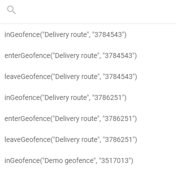

# Geofence functions

Geofence functions let you use your existing Navixy geofences directly inside **IF/THEN Logic** node expressions. Instead of approximating a geographic area with raw coordinate comparisons, you reference a named geofence by ID and choose which spatial event to evaluate: whether a device is currently inside the area, whether it just entered, or whether it just left.

This approach ties your flow logic to the same geofence definitions you already use for alerts and reports, so the boundaries stay consistent across the platform without any duplication.


Geofence functions are available only in **IF/THEN Logic** nodes. They cannot be used in **Initiate Attribute** nodes or other node types.



You must create geofences in Navixy before you can reference them in IoT Logic expressions. To create or manage geofences, see Geofences.


### Available functions

Three functions are available. Each evaluates a spatial relationship between a device and a geofence, and returns `true` or `false` for each incoming data packet.

| Function            | Returns `true` when                             |
| ------------------- | ----------------------------------------------- |
| `inGeofence(id)`    | The device is currently inside the geofence     |
| `enterGeofence(id)` | The device has just crossed into the geofence   |
| `leaveGeofence(id)` | The device has just crossed out of the geofence |

The `id` parameter is the numeric ID of the geofence in your Navixy account. The geofence picker inserts this value automatically when you select a geofence from the list (see [How to add a geofence condition](geofence-functions.md#how-to-add-a-geofence-condition)).

## Syntax



Short syntax is the format the geofence picker inserts automatically. The geofence name appears as a comment for readability but has no effect on evaluation.

```jexl
inGeofence(35229 /* Delivery zone #4 */)
enterGeofence(51577 /* Austin Warehouse */)
leaveGeofence(85269 /* Construction site 1 */)
```



Long syntax wraps the geofence function call inside the `value()` function. Use this form when you need to access a historical position value rather than the current one, or when you are combining geofence evaluation with the standard `value()` pattern used elsewhere in your expressions.

```jexl
value("inGeofence(35229 /* Delivery zone #4 */)", 1, valid)
```

The parameters follow the same convention as the `value()` function used for device attributes: the second parameter is the historical index (0 for the current value, 1 for the previous, and so on), and the third is the validity filter.

For `value()` function details, see [IF/THEN Logic expressions and syntax](logic-node-expressions-and-syntax.md).



## How to add a geofence condition

The expression field in the **IF/THEN Logic** node configuration panel includes a dedicated geofence selector , separate from the standard [attribute autocomplete](../initiate-attribute-node/managing-attributes.md#autofill-attribute-names). It lists all geofences defined in your Navixy account, grouped by name and ID.

To add a geofence function to your expression:



#### **Open the node configuration**

Open the **IF/THEN Logic** node by clicking it on the canvas.



#### **Open the geofence picker**

In the **Condition expression (JEXL)** field, click the geofence picker icon to open the geofence list.

<figure><figcaption></figcaption></figure>



#### **Find and select a geofence**

Type part of the geofence name to filter the list. Each geofence appears three times, once for each available function. Select the entry that combines the geofence you need with the function that matches your condition:

* `inGeofence` - use when you need to check whether a device is currently located inside the selected zone.
* `enterGeofence` - use when you need to detect that a device moved from outside the selected zone into it.
* `leaveGeofence` - use when you need to detect that a device moved from inside the selected zone to outside it.

The picker inserts the complete function call at the cursor position in the expression field.



#### **Combine with other conditions if needed**

Use logical operators to combine the geofence function with other conditions. See [Expression examples](geofence-functions.md#expression-examples) below.



#### **Save the configuration**

Click **Apply changes** to confirm the node configuration.




The geofence picker only lists geofences that exist in your Navixy account at the time you open the node. If you add a new geofence after opening the node, close and reopen it to refresh the list.


## Expression examples

<details>

<summary>Single geofence condition</summary>

Route data based on whether a device is currently inside a delivery zone:

```jexl
inGeofence(35229 /* Delivery zone #4 */)
```

* **THEN path**: Data from devices inside the zone flows here. Use this branch to trigger zone-specific processing, such as adjusting speed thresholds or starting a dwell timer attribute.
* **ELSE path**: Data from devices outside the zone flows here for standard processing.

</details>

<details>

<summary>Entry detection</summary>

Trigger an action when a vehicle enters a restricted site:

```jexl
enterGeofence(85269 /* Construction site 1 */)
```

* **THEN path**: Connect to a **Webhook** node to notify site security, or to a **Device action** node to log the entry event.
* **ELSE path**: Continue normal data processing for devices not entering the site.

</details>

<details>

<summary>Exit detection</summary>

Detect when a vehicle leaves an authorized service area during business hours:

```jexl
leaveGeofence(51577 /* Austin Warehouse */) && value('business_hours', 0, 'valid') == true
```

* **THEN path**: Send an alert via a **Webhook** node to a dispatch system.
* **ELSE path**: Continue normal processing.

</details>

<details>

<summary>Combining multiple geofences</summary>

Check whether a device is inside any of several restricted zones:

```jexl
inGeofence(35229 /* Delivery zone #4 */) || inGeofence(85269 /* Construction site 1 */)
```

* **THEN path**: Apply zone-specific rules or notifications.
* **ELSE path**: Process data from devices outside all listed zones.

</details>

<details>

<summary>Geofence combined with a device parameter</summary>

Detect speeding within a specific urban zone:

```jexl
inGeofence(84762 /* destination1 */) && value('speed', 0, 'valid') > 50
```

* **THEN path**: Log a speed violation scoped to that zone, or send a targeted alert.
* **ELSE path**: Continue standard processing for compliant or out-of-zone data.

</details>

<details>

<summary>Long syntax example</summary>

Access the previous position's geofence state to detect a transition from outside to inside:

```jexl
inGeofence(35229 /* Delivery zone #4 */) && !value("inGeofence(35229 /* Delivery zone #4 */)", 1, valid)
```

This expression returns `true` only on the first packet after a device enters the geofence, by comparing the current state with the previous one.

</details>

## Frequently asked questions

#### Where do I find the geofence ID?

The geofence picker displays each geofence's name and numeric ID in the list. You can also find the ID in the Navixy geofences interface. When you select a geofence from the picker, the ID is inserted into the expression automatically.

#### Can I use geofence functions in the Initiate Attribute node?

No. Geofence functions are available only in **IF/THEN Logic** nodes. They are designed to evaluate logical conditions, which is the specific purpose of the **IF/THEN Logic** node. The **Initiate Attribute** node uses a different expression context for calculating attribute values.

#### What happens if the referenced geofence is deleted?

If a geofence referenced in an expression is deleted from your Navixy account, the function cannot be evaluated. The result is treated as `false`, and data flows through the ELSE connection. Update or remove the expression to avoid unintended routing.

#### Does inGeofence evaluate the current GPS position of the device?

Yes. `inGeofence()` checks the position reported in the current data packet against the geofence boundaries. Each packet is evaluated independently, so the result reflects the device's reported position at the time that packet was received.

#### What is the difference between inGeofence and enterGeofence?

`inGeofence()` returns `true` for every packet received while the device is inside the geofence. `enterGeofence()` returns `true` only for the packet that records the moment the device crossed into the geofence. Use `inGeofence` when you need to apply logic to all data from inside the area; use `enterGeofence` when you need to react specifically to the boundary crossing event.
