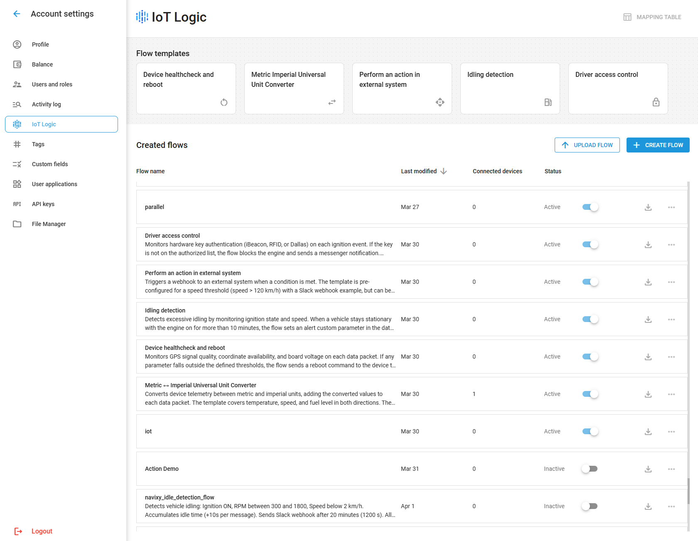
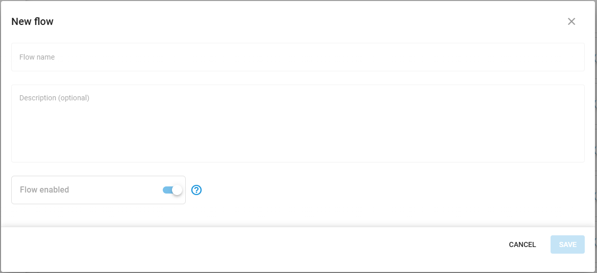

# Quick start guide

This guide will help you quickly set up your first data flow in IoT Logic and begin processing your telematics data.

## Prerequisites

Before proceeding with creating your first flow, ensure you have:

* An **Owner** role in your Navixy account
* Activated devices in your account
* Understanding of what data sources you want to process


IoT Logic workspace is available only to account **Owners** and is not displayed for regular **Users**. For details on user roles, see [Users and Roles](../users-and-roles/).


## Starting from a template

Templates are an alternative to building a flow manually from scratch. Each template is a pre-configured flow structure for a common data processing scenario that you can select from the IoT Logic start page and adapt to your needs. For details on available templates and how to use them, see [Templates](quick-start-guide/templates.md).

## Flow configuration

Now, let’s break down the basic flow configuration process step by step.



### Open IoT Logic

In the main menu, navigate to **IoT Logic**. The start page opens with two sections: **Flow templates**, a gallery of pre-configured flow structures, and **Created flows**, a table listing all existing flows in your account.

<figure><figcaption></figcaption></figure>



### Create a new flow

1. Click **Create Flow**. In the dialog that opens, enter a name and description for your flow and set its enabled state.&#x20;
2. Click **Confirm** to open the canvas and begin building the flow.

<figure><figcaption></figcaption></figure>


If you prefer to start from a pre-configured structure, you can use a template instead of building a flow from scratch. Templates are pre-configured flows for common data processing scenarios. See [Templates](quick-start-guide/templates.md) for the full list and setup instructions.




### **Configure a Data Source node**

This step defines what devices will send their readings to this flow. It is essential to provide the pipeline with actual data.&#x20;

1. From the **Nodes** pane, drag a **Data Source** node onto the canvas
2. Click the node to display quick actions, or double-click to open its configuration panel right away
3. Configure the following settings:
   1. **Node name** - Enter a descriptive name, specifying the sent data origin (e.g., _Staff vehicles_)
   2. **Sources** - Select devices whose readings you want to send to this flow.
4. Click **Apply changes** to apply the configuration


For details on the node configuration, see [Data Source node](flow-management/data-source-node.md).




### **Add data enrichment**&#x20;

At this step, we configure the calculations to enrich the raw data or even create a completely new data attributes mathematically.

1. Drag an **Initiate Attribute** node onto the canvas
2. Click the node to display quick actions, or double-click the node to open its configuration panel
3. Add a descriptive **Node name** to specify its purpose and calculations it makes (e.g. _Temperature °F to °C_)
4. Define your attribute:
   1. **Attribute name** - A clear, descriptive name (e.g., "speed\_mph")
   2. **Formula** - The calculation expression (e.g., `speed/1.609` to convert km/h to mph)\
      :bulb:**Note**: Short syntax is the primary option. Use full syntax when you need historical/indexed values or explicit validity checks (e.g., `value('speed', 1, 'valid')`).\
      Attribute names [can be autofilled](flow-management/initiate-attribute-node/managing-attributes.md#autofill-attribute-names) to avoid typos.
5. Add additional attributes if needed by clicking **Add Attribute**. To remove an attribute, click the delete icon next to it.
6. Click **Apply changes** to apply the configuration
7. Create a connection:
   1. Click the output connector of the **Data Source** node
   2. Drag the transition to the input connector of the **Initiate Attribute** node


For details on node configuration, see [Initiate Attribute node](flow-management/initiate-attribute-node/).

For details on actions with attributes, see [Managing attributes](flow-management/initiate-attribute-node/managing-attributes.md).

For sample calculation formulas, see [Calculation examples](flow-management/initiate-attribute-node/calculation-examples.md).




### **Configure data output**

This step defines where the data will be sent from this flow. You can point it to Navixy or a 3rd-party system trough MQTT.

1. Drag an **Output Endpoint** node onto the canvas
2. Hover your mouse over the node to display quick actions, or double-click the node to open its configuration panel
3. Select endpoint **Mode**:

* **Default endpoint** - a standard output for sending flow data to the Navixy platform. It is pre-configured and cannot be edited.
* **MQTT endpoint** - a custom output for sending flow data to 3rd-party destinations over MQTT.

4. Configure the preset-specific settings. Default output is pre-configured, for instructions on other preset configuration and parameters, see [Mode-specific configurations](flow-management/output-endpoint-node.md#mode-specific-configurations).
5. Click **Apply changes** to apply the configuration
6. Connect your other nodes to this one in the needed order to finalize the flow structure


Each flow should include a **Default endpoint** node to ensure data is sent to the platform. Without this connection, device data won't be visible in the Navixy interface.

For details on node configuration, see [Output Endpoint node](flow-management/output-endpoint-node.md).




### **Save and activate your flow**

1. Verify all nodes are properly connected in your flow
2. Click the **Save flow** button in the **Nodes** pane


Your flow is now active and processing data in real-time!




## Flow validation

Flow structure and formulas are validated by IoT Logic automatically, displaying warnings and error messages if the configuration is incomplete or faulty.&#x20;

To confirm the data is processed correctly, use the **Data Stream Analyzer** tool:

1. Click the **Data Analyzer** tab at the top of the canvas
2. Select the devices you want to monitor from the dropdown list
3. Observe the incoming data attributes and their values
4. Use filtering options to focus on specific parameters
5. Verify that any calculated attributes show the correct values

For details on using the tool, see [Data Stream Analyzer](data-stream-analyzer.md).


Congratulations! Your first IoT Logic data flow is up and running.


## Next steps

Now that you've created your first IoT Logic flow, you can:

* Adapt this quick start example to your business needs
* Create more complex data transformations with multiple [Initiate Attribute nodes](flow-management/initiate-attribute-node/)
* Set up additional [output destinations](flow-management/output-endpoint-node.md) for your data that can become reusable profiles for consistent configurations
* [Manage already created flows](flow-management/) to adjust data processing to any changes you face
* [Design advanced flows](flow-management/flow-configuration-example.md) for specific business scenarios using different node combinations and configurations

## Frequently asked questions

#### What happens to devices not assigned to a custom flow?

The default flow processes all devices, including those assigned to custom flows. There is no auto-exclusion: a device in a custom flow continues to be processed by the default flow as well.

#### Can I use the same device in multiple flows?

Yes. A device can belong to multiple flows at the same time. All flows that include the device process its data simultaneously, and results are merged to avoid data loss. There are no constraints on how many flows a device can belong to.

#### Will my flow continue working if I log out?

Yes, once activated, flows operate independently of your user session. As long as the flow is enabled, it will process data even when you're not logged in.

#### How do I know if my flow is working correctly?

Use the Data Stream Analyzer to monitor real-time data transmission. This tool shows both raw device data and calculated attributes, allowing you to verify that your transformations are working as expected.

#### What happens if I disable a flow?

When you disable a flow, the custom processing and any MQTT outputs configured in that flow stop. However, the default flow remains active and continues to send data from all devices to the Navixy platform, so devices will still be visible in the interface. Only disable a flow when you deliberately want to stop its specific transformations or external outputs.
