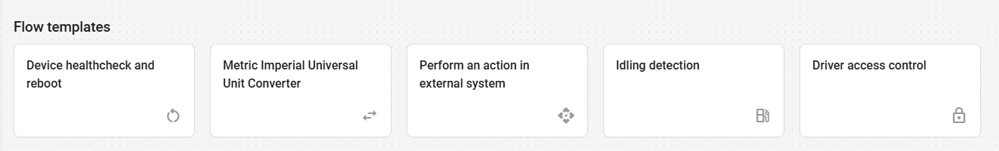

# Templates

Templates are pre-configured IoT Logic flows for common data processing scenarios. You access them from the **Flow templates** gallery on the IoT Logic start page. Clicking a template card immediately creates a flow from that template and opens it on the canvas, where you can review the pre-configured nodes and complete any required setup.

<figure><figcaption></figcaption></figure>

To learn more about the templates and their configurations, see [Available templates](templates.md#available-templates).

## How to use a template

1. Open IoT Logic. The start page opens with the **Flow templates** gallery at the top.
2. Click the template card that matches your use case. The flow is created immediately and opens on the canvas. A description modal appears explaining the flow and its setup steps.
3. Read the description modal, then close it to view the canvas.
4. Assign your devices to the **Data Source** node.
5. Configure any credentials or settings specific to your setup, such as Webhook URLs, Device action commands, or parameter names.
6. Click **Save Flow**.


Clicking a template creates a flow immediately, with no separate confirmation step. Device assignment and credentials always require manual configuration regardless of which template you use.


## Available templates

Device health check and reboot

This template monitors GPS signal quality, coordinate availability, and board voltage on each incoming data packet. If any value falls outside the defined thresholds, the flow sends a reboot command to the device to recover from potential hardware or software issues. The template includes reboot commands for Teltonika and Jimi/Concox devices.

**Nodes:** Data Source, **IF/THEN Logic** (The device is healthy), **Device action** (Teltonika device reboot), **Device action** (Jimi device reboot), Output Endpoint

**Prerequisite:** None.

**Setup**

* Remove the **Device action** node that does not match your hardware, or replace both commands with the correct ones for your device.
* Adjust the health check thresholds in the **IF/THEN Logic** node to match your requirements. The defaults are: satellites ≥ 4 and board voltage ≥ 11.5 V.

Metric to Imperial Universal Unit Converter

This template converts device telemetry between metric and imperial units, adding the converted values to each data packet. It covers temperature, speed, and fuel level in both directions. The two **Initiate Attribute** nodes convert in opposite directions; keep only the one that matches your use case.

**Nodes:** Data Source, **Initiate Attribute** (Metric values), **Initiate Attribute** (Imperial values), Output Endpoint

**Prerequisite:** None.

**Setup**

* Delete the **Initiate Attribute** node for the direction you do not need.
* Remove any individual conversions from the remaining node that do not apply to your data.
* Verify that the parameter names in the formulas match your device's actual parameter names.

Perform an action in external system

This template triggers a webhook to an external system when a condition is met. It is pre-configured with a speed threshold (speed > 120 km/h) and a Slack webhook as an example. You can adapt it to any device parameter and any system that accepts webhooks.

**Nodes:** Data Source, **IF/THEN Logic** (Speed is more than 120), **Webhook** (Webhook to your system), Output Endpoint

**Prerequisite:** The target external system must have a webhook endpoint available.

**Setup**

* Replace the condition in the **IF/THEN Logic** node with your threshold or parameter check.
* Replace the **Webhook** node URL, headers, and body with your target system's endpoint configuration.
* Update the request body to include the device parameters relevant to your use case.

Idling detection

This template detects excessive idling by monitoring ignition state and speed. When a vehicle stays stationary with the engine on for more than 10 minutes, the flow sets an alert custom parameter in the data packet. You can use that parameter to trigger alerts or reports in the tracking system. The same pattern works for any duration-based condition.

**Nodes:** Data Source, **IF/THEN Logic** (Idle condition), **IF/THEN Logic** (Idle started), **IF/THEN Logic** (Idle for 10 min), **Initiate Attribute** (Idle start = 0), **Initiate Attribute** (Idle start time), **Initiate Attribute** (Alert), **Initiate Attribute** (No alert), Output Endpoint

**Prerequisite:** None.

**Setup**

* Adjust the idle duration threshold in the **IF/THEN Logic** node "Idle for 10 min". The default is 600,000 ms (10 minutes).
* To track a different condition, replace the ignition and speed check in the **IF/THEN Logic** node "Idle condition" with your own expression.

Driver access control

This template monitors hardware key authentication (iBeacon, RFID, or Dallas) on each ignition event. If the key is not on the authorized list, the flow blocks the engine and sends a messenger notification. The template is pre-configured for Telegram notifications and Teltonika engine block and unblock commands.

**Nodes:** Data Source, **IF/THEN Logic** (Hardware key check), **Webhook** (Telegram alert), **Device action** (Block the engine on Teltonika), **Device action** (Unblock the engine on Teltonika), Output Endpoint

**Prerequisite:** Vehicles must have a hardware key reader installed and configured.

**Setup**

* Replace `ALLOWED_HW_KEY_1`, `ALLOWED_HW_KEY_2`, and `ALLOWED_HW_KEY_3` in the **IF/THEN Logic** node with your authorized key IDs.
* To use a different messenger, replace the **Webhook** node configuration entirely with your target system's endpoint configuration.
* For non-Teltonika devices, replace the engine block and unblock commands in the **Device action** nodes with the correct commands from your manufacturer's documentation.

Zone speed limit

This template detects speeding within a specific geofence. When a device reports speed above the defined threshold while inside the zone, the flow activates output No.1 to trigger a buzzer or another alerting device. To monitor multiple zones with different limits, add a separate **IF/THEN Logic** node for each one.

**Nodes:** Data Source, **IF/THEN Logic** (Is there speed violation?), **Device action** (Buzzer), Output Endpoint

**Prerequisite:** None.

**Setup**

* Replace the geofence ID in the **IF/THEN Logic** node with your geofence.
* Replace the speed value in the **IF/THEN Logic** node condition with your limit. Default: 60 km/h.
* Make sure output No.1 activates your alerting device. If not, change the output number in the **Device action** node to match your wiring.

Dangerous area detection

This template triggers when a device enters a designated geofence. On entry, the flow activates output No.1 and sends a messenger notification via webhook. The **Webhook** node is pre-configured as a Telegram example; replace it entirely to use a different messenger or system.

**Nodes:** Data Source, **IF/THEN Logic** (Is the area dangerous?), **Device action** (Buzzer), **Webhook** (Telegram alert), Output Endpoint

**Prerequisite:** A webhook endpoint must be available for the target messenger or system.

**Setup**

* Replace the geofence ID in the **IF/THEN Logic** node with your geofence.
* Replace the **Webhook** node configuration entirely with your messenger credentials.
* Make sure output No.1 activates your buzzer. If not, change the output number in the **Device action** node to match your wiring.

Anti-theft protection

This template monitors whether a device has left its allowed geofence and immediately activates output No.2 to immobilize the vehicle. Because remotely cutting engine power while the vehicle is moving can be dangerous, use this template only with devices that support gradual or safe engine cut-off. Consult your device manufacturer's documentation to confirm the correct immobilization command and output wiring for your hardware.

**Nodes:** Data Source, **IF/THEN Logic** (Object left geofence), **Device action** (Block the engine), Output Endpoint

**Prerequisite:** The device must support remote immobilization. Verify the correct output number and command in your manufacturer's documentation before use.

**Setup**

* Replace the geofence ID in the **IF/THEN Logic** node with your geofence.
* Make sure output No.2 is wired to your immobilizer. If not, change the output number in the **Device action** node to match your wiring.

Parking off-site after hours

This template detects when a device is outside its designated parking geofence during non-working hours. When the condition is met, the flow sends a messenger notification and immobilizes the vehicle. The **Webhook** node is pre-configured as a Telegram example; replace it entirely to use a different messenger or system. The **Device action** node for immobilization has no pre-configured command and requires full configuration before the flow can immobilize anything. Consult your device manufacturer's documentation for the correct command.

**Nodes:** Data Source, **Initiate Attribute** (Time zone and working hours), **IF/THEN Logic** (Is the object outside of the parking spot?), **Webhook** (notification), **Device action** (Immobilize object), Output Endpoint

**Prerequisite:** A webhook endpoint must be available for the target messenger or system. The device must support remote immobilization; verify the correct output number and command in your manufacturer's documentation before use.

**Setup**

* Replace the geofence ID in the **IF/THEN Logic** node with your geofence.
* Set your time zone and working hours in the **Initiate Attribute** node.
* Replace the **Webhook** node configuration entirely with your messenger credentials.
* Configure the **Device action** node with the correct output number and immobilization command for your device.

