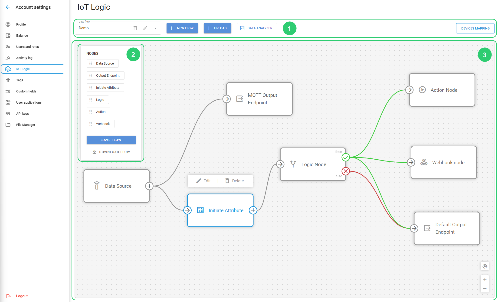

# Workspace

## Start page

When you open IoT Logic, you land on the start page. The start page is the central hub for accessing your flows and creating new ones from scratch or from a template.

[SCREENSHOT: IoT Logic start page showing both the Flow templates gallery and the Created flows table]

### Flow templates

The **Flow templates** gallery shows five pre-configured flow structures for common data processing scenarios. Each template card displays the template name and a brief description.

Clicking a template card immediately creates a flow from that template and opens it on the canvas. A description modal appears over the canvas explaining the flow and its required setup steps.

[SCREENSHOT: Template open on canvas with description modal visible]


Clicking a template creates a flow immediately. You still need to assign devices to the **Data Source** node and configure any credentials, such as Webhook URLs or Device action commands, before the flow can process data.


### Created flows

The **Created flows** table lists all existing flows in your account. The table includes the following columns: Flow name, Last modified, Connected devices, and Status.

Each row provides the following controls: a status toggle to enable or disable the flow, a download icon to export the flow as a file, and a **"..."** menu with the options **Edit**, **Download**, and **Delete**.

[SCREENSHOT: Created flows table with per-row controls visible]

The page-level buttons at the top of the table are **Upload Flow** and **Create Flow**.

## IoT Logic workspace

The flow workspace consists of two sections: **Nodes pane (1)** and **Canvas (2)**.

<figure><figcaption></figcaption></figure>

### 1 - Nodes pane

Available nodes are located in a separate pane on the left. You can drag-and-drop them onto the canvas of the current flow. The option to save the current flow configuration is also located on this pane. At the moment, the following nodes are available:

* [Data Source](flow-management/data-source-node.md)**:** A node that defines where the data is coming from to the current flow. A flow can contain multiple actual sources.
* [Initiate Attribute](flow-management/initiate-attribute-node/): A node that handles data enrichment through custom calculations before sending to a destination.
* [IF/THEN Logic](flow-management/logic-node/): A node that creates conditional branching based on logical expressions, routing data through different paths depending on real-time conditions.
* [Action](flow-management/action-node.md): A node that performs automated operations on device data, such as sending commands back to devices or triggering external system actions based on defined conditions.
* [Output Endpoint](flow-management/output-endpoint-node.md): An outbound transmitting node that defines where the data is sent from the current flow.

A flow can contain multiple nodes of each type. Combining various nodes in the same flow allows you to create complex data pipelines.

The nodes pane also includes flow management options at the bottom:

* **Save flow** button saves the current flow configuration. If you edit something in the flow, don't forget to save the changes. Unsaved changes can be discarded by the page reload.
* **Download flow** button exports the current flow configuration as a JSON file. This is useful for backing up your flow configurations, sharing them with team members, or migrating flows to other accounts.


The **Save flow** button saves the current flow configuration. If you edit something in the flow, don’t forget to save the changes. Unsaved changes can be discarded by the page reload.


### 2 - Canvas

This is the main interactive element of the workspace where your flows are visualized:

* **Node blocks**: All nodes you drag-and-drop to the canvas appear as blocks. You can place them however you like to make the image of your flow clear and intuitive. Hovering your mouse over a node displays an edit window.\
  **Note**. You can also open the editing window by double-clicking a node.
* **Transitions**: The arrows represent connections between nodes, defining the path your data follows within the flow. Node blocks also show hints on which connection directions they support. To create a transition, simply click a connection element on a start node and drag it to the target one. If you try to connect nodes in an unsupported direction (e.g. from an **Output Endpoint** to a **Data Source**), the attempt will fail. This way, the platform prevents an accidental configuration of an incorrect data flow.
* **Center** : This button allows you to quickly focus on the canvas area that contains actual elements, ensuring that the whole flow is visible. It is especially helpful for large and complex flows, but at the same time offers a handy shortcut to autosize the flowchart to fit the window.
* **Zoom in/out** : Common functionality to manage the scale of the flowchart. You can also zoom in or out using your mouse wheel.

## Default flow

<figure><figcaption></figcaption></figure>

Navixy offers a pre-configured data flow that includes all devices connected to the account and sends their data directly to the platform. This flow is available in every account and cannot be edited. It consists of two basic nodes: **Default Input** and **Default Output Endpoint**.

The default flow serves as a foundational data transmission path in the Navixy system. Its primary purpose is to ensure that data from devices not included in any custom flow is not lost and is transmitted to the default destination - the Navixy platform.

### Key characteristics of the default flow

* Present in every Navixy account regardless of whether IoT Logic is actively used
* Cannot be deleted, edited, or modified in any way
* Processes all devices in the account, including those assigned to custom flows
* Provides direct data transmission without transformations
* Maintains system stability by protecting the default data transmission path

### Default input

The **Default Input** node serves as the universal data collector for your account. It receives data from all devices, including those assigned to custom flows. Assigning a device to a custom flow does not affect its membership in the default flow.

### Default Output Endpoint



The **Default Output Endpoint** node provides a pre-configured destination for sending device data to the Navixy platform. This node is pre-configured with optimal settings for direct transmission to Navixy's servers.




<figure><figcaption></figcaption></figure>




The endpoint ensures that all data collected through the default flow is properly formatted and transmitted to the Navixy platform, enabling full visibility of your devices in the main Navixy interface.


The **Default Output Endpoint** node is also available for use in custom flows. Each custom flow should maintain connections to this output node to ensure device data is sent to the platform, enabling monitoring capabilities using Navixy tools. If the Navixy output is removed from a custom flow, data from the devices involved in that flow will no longer reach the platform.


## Using Data Stream Analyzer with the default flow

**Data Stream Analyzer** is flow-responsive, which means that it monitors only the data within the flow where it was opened. Using the tool within the default flow allows you to troubleshoot and monitor data transmission for all devices in the account, since the default flow processes every device. This functionality is particularly useful for diagnosing connectivity or data issues across your fleet.

To access this feature, go to the IoT Logic start page, click the default flow name in the **Created flows** table to open it on the canvas, then click the **Data Analyzer** tab at the top of the canvas.

For detailed instructions on using the tool, refer to [Data Stream Analyzer](data-stream-analyzer.md).

## Understanding flow relationships

The relationship between the default flow and custom flows follows these principles:

1. **Every device in your account must have a path to transmit data** - The IoT Logic system ensures that all devices connected to your account always have a defined route for their data. This guarantees no device data is ever lost due to routing configuration issues, maintaining complete visibility of your device fleet.
2. **A device can belong to multiple flows at the same time** - All flows that include the device process its data simultaneously, and results are merged to avoid data loss. There are no constraints on how many flows a device can belong to.
3. **The default flow processes all devices** - The default flow receives data from every device in your account, including those assigned to custom flows.

This approach ensures complete data coverage while allowing for customized data processing where needed.

## Default flow

Navixy includes a pre-configured flow in every account that processes data from all devices and sends it to the Navixy platform. This flow cannot be edited or deleted. For full details on how it works and how it relates to your custom flows, see [Default flow](flow-management/default-flow.md).
