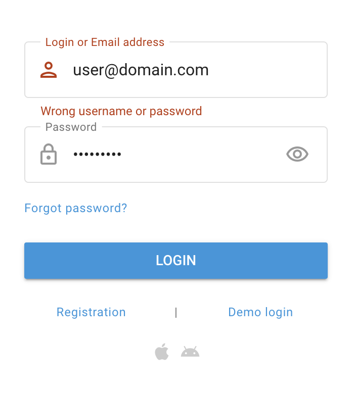

# Password recovery

If you've forgotten your password and need to recover it, follow these steps:

1. Open the login page. Please contact your [Service provider](../quick-start/about-service-providers.md) for the URL if you don’t know it.
2. Locate and click the "Forgot password?" link below the password field.
3. Provide your registered email address and enter the CAPTCHA.
4. Check your email for a password reset link and follow the instructions provided in the email to reset your password. Make sure your new password meets the password requirements.



## FAQs and troubleshooting

If you don't have access to the email address, try contacting your [Service provider](../quick-start/about-service-providers.md) to regain access to your account.
