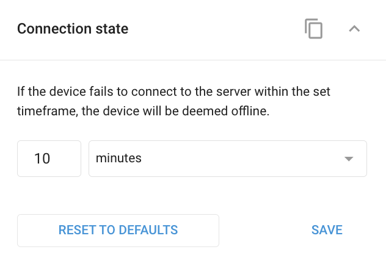

# Connection state

Sets how long a device may be silent before it's marked offline, so infrequently-reporting or power-saving devices aren't shown as disconnected too early. It affects only the offline/disconnected status indicator, not how the device reports (that's [Tracking mode](../location-and-movement/tracking-mode.md)).


You can monitor the [Connection state](../../tracking/objects-list/connection-state.md) of your devices in the [Objects list](../../tracking/objects-list/) in the Tracking module and the **X-GPS Monitor** mobile app. It's shown as a color-coded circle in each device's widget.


## Settings

* **Time interval**: The duration without data after which the device is considered disconnected. Choose minutes, hours, or days. Default **10 minutes**. You can set it from 1 minute up to about 3,000 days. A **Reset to defaults** button restores the default.

## Availability

Appears on applicable devices for users with edit rights.

## Limitations

* This affects only the offline status indicator, not the device's reporting behavior.
* For devices in deep sleep or power-save, set the timeout long enough that a sleeping device isn't shown offline prematurely. Coordinate with [Tracking mode](../location-and-movement/tracking-mode.md) and [Sleep mode](../device-specific-controls/power-management/sleep-mode.md).

## See also

* [Connection state](../../tracking/objects-list/connection-state.md): the connection statuses and their color-coded meanings.
