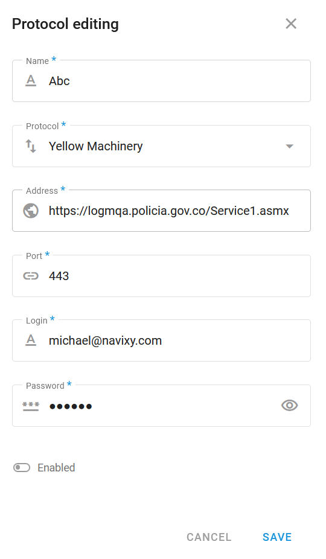

# Maquinaria Amarilla

### What is Maquinaria Amarilla?

Maquinaria Amarilla is a regulatory security protocol that monitors, provides visibility, and generates reports on heavy machinery operations. Navixy added the Maquinaria Amarilla data forwarding protocol for use by companies in the Colombian industry, which are required by law to be monitored by the National Police of Colombia.

Maquinaria Amarilla is used by the Colombian government to monitor heavy machinery and prevent illicit use. Compliance with this protocol is mandatory under Decree 723 of 2014.

### General information

The Maquinaria Amarilla protocol uses SOAP to send XML data every 60 minutes via HTTP to the Colombian police.

The following data is sent to the Colombian National Police:

* Vehicle license plate
* Event code
* Date
* Address
* Latitude
* Longitude
* Altitude
* Speed
* Course
* Ignition
* Odometer
* Device ID

### Configuration

#### Required parameters

The following parameters are required:

* User and password: Credentials for Maquinaria Amarilla
* External ID: A 20-character ID that includes the provider code provided by the Colombian Police
* Token: Required for all operations within the protocol

#### How to generate a token

To obtain a token, you must send specific XML data.

**Prerequisites**:

* Download the [Postman collection](https://drive.google.com/file/d/1XFe_vi22rHqqIDgLlAiTlcepLBBVPemZ/view)
* Install **Postman** or use its web version



Open **Postman**



Click **Import** and upload the previously downloaded XML file

<div align="left"><figure><figcaption></figcaption></figure></div>



Select the call for token generation and go to the **ValIngreso** section

<div align="left"><figure><figcaption></figcaption></figure></div>



Go to the **Body** tab and select **Raw**

<figure><figcaption></figcaption></figure>



Change the following three values:

* **User**: The login of the company registered with the Colombian police
* **Password**: The password of the company registered with the Colombian police
* **Valid number**: The number in the example format `4.1234567890`

<figure><figcaption></figcaption></figure>



Send the request to generate the token



#### How to register objects and devices

Once the token is generated, you must register the objects and devices to synchronize them with the Police database. The process is similar to obtaining the token, but uses the device and object data.



Add GPS devices

Import [this JSON](https://drive.google.com/file/d/1C45u-A2n3E1wbteuLl_D-dqrxMbHJYGw/view?usp=share_link) into Postman.

Enter the user and token generated previously, along with the fields exactly as registered in your Excel file. The system will generate one of the following response codes:

```
001 --> STARTING PROCESS
002 --> RECORD INSERTED OK
ER1 XXXXX --> DUPLICATE RECORD ERROR (IDTRAMA) XXXXX = ORACLE ERROR CODE
ER2 XXXXX --> OTHER RECORD ERROR XXXXX = ORACLE ERROR CODE
ER3 XXXXXXXXXX --> USER ERROR OR INACTIVE TOKEN
```



Add objects

Import [this JSON](https://drive.google.com/file/d/1Y77If2KFPvnSIl-JZ6safx8Rm5nnI101/view) into Postman

Enter the user and token generated previously, along with the fields exactly as registered in your Excel file. The system will generate one of the response codes listed above.



Link objects with devices

Import [this JSON](https://drive.google.com/file/d/1cfj26NXqdTvLIbSHWoeA-QSGDwz29EWk/view?usp=sharing) into Postman.

Enter the previously generated user and token, along with the fields exactly as listed in your Excel file.

When the machine is registered correctly, the system returns `002`, indicating that the machine was inserted successfully.



#### How to configure data forwarding in Navixy

To configure data forwarding for the Maquinaria Amarilla protocol:



Navigate to the **Devices and settings** in the main side panel



Select the **Data Forwarding** portlet



Click **Protocols**



Click the **+** button to add a new retranslation protocol.



Enter the following parameters:

* **Name**: Enter a name to identify this protocol
* **Protocol**: Select **Maquinaria Amarilla (Yellow Machinery** in English) from the dropdown menu
* **Address**: `https://logmqa.policia.gov.co/Service1.asmx`
* **Port**: `443`
* **Login**: Enter the login provided by the Colombian Police
* **Password**: Enter the password provided by the Colombian Police

<figure><figcaption></figcaption></figure>



Ensure the **Enabled** checkbox is selected



Click **Save**



#### How to manage data forwarding

To edit or stop data forwarding:

* Click **Edit** next to the protocol's entry to open the **Protocol editing** window and change its configuration.
* Click **Delete** to delete a protocol and stop data forwarding. Confirm the change in the pop-up window.

### Troubleshooting

If data does not appear in the **Maquinaria Amarilla** system, verify the following:

* The username and token for **Maquinaria Amarilla** are entered correctly.
* The URL is entered correctly.
* Device registration was completed successfully with the police.
* The retranslation protocol is enabled in Navixy.
