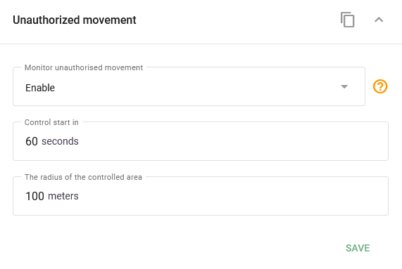

# Unauthorized movement

Arms the device to detect that a parked vehicle has moved and to report an event to the Navixy platform. On many devices this works as an auto-geofence: when the ignition is off, the device treats the current position as a parking point and reports an event if the vehicle leaves a set radius.

## Settings

The fields depend on the device. You may see:

* **Enable**: turn unauthorized-movement detection on or off.
* **Activation timeout**: the delay after the ignition is switched off before detection becomes active.
* **Radius**: the distance from the parking point within which movement triggers an event.
* On vibration-based variants, these models use motion-sensor fields instead of a radius:
  * **Sensitivity level**: how easily the motion sensor triggers (low, medium, or high).
  * **Start motion detection in (minutes)**: the delay after ignition off before monitoring activates.
  * **Motion interval (seconds)**: how long motion must persist before an event is recorded.
  * **Delay time (seconds)**: an additional delay after motion is confirmed before the alert is sent, to filter out brief bumps.

## Availability

Appears on device models that support device-side unauthorized-movement or auto-geofence detection.

## See also

* [Tow detection](../../location-and-movement/tow-detection.md): a related device-side movement alarm.
* [Unauthorized movement](../../../events-and-notifications/security/unauthorized-movement.md): the platform rule that acts on these events.
