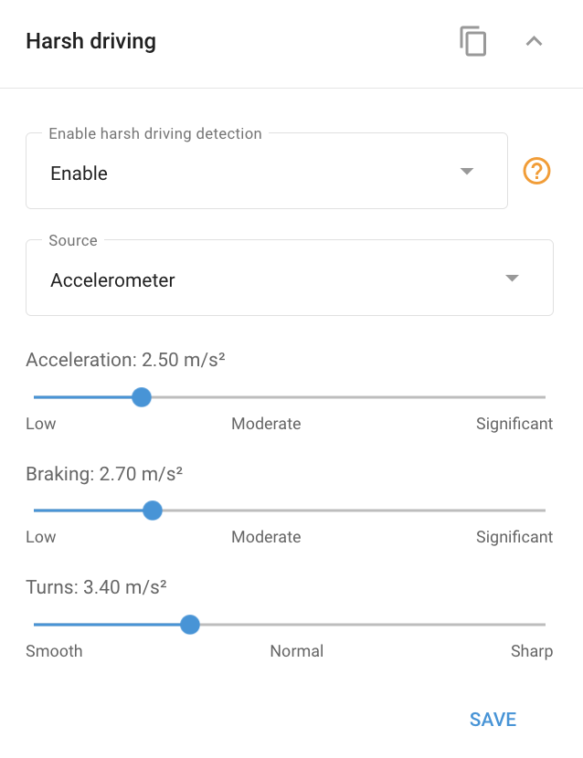

# Harsh driving block

Many advanced vehicle GPS devices feature a built-in harsh driving detector. This detector continuously monitors acceleration values during acceleration, braking, and turning. When these values exceed predefined thresholds, the system generates a corresponding **Harsh driving** event. These events can be tracked and analyzed using [Notifications](../../events-and-notifications/safety/harsh-driving.md) and [Eco-driving reports](../../fleet-management/eco-driving.md), allowing for a detailed assessment of driving behavior.

## Configuring harsh driving detector thresholds

As vehicles vary in their technical characteristics, such as the ability of a sedan to accelerate faster than a bus, the critical acceleration values also differ. Navixy allows you to customize the harsh driving parameters of GPS devices according to the specific type of vehicle you are monitoring.

To access the **Harsh driving** block in Navixy, navigate to the **Devices and settings** module, select the desired device, and then expand the **Harsh driving** block to adjust the settings.

In the block, you can adjust the threshold values for acceleration, braking, and turning. Exceeding these thresholds will trigger different event types, which can be analyzed later through event reports or eco-driving reports. This customization ensures that the system accurately reflects the driving conditions and safety requirements of your fleet.
