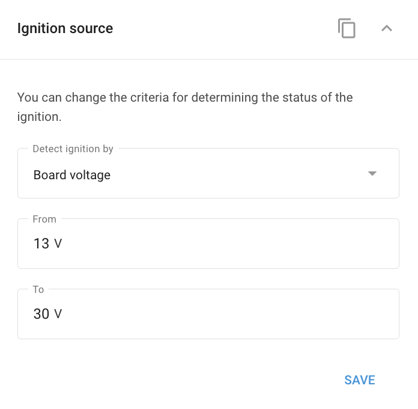

# Ignition source

Tells the platform how to determine ignition on/off: Important when the ignition wire isn't connected. Many devices can derive ignition from a digital input, the vehicle's on-board voltage, or the built-in motion sensor.

## Settings

Select the **mode** used to detect ignition:

* **Digital input** (`din1`), uses a specific input, typically the ignition cable. The default on most devices.
* **On-board voltage** (`power_voltage`), detects ignition from the vehicle's voltage. Set the **low and high voltage thresholds** (in millivolts, 0–30,000, with a default low level around 13,000 mV) that bracket "ignition on."
* **Movement or motion sensor** (`movement`): infers ignition from vehicle movement, useful when the device isn't wired to the vehicle's electrical system.

## Availability

Appears on devices that support configurable ignition detection (vendor variants exist, e.g. Teltonika, Suntech, Ruptela, Queclink).

## Limitations

* **Voltage mode** works because a running engine's alternator raises system voltage above the battery's resting level.
* Motion-based ignition is convenient when not wired to the vehicle, but towing reads as ignition-on (the engine isn't actually running).

## See also

* [Ignition source (discrete sensor)](../vehicle-sensors/discrete-sensors/ignition-source.md): creating an ignition sensor on the platform (distinct from this device-side detection mode).
* [Parking detection](parking-detection.md): can use ignition to confirm parking.
