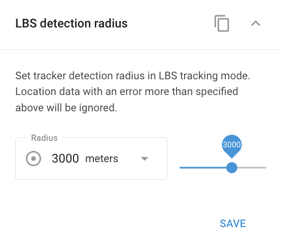

# LBS detection radius

## Purpose

The **LBS (Location-Based Service) detection radius** tunes **cellular/Wi-Fi-based positioning**, used as a fallback when GPS isn't available. It sets how far the platform will trust a base-station or Wi-Fi fix to pinpoint the device.

## Settings

* **Maximum radius**: The radius within which the platform trusts a cell-tower/Wi-Fi fix. Range **0–5000 m**, set with a slider that offers locale-aware presets (for example 100, 500, 1000, 3000, or 5000 m in metric).

## Appears when

Appears when the device supports LBS **and** the plan/account enables it, or for mobile app devices.

## Choosing a radius

* **Rural areas**: Use a **larger** radius. With fewer base stations, allowing more distant towers improves the chance of locating the device.
* **Urban areas**: Use a **smaller** radius. Dense towers provide enough signal for accuracy, so a smaller radius keeps precision higher.

## Gotchas

* Larger radius = wider search but **lower accuracy**.
* On the map, LBS positions appear as a **circle** whose size equals the inaccuracy: a small circle means higher accuracy (typically urban), a large circle means more inaccuracy (typically rural).

## See also

* [Tracking mode](tracking-mode.md), how the device reports GPS position.
