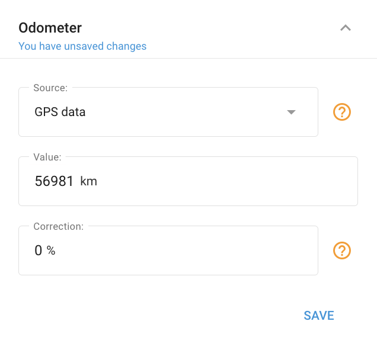

# Odometer block

## Purpose

The **Odometer** block tracks a vehicle's **total mileage** and lets you **correct measurement error**. Readings can come from GPS-based mileage, hardware/CAN mileage, a tachograph, or a measurement sensor you've created. It integrates with [Fleet maintenance](../../fleet-management/maintenance.md) so you can schedule service by mileage and receive reminders.

## Settings

* **Data source**: GPS-based mileage, hardware/CAN mileage, tachograph, or a measurement sensor. Additional sources appear only after you create the matching **measurement sensor**.
* **Current value**: Set the odometer to match the vehicle. Kilometers, 0–99,999,999, up to 2 decimals.
* **Correction multiplier**: Adjust readings up or down by a percentage. Range about **−95% … +95%** (a positive value increases readings, negative decreases them).

## Activation



**Open the block**

Open **Devices and settings**, select the object, and go to the **Odometer** block.



**Add the odometer**

If none exists yet, click **Add odometer**.



**Choose a source and set the value**

Pick the data source, set the initial mileage value, and click **Save**.



## Appears when

Appears on device models that support an odometer.

## Gotchas

* The platform odometer **rarely equals** the vehicle's physical odometer. It counts all GPS points and allows for manufacturer error. Use the multiplier to correct a consistent offset, and collect about **200 km** of data first to estimate it.
* Additional sources (e.g. CAN mileage) only appear after the matching measurement sensor is created.
* The **Odometer** value is also accessible from the device's [Object widget](../../tracking/objects-list/object-widget.md).

## See also

* [Engine hours block](engine-hours-block.md), the equivalent counter for engine running time.
* [Fleet maintenance](../../fleet-management/maintenance.md), schedule service by mileage.
