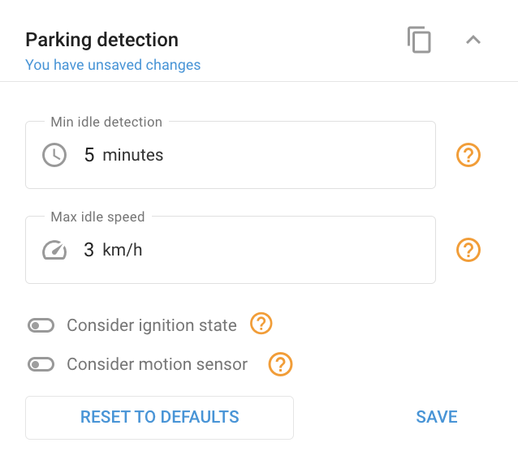

# Parking detection block

## Purpose

**Parking detection** defines when a vehicle counts as **parked** versus **in a trip**: The basis for trips, stops, and parking in reports. It identifies when an object has been stationary long enough, below a speed threshold, optionally confirmed by ignition or a motion sensor.

## Settings

* **Minimum idle time**: How long an object must remain stationary before it's considered parked. Range **1–1440 minutes**, default **5**.
* **Idle speed threshold**: The speed under which the object must stay to be detected as parked. Range **0–200 km/h**, default **3**.
* **Use ignition**: Confirm parking using the ignition state. Appears only if an **ignition sensor** is configured.
* **Use motion sensor**: Confirm parking using the motion sensor. Appears only on devices with a **motion sensor**.

A **Reset to defaults** button restores the default values.

## How conditions combine

* **By speed and time:** parking is detected when speed drops below the threshold and stays there longer than the minimum idle time. Stops shorter than the minimum idle time don't interrupt the trip.
* **Considering ignition:** the trip starts when speed ≥ threshold **and** ignition is on. The trip ends when speed drops below threshold and either the idle time is exceeded **or** ignition is off.
* **Considering motion sensor:** the trip starts when speed ≥ threshold **and** the motion sensor detects movement. The trip ends when speed drops below threshold or motion stops, and the idle time is exceeded.
* **Considering both:** ignition takes precedence over the motion sensor.

## Appears when

Available on all devices except a few models that don't support parking detection.

## Gotchas

* The **Use ignition** and **Use motion sensor** options only appear when the corresponding sensor exists on the device.
* Tuning idle time and speed threshold to the vehicle's real behavior minimizes false detections and improves trip accuracy.

## See also

* [Tracking mode block](tracking-mode-block.md), how often the device reports position.
* [Ignition source block](ignition-source-block.md), how ignition is determined.
