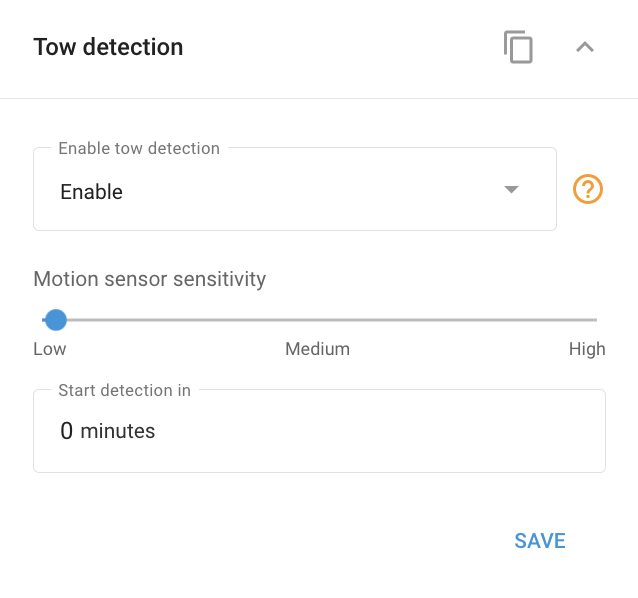

# Tow detection

Detects unauthorized movement of a parked vehicle using the device's built-in motion sensor. After the ignition is switched off, the sensor arms and monitors for vibration, impact, or movement. If movement is detected, the device sends an event to the Navixy platform, which can notify you via [Rules and notifications](../../events-and-notifications/security/unauthorized-movement.md).

## Settings

* **Enable or disable**: Turn tow detection on or off.
* **Sensitivity**: Motion sensor sensitivity, for example high, medium, or low, where a lower value is more sensitive.
* **Delay after engine off**: How long after ignition-off before detection arms.
* **False-alarm (fake-tow) delay**: A short delay that filters out brief movements so they don't trigger a false tow event.

## Availability

Appears on devices that support tow detection (vendor variants exist, e.g. Queclink, Teltonika).

## Limitations

* Set sensitivity carefully to avoid false alarms. Accuracy depends heavily on correct installation and varies by model.
* This is device-side detection. It's related to, but distinct from, the platform-side [Unauthorized movement](../../events-and-notifications/security/unauthorized-movement.md) rule and the other [anti-theft and security](../device-specific-controls/anti-theft-and-security/README.md) modes.

## See also

* [Anti-theft and security](../device-specific-controls/anti-theft-and-security/README.md): other device-side alarm modes.
* [Unauthorized movement](../../events-and-notifications/security/unauthorized-movement.md): the platform rule for movement alerts.
