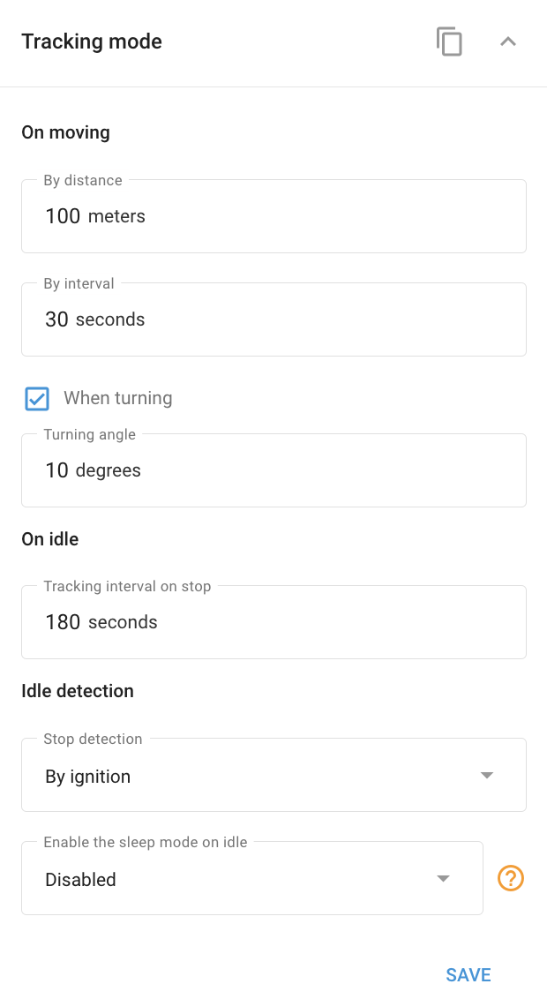

# Tracking mode block

## Purpose

The **Tracking mode** block controls **how often and on what basis the device reports its position**: Balancing live-tracking detail against data and battery usage. Every device has a reporting configuration, but the **exact fields are chosen by the device model**, so this page describes the underlying concepts rather than a fixed form.

<figure><figcaption>
Tracking mode settings block example
</figcaption></figure>


The controls below are the canonical building blocks. Your device shows the subset it supports, sometimes with different labels. The device reports when **at least one** of the enabled conditions is met.


## Core reporting controls

* **Reporting interval**: Report at least every N seconds. The core "how often" control (typically from ~30 seconds up to a day or more, varies by model).
* **Distance**: Report after moving N meters (typically ~100–65,535 m, varies by model).
* **Cornering or turning angle**: Report when heading changes by N degrees (typically 10–180°), so corners aren't cut.


The numeric ranges above are typical values. The exact minimums, maximums, and defaults are set by your device model.


## Power-save and battery options

On battery or power-managed devices you may also see:

* **Power-save mode**: Choose the power-save strategy (for example, distance-based vs fixed-interval reporting).
* **Power-save interval**: A slower reporting rate used when parked or in power-save.
* **On-stop interval**: A separate interval used while the vehicle is stopped.
* **Sleep and active windows**: Deep-sleep scheduling on battery devices (sleep and active times, deep-sleep enable, stay online on external power).
* **Emergency interval**: Faster reporting during an alarm.
* **Optional daily timer**: Wake and report at a set time of day, available on some models when the interval is 24 hours or more.
* **GPS/GSM working mode**: Radio power modes on some models, trading reporting responsiveness for battery life.

## Anti-drift (freeze) options

* **Freeze options**: Hold the reported position while the vehicle is stationary (by speed, motion, or ignition) to avoid GPS drift. These are the recommended fix for **parked-vehicle "jitter"**, where a stationary vehicle appears to wander on the map.

## Appears when

Always, every device has a reporting configuration. The exact fields are determined by the device model.

## Gotchas

* Because fields are model-driven, configure the **concepts** (interval, distance, angle, power-save, freeze, or sleep) rather than expecting a fixed form.
* **Under-reporting** here, a long interval with no angle or distance, or aggressive power-save, is the usual cause of **"missing mileage" and cut-corner** complaints.
* The **freeze** options are the fix for **parked-vehicle drift**. Enable them if a stationary vehicle appears to move.
* This block controls how the device **reports**. It does not change when the device is marked offline (see [Connection state](../connectivity/connection-state-block.md)).

## See also

* [Connection state block](../connectivity/connection-state-block.md), the offline-timeout threshold.
* [Sleep mode](../device-specific-controls/power-management/sleep-mode.md): sleep and charging controls that overlap with power-save.
* [Parking detection block](parking-detection-block.md), how parking and trips are determined.
