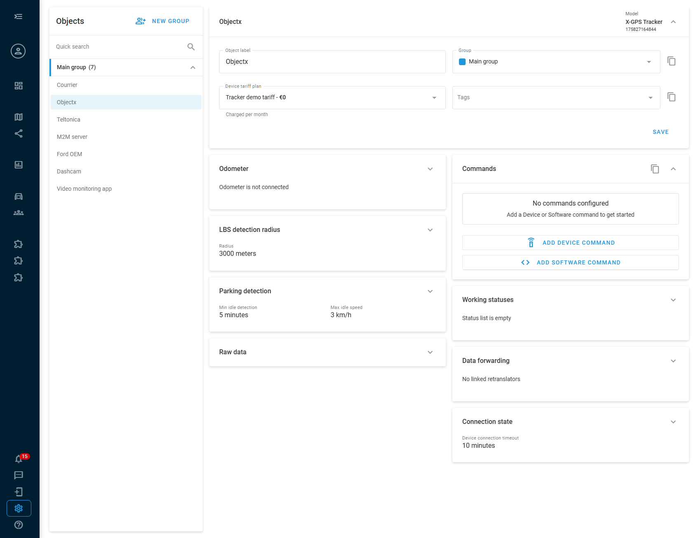
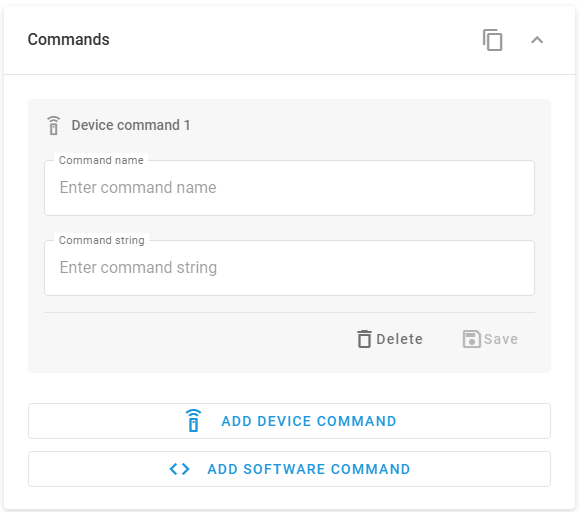
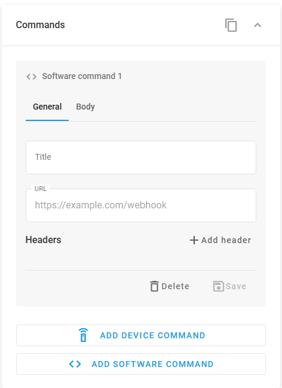
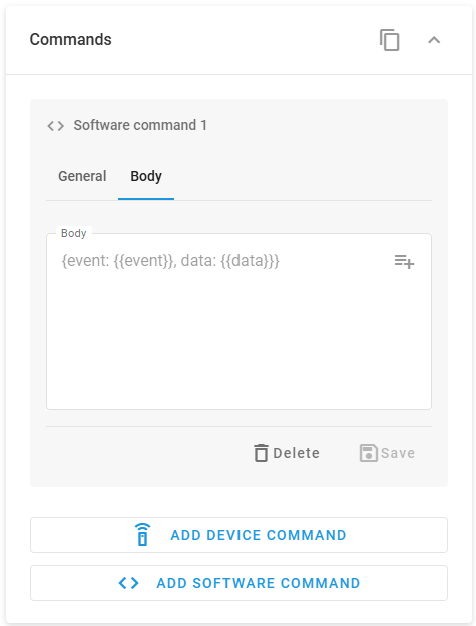
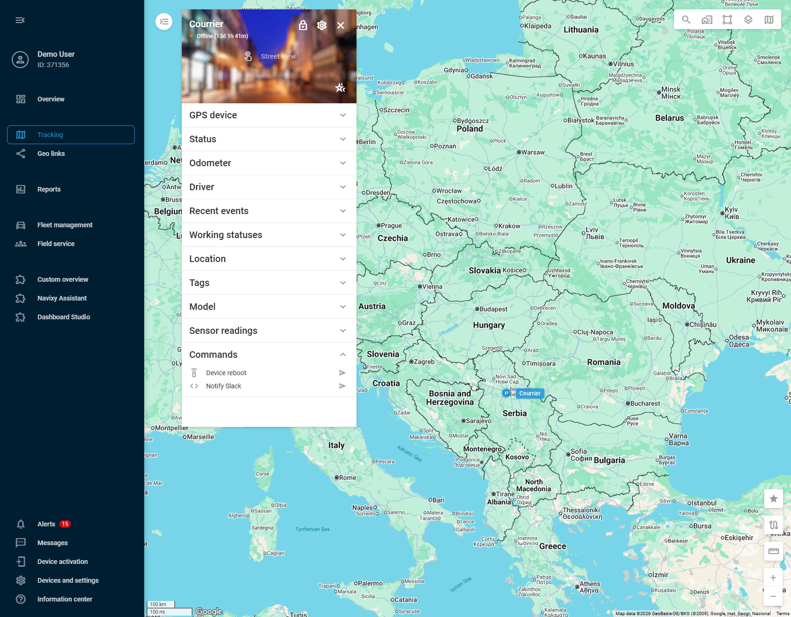

# Commands

The **Commands** block lets you define custom commands for a device in Navixy and send them on demand from the device's [Object widget](../../tracking/objects-list/object-widget.md). Use it to send a firmware-level instruction directly to a device, such as sending a CAN command or activating an output, or to call any external system that accepts HTTP requests, such as a Slack channel, a notification service, a CRM, or a custom API endpoint. Once configured, commands can be dispatched with a single click.

The Commands block supports two command types:

* **Device command** sends a protocol-level instruction string directly to the device, for example to send a CAN command or activate an output.
* **Software command** sends an HTTP POST request with a JSON body to any URL, optionally including current device data such as location, speed, or device ID in the payload.

Commands are saved per device and remain available for repeated use.


**When to use Commands vs. IoT Logic**

Commands is designed for ad-hoc, manual actions targeting a single device. Use it when you need to send a one-off command without configuring an automation flow.

For automated, rule-based command sending, such as triggering a device action or a webhook when a sensor threshold is crossed, or sending the same command across multiple devices, use [IoT Logic](../../account/iot-logic/). The **Device action** and **Webhook** nodes in IoT Logic provide the same underlying capabilities with full flow automation and multi-device targeting.


## Configuration

To configure Commands for a device, follow these steps:

1. Go to **Devices and settings** in the left sidebar.
2. Select the device you want to configure.
3. Locate and expand the **Commands** block.

<figure><figcaption></figcaption></figure>

You can add multiple commands of each type. Each command is saved individually.

### Device commands

A **device command** sends a protocol-level instruction string directly to the device over its communication channel.

<figure><figcaption></figcaption></figure>

To add a device command, click **Add device command** at the bottom of the block. Configure the following fields:

1. **Command name**: a label for the command as it appears in the Object widget, for example `device reboot`. Choose a name that clearly describes what the command does.
2. **Command string**: the exact instruction string that is sent to the device, for example `cpureset`.


Valid command strings are device-specific and defined by the device manufacturer. Always refer to the official documentation for your device model to find the correct command strings. Entering incorrect values may have unintended effects on the device.


Click **Save** to store the command. Click **Delete** to remove it.

### Software commands

A **software command** sends an HTTP POST request with a JSON body to a URL you specify. This can be an external service endpoint, such as Slack, a custom webhook receiver, or any REST API, or a Navixy API endpoint.

The request body is JSON and must be structured according to what the destination endpoint expects. You can include device data attributes in the body using the `{{attribute_name}}` syntax.

Software commands are configured across two tabs: **General** and **Body**.

To add a software command, click **Add software command** at the bottom of the block.

#### General tab


{% column width="58.333333333333336%" %}
Configure the following:

1. **Title**: a label for the command as it appears in the Object widget.
2. **URL**: the full endpoint URL where the POST request is sent, for example `https://hooks.slack.com/services/...` or `https://api.eu.navixy.com/v2/...`.
3. **Headers**: key-value pairs sent as HTTP request headers. Add headers as needed for the destination endpoint. Click **Add header** to insert a new row.
   * Use the `Authorization` header for token-based authentication, for example `Authorization` set to `Bearer your_token`.
   * Other authentication methods supported by the destination, such as API keys passed as query parameters in the URL, can also be used.


{% column width="41.666666666666664%" %}
<figure><figcaption></figcaption></figure>



#### Body tab


{% column width="58.333333333333336%" %}
The **Body** field is where you compose the JSON payload. Write valid JSON that matches the format expected by the destination endpoint.

To include live device data in the payload, use the `{{attribute_name}}` syntax. Click the attribute picker button  at the top-right of the body field to open a searchable list of available attributes for the device. Selecting an attribute inserts the corresponding `{{attribute_name}}` placeholder into the body at the cursor position.


{% column width="41.666666666666664%" %}
<figure><figcaption></figcaption></figure>




The available attributes depend on the specific device and the data it transmits to the Navixy platform. Only attributes actually sent by the device appear in the list. Use the picker to avoid typos or incorrect attribute names.


Click **Save** to store the command. Click **Delete** to remove it.

#### Example: sending a Slack notification

Slack supports receiving messages from external services via Incoming Webhooks. Once you have set up a webhook in your Slack workspace and obtained the webhook URL (see the [Slack Incoming Webhooks guide](https://docs.slack.dev/messaging/sending-messages-using-incoming-webhooks/)), create a software command with the following configuration.

**General tab:**

* **Title**: `Notify Slack`
* **URL**: your Slack Incoming Webhook URL, for example `https://hooks.slack.com/services/T00000000/B00000000/XXXXXXXXXXXX`
* **Headers**: no headers required

**Body tab:**


```json
{
  "text": "Device {{device_id}}: speed {{speed}} km/h at {{latitude}}, {{longitude}}"
}
```


Slack expects a JSON object with a `text` field. The `{{device_id}}`, `{{speed}}`, `{{latitude}}`, and `{{longitude}}` placeholders are replaced with the current values for the device at the moment the command is sent. When triggered from the Object widget, the message appears in the Slack channel configured for your webhook.

## Sending commands from the Object widget

Once commands are saved, they appear in the **Commands** block of the device's [Object widget](../../tracking/objects-list/object-widget.md) in the Tracking module.

<figure><figcaption></figcaption></figure>

Click the **send** button next to a command name to dispatch it immediately. There is no confirmation dialog and the command is sent as soon as you click. The Commands block shows all device commands and software commands configured for that device.


Commands are per-device. Commands configured for one device do not appear in other devices' Object widgets. To send commands to multiple devices based on rules or conditions, use IoT Logic.

