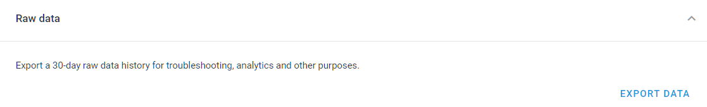
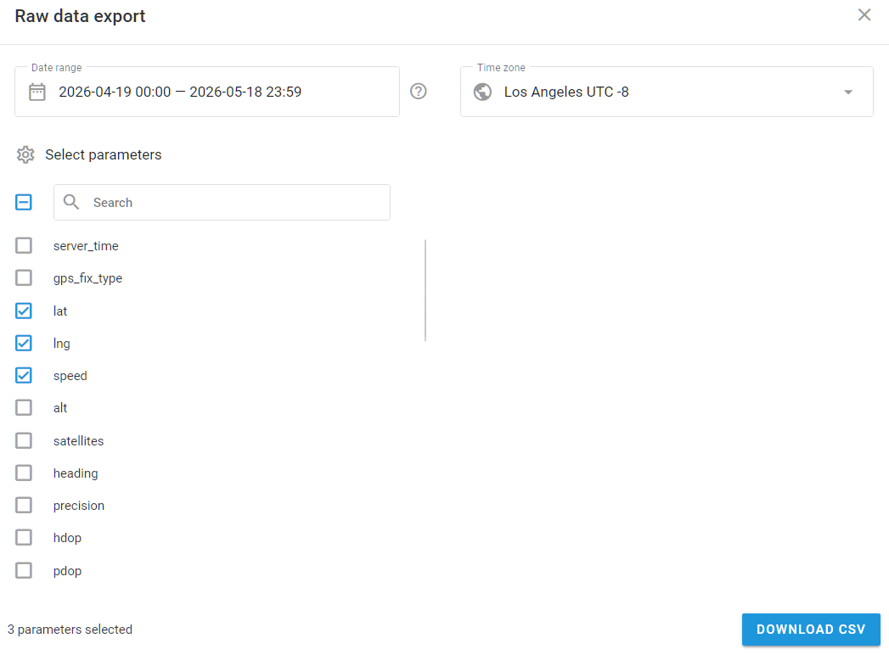
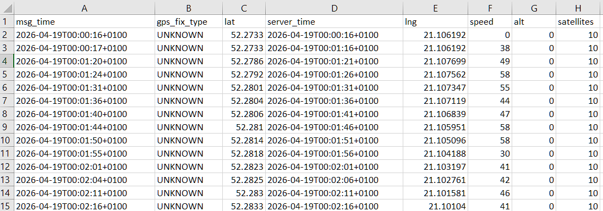

# Raw data

The raw data export tool in Navixy allows you to download parsed and decoded data from any GPS device on the Navixy platform in CSV format. This feature is essential for device diagnostics, data analytics, and integrating data with AI and ML programs.

<figure><figcaption>
Raw data block
</figcaption></figure>

## Overview

With the raw data export tool, you can:

* **Download parsed data** from any GPS device on the platform
* **Select specific parameters** to include in your CSV file, with an easy-to-use search function
* **Access historical data** without needing to activate data saving in advance
* **Adjust timestamps** to your preferred timezone, making it easier to manage data across different regions

The output of the raw data consists of all decoded information from the proprietary protocols of the device model. Once decoded, the data is stored in a universal format, including key details such as location and sensor readings. The data is provided in the CSV format for easy access and integration.

## Availability

Appears for users with device-edit rights, where the deployment has the raw-data feature enabled. History is limited to roughly the **last 29–30 days**, and you can include up to **1,000 columns** per export.

## How to use raw data export

Start by going to the **Devices and settings** module and locating the device. Then click the **Export data** button in the **Raw data** block. This opens the **Raw data export** tool. Choose the date range, timezone, and parameters that must be included in the CSV file.

To avoid accidental window closing, the **Raw data export** tool can only be closed by clicking **X** in the top-right corner. Additionally, if you haven't switched devices or refreshed the page, the tool remembers your previously selected settings. This feature makes it easy to review GPS device or sensor settings, return, and continue working.

### Selecting a date range

You can select up to the last 30 days or more, depending on your plan. Dates can be chosen either by clicking on the calendar or manually entering them. Specific times can also be set. Here are some quick selection options:

* Yesterday
* Last week
* Last 30 days

Clicking on these will automatically set the appropriate date range.

To simplify the process, a counter shows how many days you've selected. If you attempt to select a date more than 30 days in the past, you'll receive a message, and the selection button will be disabled.

### Choosing a timezone

The timezone defaults to the user’s account timezone, but can be adjusted by:

* Choosing from a list of available time zones.
* Entering the timezone name.
* Inputting the timezone offset (e.g., -8, +2).

### Selecting parameters

The available parameters vary by device model and include all parameters integrated into the platform for each model. Up to 1000 parameters can be selected per file.

Options for parameter selection include:

* **Select all**: Click the checkbox to select all parameters.
* **Select specific parameters**: Use the checkboxes next to each parameter.
* **Search**: Find specific parameters by typing their name or part of their name.

For multiple inputs of the same type, the system prioritizes the input with the largest index number. You may specify which indices to include by entering numbers separated by commas or defining a range using a dash (e.g., “1-2, 4, 7”).

A count of selected parameters is displayed, and each chosen parameter will add a column to the CSV file.

<figure><figcaption>
Raw data export tool file configuration window with chosen parameters
</figcaption></figure>

## How to read the raw data file

After selecting the necessary parameters, click **Download CSV** to download the file.

* The file can be opened with any text editor or table viewer that supports CSV format. Columns are separated by commas.
* The file name includes the device ID, device label, and the specified date and time range.
* Each row (starting from the second row) represents a message sent from the device to the platform. The first row contains the message time in the chosen timezone, followed by the selected parameters.

<figure><figcaption>
Raw data file columns example
</figcaption></figure>

This tool is essential for diagnostics and analytics, providing detailed insights into your device data.
