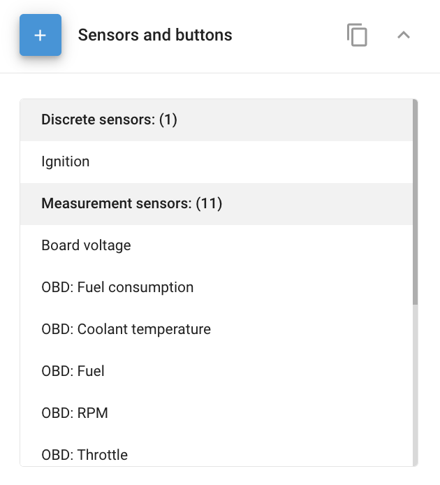

# Vehicle sensors

The **Sensors and buttons** block in Navixy allows you to manage and configure various sensors connected to your GPS devices from the Navixy platform standpoint. Use it to monitor vehicle parameters such as fuel levels, temperature, and engine diagnostics directly through the Navixy platform.

The **Sensors and buttons** block is located in the **Devices and settings** module, which you can access by clicking the corresponding item in the main menu.

The block provides an overview of the number of sensors already connected to the selected device. Expanding the panel lets you add new sensors or edit existing ones.

The number and type of sensors you can connect depend on the GPS device model. For example, certain devices allow you to configure data parameters transmitted via the CAN bus or OBDII diagnostic connector.

## Availability

The **Sensors and buttons** block appears when the device model has inputs (digital, analog, or RS232).

## Adding and editing sensors

To manage your sensors, you can use the following buttons:

* **Add**: Allows you to add a new sensor
* **Edit**: Lets you modify the parameters of an existing sensor
* **Delete**: Removes the selected sensor from the system

### Sensor types

<table data-view="cards"><thead><tr><th>Type</th><th>What it's for</th><th data-hidden data-card-target data-type="content-ref"></th></tr></thead><tbody><tr><td><h4>Discrete sensors</h4></td><td>Binary states like ignition, doors, or alarm on or off.</td><td><a href="discrete-sensors/">discrete-sensors</a></td></tr><tr><td><h4>Measurement sensors</h4></td><td>Continuous values like fuel level, temperature, or RPM.</td><td><a href="measurement-sensors/">measurement-sensors</a></td></tr><tr><td><h4>Aggregation sensors</h4></td><td>Combine several sensors into one value by average or sum.</td><td><a href="aggregation-sensors.md">aggregation-sensors.md</a></td></tr><tr><td><h4>Virtual sensors</h4></td><td>Computed values derived from another input or state.</td><td><a href="virtual-sensors/">virtual-sensors</a></td></tr><tr><td><h4>Specialized sensors by manufacturer</h4></td><td>Galileosky, Teltonika, and CalAmp-specific sensors.</td><td><a href="specialized-sensors-by-manufacturer/">specialized-sensors-by-manufacturer</a></td></tr></tbody></table>

### Copying sensor settings

To streamline configuration, you can copy sensor settings from one device to another, provided the devices are of the same model. This is particularly useful when managing large fleets with similar vehicle types.

**Steps to copy sensor settings:**

1. Click the copy button (📋).
2. Select the devices to which you want to apply the copied settings.
3. Click **Apply**.


Copying sensor settings will overwrite the current settings on the selected devices. Ensure that you only select the devices you intend to update.

