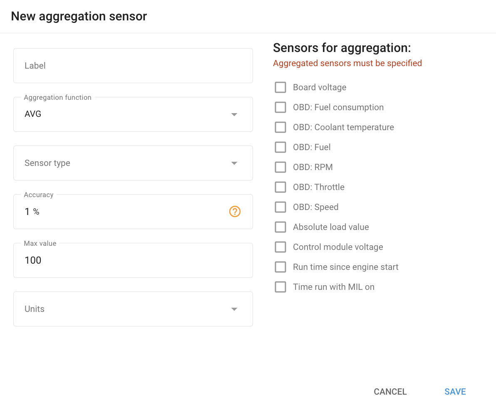

# Aggregation sensors

The **Aggregation sensor** **widget** in Navixy is a powerful tool that allows you to combine data from multiple sensors and process it using an aggregation function. This functionality is particularly useful in scenarios where multiple sensors are used to monitor similar parameters, such as fuel levels in a vehicle.

## Aggregation function options

The two available aggregation functions are **Average (AVG)** and **Sum (SUM)**.

* **AVG (Average)**: This function calculates the average value of the selected sensors. It is useful when you want to smooth out the readings from multiple sensors, providing a more stable and representative value.
* **SUM (Sum)**: This function adds up the values of the selected sensors. It is ideal when the total value of a parameter needs to be monitored, such as the combined fuel level from two tanks.

## Practical examples: multiple fuel sensors in a vehicle

1. **Single tank with two fuel level Sensors**:

* **Scenario**: You have a large fuel tank with two sensors positioned at different points inside the tank.
* **Goal**: To get a more accurate reading of the overall fuel level by averaging the readings from both sensors.
* **Configuration**:
  * **Aggregation function**: Select **AVG**.
  * **Sensors for aggregation**: Choose the two fuel level sensors.
  * **Result**: The system will display the average fuel level, providing a balanced reading that compensates for any discrepancies between the two sensors.

2. **Two tanks with separate sensors**:

* **Scenario**: You have two fuel tanks that are separate, and each tank has its own fuel level sensor.
* **Goal**: To monitor the total fuel available across both tanks.
* **Configuration**:
  * **Aggregation function**: Select **SUM**.
  * **Sensors for aggregation**: Choose the sensors from both tanks.
  * **Result**: The system will sum the fuel levels from both tanks, giving you the total fuel available.

## Setting up the aggregation sensor

1. **Label**: Enter a name for your aggregation sensor that clearly identifies its purpose.
2. **Aggregation Function**: Select either **AVG** (for averaging) or **SUM** (for summing) depending on your needs.
3. **Sensor type**: Choose the type of sensor (e.g., fuel level).
4. **Accuracy**: Set the acceptable margin of error. For example, if the accuracy is set to 5% and the maximum value is 100 liters, changes of 5 liters or less will be ignored.
5. **Max value**: Set the upper limit for the aggregated value. This prevents the aggregated reading from exceeding a certain threshold.
6. **Units**: Set the unit of measurement (e.g., liters).
7. **Sensors for Aggregation**: Select the individual sensors whose data you want to aggregate.
8. **Save**: After configuring the sensor, click **Save** to apply the settings.

This configuration enables you to effectively monitor and manage data from multiple sources, enhancing the precision and utility of your fleet management and telematics solutions.
