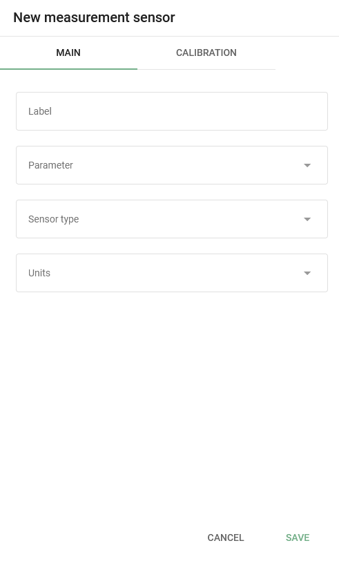
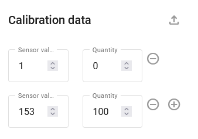
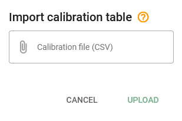
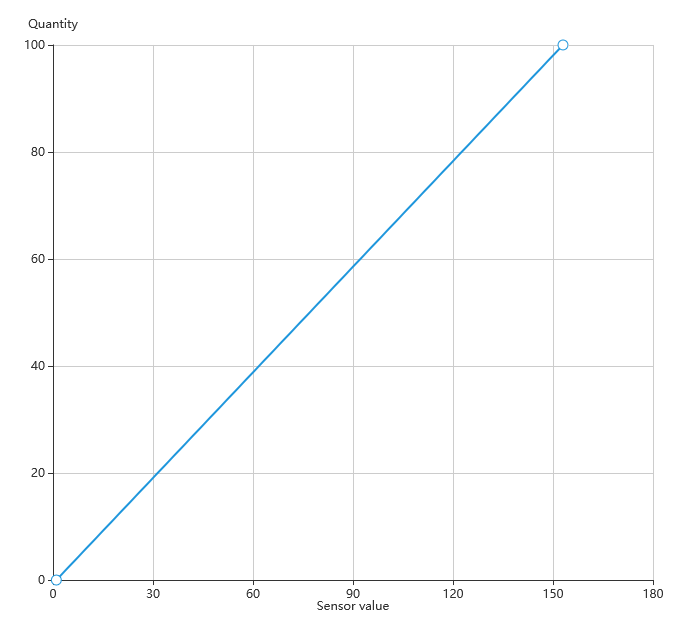
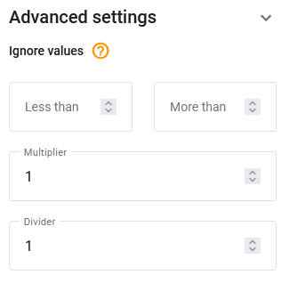

# Measurement sensors

Measurement sensors turn a device's continuous inputs into meaningful values, such as fuel level, temperature, RPM, or voltage, with units and a calibration table that maps raw sensor readings (the unprocessed electrical signal the device sends) to real-world quantities.

## Availability

Available when the device model has inputs.

## Adding a measurement sensor

To add a measurement sensor, click  and select **Measurement sensor** in the pop-up menu.

Configure the required sensor parameters:

* **Label**: Enter the sensor label as it appears in Navixy. It can be any name of your choice.
* **Parameter**: Choose the input to which the sensor is connected (number and types of inputs available are determined by device model).
* **Sensor type**: Choose the sensor type.
* **Units**: Choose the measurement units. You can select available units from the drop-down list or specify custom ones.
* **Additional parameters**: Only appear when the specific type of sensor is chosen. For example, for a fuel sensor, you can adjust the accuracy and threshold parameters for use in drain detection.

## Adding calibration data

After all parameters are set, you must enter the calibration data. Learn more about this process in the [Sensors setup and configuration guide](https://app.gitbook.com/s/IgDb43gtyXcm1Av4h1np/vehicle-telematics-technology/fuel-management/fuel-control-in-navixy/sensors-setup-and-configuration).

1. First, create a corresponding list of raw values of the measuring sensor (e.g., volts) and the actual value that the sensor is measuring (e.g., liters).
2. Click  to add rows to the table.
3. In the created line, fill in the **Sensor value** field with the obtained value and the **Quantity** field with the corresponding measured quantity.
4. Click  to delete a row.

5. Click  to upload the calibration table file.

Click **Advanced settings**  to access additional settings, such as **Ignore values** and **Multiplier**.

* **Ignore values:** Allows you to adjust a "valid" range of raw measurement values (the unprocessed signal from the device). Any values above and below the range are omitted. For example, this can be used for skipping the fuel sensor's zero values when the ignition is off.
* **Multiplier:** Used to correct raw data values from the sensor by multiplying them by a fixed number (for example, 0.1 to scale millivolt readings down to volts).

### **Filtering order**

Keep in mind that the **Less than** and **More than** restrictions are applied before the **Multiplier.** Navixy processes each incoming sensor value in this fixed order:

1. Ignore values (**Less than** and **More than**)
2. **Multiplier**
3. **Calibration table**

For example, the incoming raw value from the device is 1000, the ignore-values boundaries are 100 (minimum) and 3000 (maximum), and the multiplier is 0.2.

In this case, the value passes the min/max check, is multiplied by 0.2 and becomes 200. The calibration table then takes 200 as the source value and converts it into the final quantity shown in the platform. If an incoming value exceeds 3000, it is discarded at the boundary step and no multiplication or calibration applies.

The numbers here are given as a sample. You may have other settings, but the principle remains.

### **Graph**

As you enter data into the table, the graph is plotted.

To confirm your changes, click **Save**.

### **Raw sensor data storage**

By default, raw sensor data is stored on the Navixy platform. This allows users to recalibrate the represented sensor data of the past device sensor history. Whenever the multiplier, maximum ("less than"), minimum ("more than"), or calibration table data are changed, the platform recalculates the history and represents the data according to the new settings. The advantage of this approach is that the user can always recalibrate the table, change the sensor settings, and build a report based on the recalculated data "on the fly".

