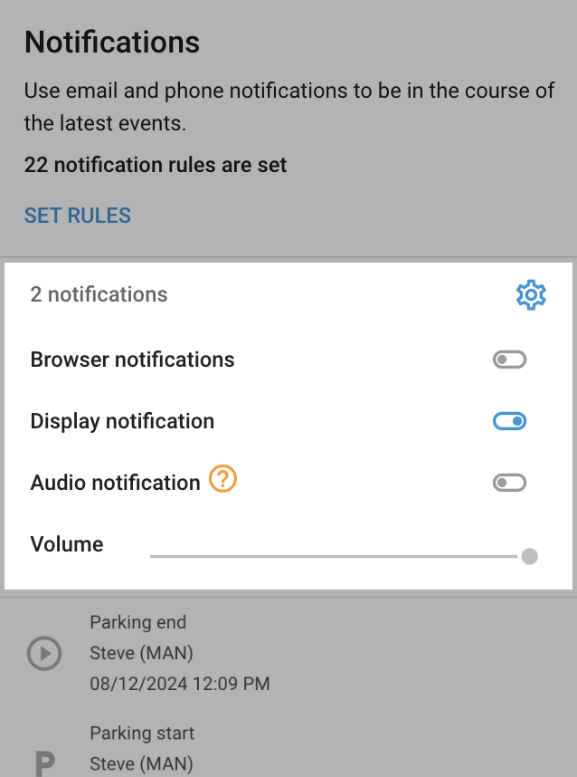

# Alerts

Using **Rules and Notifications** in Navixy, you can detect various events, view their details, and get notified about them. These features help users monitor and manage their fleet, assets, and field employees more effectively. Events can range from simple geofence breaches to complex scenarios like anti-theft alerts or fuel theft prevention. See the [examples](./#examples) for more details.

## Events list

The list of events, displayed to the left of the **Alerts** module, contains notifications about all events happening to the objects in your fleet. Unread notifications are marked bold. New notifications are added as you scroll down.

### Event details

By clicking on an event in the list, you will see the following information:

* **Event description**: The notification message with details about the event.
* **Location**: The place where the event occurred, if applicable.
* **Timestamp**: The date and time the event occurred.
* **Video monitoring:** A video recording of the event, if available and uploaded into the cloud. Only available for devices with this functionality.
* **Additional details:** Further information depending on the type of monitored event, such as the temperature threshold or the driver assigned to the vehicle at the time of the event.

### Types of detected events

Navixy offers a comprehensive set of events structured into various categories to help you monitor and manage your fleet, assets, and field employees efficiently. Below are the categories of the events:

* [**Device power**](device-power/): Monitor device power status, including battery and external connections
* [**Device connection**](device-connection/): Track device connectivity to the cell network or the platform
* [**Device positioning**](device-positioning/): Monitor GPS information
* [**Security**](security/): Events related to vehicle security and tampering
* [**Safety**](safety/): Events related to driver safety
* [**Movement monitoring**](movement-monitoring/): Track vehicle movement, speed, and route
* [**Scheduling and dispatching**](scheduling-and-dispatching/): Manage vehicle and personnel scheduling
* [**Vehicle efficiency**](vehicle-efficiency/): Monitor fuel consumption and efficiency
* [**Inputs and outputs**](inputs-and-outputs/): Track status of connected sensors and equipment

### Where events are computed

In IoT systems, events can be detected either on the device side or on the server side:

* **Events detected on the device side**: Triggered by the sensors or inputs of the GPS tracking device installed in the vehicle or asset. These events occur due to physical actions or conditions, such as pressing an emergency button, detecting a car crash, or registering harsh driving behavior. The specific events detected depend on the capabilities of the device being used.
* **Events detected on the server side**: Generated by analyzing data received from the device against predefined rules and conditions set by the user. These events are identified through server logic, such as detecting geofence breaches, route deviations, scheduled maintenance alerts, or unusual fuel level changes. The server processes the data and triggers alerts based on the configured criteria.

### Accessing event history

Event history can be accessed across different platforms, allowing users to review past events and alerts.

* **Web app**: Access the notification history through the **History** section in the **Tracking** module. Filter by date, event type, and other criteria.
* **Mobile app**: View recent notifications and history in the mobile app.
* **Reports**: Generate detailed reports on past events and notifications for analysis and record-keeping.

## Notification rules

Rules in Navixy are predefined conditions that trigger events when met. To set up, edit, or delete rules you want to monitor and get notified about, choose **Alerts** from the main menu.

How to manage rules

To access the notification rules setup in Navixy, go to the left menu and choose **Alerts**. This will open the Notification panel. Click on **Set rules**, and the Alert rules interface will appear.

In the **Rules** interface, you can:

* **View existing rules**: The interface will display a list of all existing alert rules.
* **Select or create new rules**: You can select existing rules to edit or create new rules by clicking the **+** button.
* **Rule settings**: For each rule, you can configure the following settings:
  * **Name and Type**: Set the rule name and description.
  * **Settings**: Define the specific conditions and parameters for the rule.
  * **Notifications**: Configure how and to whom the notifications will be sent.
  * **Schedule**: Set the schedule for when the rule will be active.

### Binding rules to objects

A rule can be bound to one or multiple objects, such as individual vehicles or groups of vehicles, depending on the alert. This flexibility allows you to apply the same rule across various assets, ensuring consistent monitoring and notifications.

How to bind a rule to objects

* **Open the rule settings**: Navigate to the **Alerts** section from the main menu and select the rule you want to configure.

- **Select objects**: In the **Rule settings** panel, you will see a list of available objects on the left side. These objects can be individual vehicles or groups of vehicles organized by departments.

* **Choose objects**: Check the boxes next to the objects or groups you want to bind the rule to. For example, you can select individual vehicles like "Oliver (Chevrolet)" and "Marisol (Nissan)," or entire groups such as "Sales department."

### Name and Type

In the **Name and Type** subsection of the dialog, you can specify the following details for your notification rule:

* **Rule type**: Select one of the many event types that can be monitored with the platform.
* **Rule label**: Provide a name for the rule to easily identify it. Example: "Vehicle is out of the depot ABC."
* **Rule description**: Add a brief description of the rule to explain its purpose or any additional details. Example: “This rule triggers an alert when a vehicle exits the designated depot ABC area, helping to monitor unauthorized movements.”

Using the label and description helps you organize and manage many rules effectively.

### Receiving notifications

You can receive notifications through various channels to ensure you are promptly informed about important events. These channels include:

* **SMS notifications**: Immediate alerts sent to the user's mobile phone.
* **Email notifications**: Detailed notifications sent to the user's email address.
* **Push notifications**: Instant alerts through the X-GPS mobile app.
* **In-App notifications**: Alerts displayed within the Navixy web interface.

The notification text here will help identify specifically what alert was triggered. The notification message here will be what appears when triggered.

### Schedule

In the **Schedule** section, you can define when your notification rules are active or inactive. This allows for precise control over when alerts should be triggered, based on your specific operational needs.

Configuring schedule

Here’s how you can configure the schedule:

* **Template**: Select a pre-defined schedule template, if available, to quickly apply common scheduling patterns, such as Weekends, Weekdays, and Every day.
* **Active periods**: The blue blocks represent the times when the rule is active and will trigger notifications. You can set these blocks for specific hours of the day and days of the week.
* **Inactive periods**: The gray blocks indicate times when the rule is inactive and will not trigger notifications. This helps avoid unnecessary alerts during non-operational hours.

To customize the schedule, simply click on the desired time blocks to toggle between active and inactive states. This flexibility ensures that you receive notifications only during relevant times, reducing the chances of alert fatigue and enhancing the effectiveness of your monitoring efforts.

### Suspending and reactivating rules

Users can temporarily suspend rules and resume them as needed. This feature is useful during periods when the rules' actions are not required, such as during maintenance or seasonal inactivity.

How to suspend an existing rule

1. **Navigate to alerts**: Go to the **Alerts** section from the main menu.
2. **Select the rule**: Find the rule you want to suspend in the list of alert rules.
3. **Suspend the rule**: Click on the pause icon next to the rule name to suspend it.

To reactivate the rule, click the play icon on the rule.

## Examples

This section contains several examples showcasing the use of event notifications in various scenarios.

### Geofence alerts

Geofence alerts are a powerful feature in Navixy that help users monitor the movements of their vehicles and assets within predefined geographical boundaries, known as geofences. This functionality is essential for ensuring operational efficiency, security, and compliance with organizational policies.

How geofence alerts work

A geofence is a virtual perimeter set on a map around a specific geographic area. This area can be of any shape and size, such as a circular radius around a point or a more complex polygon that outlines a specific region.

When a vehicle or asset equipped with a GPS tracking device crosses the boundary of a geofence, an event is triggered. The system then logs this event and sends notifications to the user according to the predefined settings.

**Setting up geofence alerts**

1. **Define the geofence area**:
   1. **Circular geofence**: Set a radius around a central point, such as a warehouse or office.
   2. **Polygonal geofence**: Draw a complex shape on the map to cover areas like construction sites, delivery zones, or city districts.
   3. **Route geofence:** Create a narrow, elongated geofence that follows a specific route or path, such as a highway, railway, or pipeline, to monitor movement along that route and detect deviations.

2) **Configure alert conditions**:
   1. **Entry alerts**: Notify when a vehicle or asset enters the geofence.
   2. **Exit alerts**: Notify when a vehicle or asset leaves the geofence.

3. **Set notification preferences**:
   1. Choose the channels through which notifications will be sent, such as SMS, email, push notifications, or in-app alerts.
   2. Customize the message content to include relevant details like vehicle ID, location, time of the event, and more.

**Practical use of geofence alerts**

* **Fleet management**: Ensure vehicles adhere to predefined routes and detect unauthorized trips or deviations from the assigned routes.
* **Asset security**: Monitor the location of valuable assets and receive immediate alerts if they are moved outside a secure area.
* **Employee management**: Track field employees and ensure they are within designated work zones during their shifts.
* **Operational efficiency**: Optimize logistics by monitoring entry and exit times at key locations like warehouses and delivery points.

**Example scenario**

A delivery company sets up a geofence around its main warehouse. When a delivery truck enters this geofence, an entry alert is triggered, notifying the warehouse manager via push notification. This allows the manager to prepare for unloading the truck. If the truck leaves the geofence, an exit alert is sent to the security team, indicating potential unauthorized use or theft.

By using geofence alerts, organizations can enhance their operational control, improve security, and ensure compliance with internal and external regulations.

### Car anti-theft alerts

Car anti-theft alerts are a crucial feature in Navixy designed to enhance the security of vehicles by detecting unauthorized movements or tampering. This functionality provides peace of mind to vehicle owners and fleet managers by ensuring immediate action can be taken in case of suspicious activities.

How car anti-theft alerts work

Car anti-theft alerts are triggered when specific conditions indicative of unauthorized use or tampering are met. These conditions can be customized based on the user's requirements and the security needs of the vehicle.

**Setting up car anti-theft alerts**

1. **Define unauthorized movement criteria**:
   1. **Ignition detection**: Monitor the vehicle's ignition status to detect if the vehicle is started.
   2. **Movement detection**: Use GPS tracking to identify when a vehicle moves from its parked location unexpectedly.
   3. **Time-based restrictions**: Set alerts for vehicle movement during off-hours or outside of designated operating times.

2) **Detecting tampering**:
   1. **Door and window sensors**: Install sensors to detect if doors or windows are opened forcefully or without proper authorization.
   2. **Battery disconnection**: Set alerts for instances when the vehicle’s battery is disconnected, which is a common method used by thieves to disable tracking systems.
   3. **GPS signal interference**: Monitor for jamming or interference with the GPS signal, indicating possible tampering.

3. **Configure alert notifications**:
   1. **Instant notifications**: Set up SMS, email, push notifications, or in-app alerts to be sent immediately when unauthorized activity is detected.
   2. **Alert recipients**: Designate specific individuals or teams (e.g., security personnel, fleet managers) to receive these alerts.
   3. **Alert content customization**: Include essential details in the notification, such as the vehicle's current location, time of the event, and the type of unauthorized activity detected.

**Practical uses of car anti-theft alerts**

* **Private vehicle security**: Owners of private vehicles can use anti-theft alerts to protect their cars from theft or unauthorized use, especially in high-risk areas.
* **Fleet management**: Fleet managers can ensure the security of their vehicles, preventing unauthorized use by employees or theft from parking lots and depots.
* **Rental services**: Car rental companies can monitor their vehicles to detect and respond to unauthorized movements or tampering, safeguarding their assets.
* **Logistics and delivery**: Companies involved in logistics and delivery can protect their vehicles and the valuable goods they transport from theft or unauthorized access.

**Example scenario**

A logistics company has built security-specific alerts for its delivery trucks. One evening, after business hours, the system detects that the ignition of one of the trucks has been turned on. An instant alert is sent to the fleet manager via push notification, SMS, and email, indicating unauthorized ignition.

Simultaneously, GPS tracking shows that the truck is moving away from its designated parking spot. The fleet manager immediately contacts the local authorities and provides the real-time location of the truck. Thanks to the timely alert, the authorities intercept the vehicle, preventing theft and securing the company's assets.

By utilizing car anti-theft alerts, organizations can significantly enhance the security of their vehicles, quickly response to potential theft, and minimize the risk of asset loss.

### Temperature control alerts

Temperature control alerts are a helpful feature in Navixy designed to ensure that sensitive cargo is transported under optimal conditions. This functionality is crucial for industries like pharmaceuticals, food and beverage, and other sectors where maintaining a specific temperature range is essential to preserving the quality and safety of the products.

How temperature control alerts work

Temperature control alerts monitor the temperature of cargo in real-time using sensors installed within the transportation vehicle. When the temperature exceeds or drops below the predefined limits, an alert is triggered. This allows for immediate action to be taken to rectify the situation and prevent damage to the cargo.

**Setting up temperature control alerts**

1. **Install temperature sensors**:
   1. **Sensor placement**: Place temperature sensors in strategic locations within the cargo area to ensure accurate and comprehensive monitoring.
   2. **Sensor calibration**: Ensure sensors are calibrated correctly to provide precise temperature readings.

2) **Define temperature limits**:
   1. **Upper and lower thresholds**: Set maximum and minimum temperature limits based on the requirements of the specific cargo.
   2. **Temperature ranges**: Define acceptable temperature ranges to cater to different types of cargo that may have varying requirements.

3. **Configure alert conditions**:
   1. **Real-time monitoring**: Continuously monitor the temperature and trigger alerts if it deviates from the set limits.
   2. **Duration-based alerts**: Set alerts to trigger if the temperature remains outside the acceptable range for a specified duration, indicating a persistent issue.
   3. **Multiple thresholds**: Define multiple thresholds for different levels of alerts (e.g., warning, critical) based on the severity of the temperature deviation.

4) **Set notification preferences**:
   1. **Notification channels**: Choose the channels through which alerts will be sent, such as SMS, email, push notifications, or in-app alerts.
   2. **Alert recipients**: Specify individuals or teams responsible for responding to temperature alerts (e.g., quality control, logistics managers).
   3. **Alert content customization**: Include essential details in the notifications, such as object label, current temperature, location, time of the alert, and recommended actions.

**Practical uses of temperature control alerts**

* **Pharmaceutical industry**: Ensure that vaccines, medications, and other temperature-sensitive pharmaceuticals are transported within the required temperature range to maintain their efficacy and safety.
* **Food and beverage industry**: Prevent spoilage and ensure food safety by maintaining the correct temperature for perishable goods like dairy, meat, and produce during transportation.
* **Chemical industry**: Safeguard temperature-sensitive chemicals from degradation or hazardous reactions by monitoring and controlling transportation conditions.
* **Cold chain logistics**: Optimize the cold chain process by ensuring that all links in the supply chain maintain the required temperature conditions, from production to delivery.

**Example scenario**

A pharmaceutical company uses Navixy's temperature control alerts to monitor the transport of vaccines. These vaccines must be kept between 2°C and 8°C to remain effective. The company installs temperature sensors in its refrigerated trucks and sets the upper and lower temperature thresholds accordingly.

During a delivery, one of the trucks encounters a malfunction in its refrigeration unit, causing the temperature to rise above the 8°C limit. The system immediately triggers an alert, sending notifications to the quality control team via SMS, email, and push notifications.

The notification includes details such as the current temperature (10°C), the truck's location, and the time of the alert. The quality control team contacts the driver and instructs them to take corrective actions, such as stopping at the nearest facility with refrigeration repair services.

Additionally, the team arranges for an alternative vehicle to continue the delivery, ensuring the vaccines remain within the safe temperature range. The quick response prevents potential spoilage of the vaccines, saving the company from significant financial loss and maintaining the integrity of their products.

By using temperature control alerts, organizations can ensure the safe and effective transportation of sensitive cargo, minimize the risk of spoilage or damage, and comply with industry regulations.

### Fuel theft prevention alerts

Fuel theft prevention alerts are a critical feature in Navixy designed to protect vehicles from unauthorized fuel siphoning and to ensure efficient fuel usage. This functionality helps fleet managers and vehicle owners monitor fuel levels in real-time and receive immediate alerts when suspicious drops in fuel levels are detected, allowing for quick intervention and mitigation of losses.

How fuel theft prevention alerts work

Fuel theft prevention alerts are triggered when the fuel level in a vehicle's tank drops unexpectedly, indicating possible theft or unauthorized usage. The system uses data from fuel level sensors installed in the vehicle to monitor and analyze fuel levels continuously.

**Setting up fuel theft prevention alerts**

1. **Install fuel level sensors**:
   1. **Sensor placement**: Install sensors within the fuel tank to provide accurate readings of the fuel level.
   2. **Sensor calibration**: Ensure that the sensors are correctly calibrated to reflect precise fuel levels, accounting for the tank's shape and size.

2) **Define alert conditions**:
   1. **Unexpected drops**: Set conditions to detect significant drops in fuel levels that occur outside of normal usage patterns, such as when the vehicle is parked or not in use.
   2. **Threshold limits**: Establish specific thresholds for fuel drops (e.g., more than 10 liters in a short period) to trigger alerts.
   3. **Time-based alerts**: Configure alerts to be more sensitive during times when the vehicle should not be in use, such as after hours or during weekends.

3. **Configure notification settings**:
   1. **Notification channels**: Choose the channels for receiving alerts, such as SMS, email, push notifications, or in-app alerts.
   2. **Alert recipients**: Designate individuals or teams (e.g., fleet managers, security personnel) responsible for responding to fuel theft alerts.
   3. **Alert customization**: Include detailed information in the alerts, such as the vehicle ID, current location, time of the fuel drop, and the amount of fuel lost.

**Practical uses of fuel theft prevention alerts**

* **Fleet management**: Protect fleet vehicles from fuel theft, reducing operational costs and ensuring accurate fuel usage records.
* **Stationary equipment:** Safeguard stationary equipment such as diesel electric generators from unauthorized fuel siphoning, ensuring consistent operation and preventing costly fuel losses.

**Example scenario**

A logistics company utilizes Navixy's fuel theft prevention alerts to monitor their delivery trucks. They have installed fuel level sensors in all their vehicles and configured the system to detect unexpected drops in fuel levels, especially during non-operational hours.

One evening, after all deliveries have been completed and the trucks are parked at the company’s depot, the system detects a sudden drop of 15 liters in the fuel level of one of the trucks. This unexpected drop triggers an immediate alert, sending notifications to the fleet manager via SMS, email, and push notifications.

The alert includes the truck's ID, its location within the depot, the time of the fuel drop, and the amount of fuel lost. The fleet manager quickly contacts the on-site security team to investigate the situation. The security team finds evidence of tampering with the fuel tank and is able to apprehend the suspect, preventing further fuel theft.

By using fuel theft prevention alerts, the logistics company can effectively monitor and protect its fuel assets, reducing losses due to theft and ensuring efficient fuel management. This proactive approach not only saves costs but also helps maintain the integrity of their operations.

## Automatically created rules

When you [activate](../quick-start/activate-gps-device.md) a new device on the Navixy platform, the system automatically creates some rules based on the device’s capabilities, such as a "Pressing SOS Button" rule for a personal GPS tracker with an emergency button. This automation saves you time by setting up essential monitoring features right from the start, ensuring that your device is ready for use immediately.

These pre-configured rules are fully customizable—you can easily add notifications, adjust settings, or suspend any rule if it’s not needed. This streamlined approach enhances security and user experience, allowing you to focus on what matters most without the hassle of manual setup.

## Customizing in-browser notifications

You can customize your in-browser event notifications by clicking the gear icon in the event list. To access and customize notification settings, click “Alerts” in the left menu to open Notifications, then click the gear icon.

* **Browser notifications:** Enable this to receive event alerts directly within your operating system's notification center (e.g., Windows Action Center). Your browser will prompt you to allow these notifications.
* **Display notifications:** New events will appear as pop-up notifications in the upper right corner of the monitoring platform page.
* **Audio notification:** Each new event will trigger a sound alert within the browser.
* **Volume:** Adjust the volume of the sound notifications in your browser to suit your preference.
