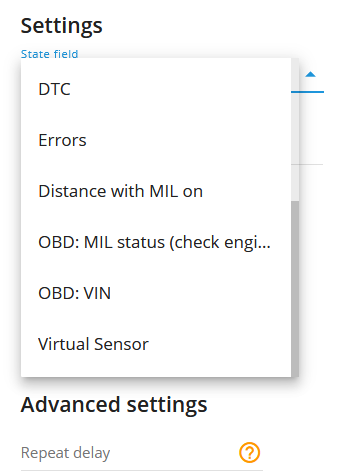
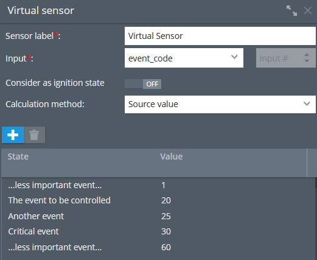

# State field value

### Description

The "State field value" alert type is designed to monitor the status of various object states, such as doors, handbrake, airbag, as well as special event states like ADAS (Advanced Driver Assistance Systems), DTC (Diagnostic Trouble Codes), and errors. When the platform receives the expected value in the status field for a particular state, the user will receive a notification.

By utilizing the "State field value" alert, users can stay informed about critical object states and event occurrences in real-time. This functionality enhances safety, security, and maintenance processes, ensuring prompt action can be taken when specific states or events are detected.

Users can generate event reports that summarize the occurrences of specific states or events over a defined period. For example, they can analyze the frequency of door openings, instances of airbag deployment, or the occurrence of ADAS activations. These reports help identify patterns, trends, or anomalies in the data, facilitating maintenance planning, safety assessments, and operational improvements.

## Settings

For a quick setup of the state change notification:

* Choose the necessary state field and set an expected value for it. For example, state field = Trunk, expected value = Opened.
* Do not enable the "Allow repeat" option and leave the "Repeat delay" field empty. In this case, you will be notified only if the value changes.

For a quick setup of the event change notification:

* Choose the necessary state field and set an expected value for it. For instance, state field = event\_code, expected value = 7 (over speed alarm for Howen Technologies devices). For each event code, a separate state field rule should be created. All expected values can be found on the device manufacturer's website or can be obtained directly from the manufacturer through a request to their support team.
* Enable allow repeat to get notifications for the same values and set repeat delay (how often the same incoming values will trigger the rule event notification). For example, if you want to receive speeding notifications for no more than every 30 minutes, set the repeat delay to 1800 seconds.

**State field:**

Here the user specifies the field to be monitored. In our example it is Trunk. So, when the Trunk is Opened, as we define it in the expected value selector, the platform generates a notification event. The "Allow repeat" checkbox also affects behaviour but this setting is described below in this article.

**Expected value:**

Standard state fields (e.g. Trunk, Door, Seat Belt, etc) have intuitively expected value variants. It is usually Opened/Closed or Locked/Unlocked. However, if you want to receive a state field notification about some special event occurrences, the user should know what event code it would be sent from the device so that the platform knows what to expect in the event\_code incoming field.

For instance, a hardware key has a custom value that the platform will expect and notify the user after the A1DD3FC3452904D value arrives in the hardware\_key field.

**Allow repeat:**

If unselected, the event will be repeatedly triggered only if there was another incoming value received before the currently expected value AND the expected value comes in but in a new data packet. For example, if we have the checkbox unselected, whenever we receive that hardware key from the example above (A1DD3FC3452904D), the platform does not trigger the event notification until a different hardware key value arrived AND the expected value comes again.

This is how the "Allow repeat" if unselected works:

* 09:00 AM The last received key A1DD3FC3452904D
* 09:15 AM The platform receives a data packet with the same hardware\_key value (A1DD3FC3452904D). No notification is triggered
* 09:20 AM A new hardware\_key value arrived. Say, B99978233FDD1. No notification is generated because this value is not expected. But the internal switcher is ready now to yield notification when the A1DD3FC3452904D key arrives.
* 09:30 AM The platform receives a data packet with the A1DD3FC3452904D hardware\_key value. Notification is triggered now.

In short, notifications will be generated only on change but if the expected value arrives after another value.

If the option is selected, the scenario will be:

* 09:00 AM The last received key A1DD3FC3452904D
* 09:15 AM The platform received a data packet with the same hardware\_key value (A1DD3FC3452904D). Notification is triggered this time.
* 09:25 AM The platform received a data packet with the same hardware\_key value (A1DD3FC3452904D). Notification is triggered this time again.
* 09:34 AM A new hardware\_key value arrived. Say, B99978233FDD1. No notification is triggered, as the B99978233FDD1 key is not the expected one.
* 09:45 AM The platform received a data packet with the expected hardware\_key value (A1DD3FC3452904D). Notification is triggered this time.

In short, if the expected value in the previously defined state field arrives on the platform, it generates the notification event.

Please note, that if "Allow Repeat" is selected, the event will not occur more often than the "Repeat delay" timer allows. For the rule type of state field value, the default reset timer is 5 minutes and can be adjusted using the "Repeat delay" field.

**Bind zone to rule:**

Enables geofence rule binding.

**Map button:**

Shows bound geofences on the map.

**Repeat delay:**

Sets a custom reset timer in seconds for event notifications. For example, if you want to be notified no more often than once every 30 minutes, set the field to 1800 (seconds).

**Working with Virtual Sensors:**

The state field rule allows the selection of not only state fields but also virtual sensors.\
By selecting the appropriate virtual sensor and specifying the desired event from the virtual sensor table, users can receive notifications and include the event in reports. This allows businesses to customize and control the events they wish to be informed about, tailoring the monitoring system to their specific needs. This flexibility enhances the ability to track and manage critical or custom events, providing valuable insights and facilitating data-driven decision-making for various business operations. All the events from expected values are custom and can be created according to the users' needs. For further details regarding Virtual Sensors, kindly refer to the [Virtual Sensors](../../devices-and-settings/vehicle-sensors/virtual-sensors/) article.











### Notifications

**Emergency notification:**

is used for important events. A message on the screen and the sound signal can only be disabled by clicking on the notification. Please note, some browsers can block notification sound until user activity is recorded on the page.

**Push notifications:**

Receive push notifications on the mobile app and web interface.

**Add geofence name to the notification:**

Adds names of the specified geofences to the notification text. This option is available only when the "Inside" geofence binding radio button is selected on the "Settings" tab.

**SMS notifications:**

List of recipients for SMS notifications when the event occurs.

**Email notifications:**

List of recipients for email notifications when the event occurs.

### Schedule

Set a schedule for when the rule will run. If your schedule indicates that the event should not run some day or time period, it will not appear as a notification in the user interface, and notifications via SMS or email will not be sent. Additionally, you can choose a default template for quick scheduling.

### The platform specifics:

* The "State field" alert has a 5-minute reset timer, meaning the alert event will not occur more often than once every 5 minutes. If this type of event occurs in time the rule has been waiting for the reset, this event will be omitted by the platform, including the reports.
* The rule supports only one device per rule. This is due to the fact that multiple different sources of state fields can not be cross-referenced with multiple trackers.
