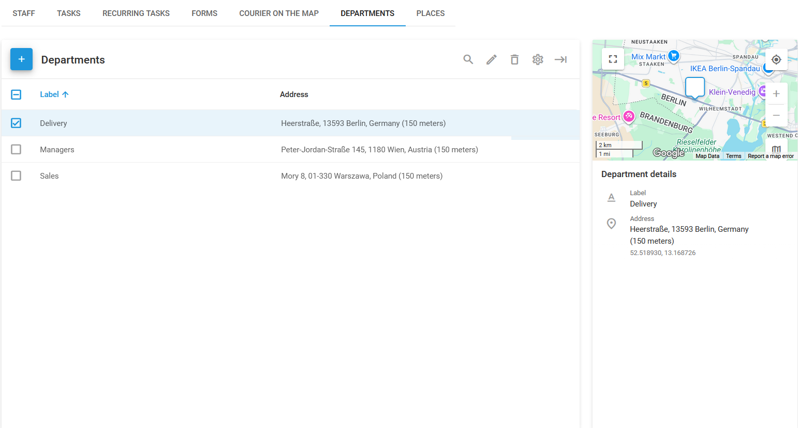
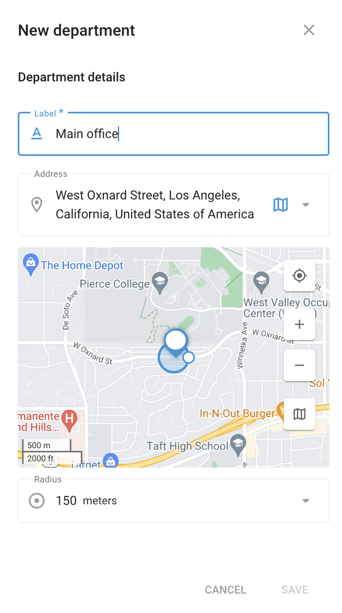

# Departments

The **Departments** page in Navixy's **Field service** module allows you to organize your workforce by categorizing employees into specific departments. This organizational structure helps streamline task assignments, reporting, and overall management of field operations.

You can assign employees to departments on the [Staff](staff.md#assign-employee-to-department) page.

<figure><figcaption>
Departments page
</figcaption></figure>

The department list is used to manage different departments in your organization. Each department can be labeled, such as "Delivery" or "Sales," to reflect the specific function of the team.

## How to create a new department



#### Go to Departments

Open the **Departments** page in the **Field service** module.



#### Start creating a department

Click **+** to open the department creation dialogue.



#### Enter department details

* **Label**: Provide a name for the department.
* **Address**: Enter the department's physical location or use the map to select a point.
* **Radius**: Define a radius around the department’s location. This helps in assigning tasks based on proximity to the department.



#### Finish creating the department

After filling in the necessary details, click **Save** to create the department.



Once a department is created, it will appear on the **Departments** page, where you can view its details, such as name and address. This page also allows you to edit or delete departments as needed.

By using the Departments feature, you can ensure that tasks are assigned to the appropriate teams, enhancing the efficiency and productivity of your field service operations.
