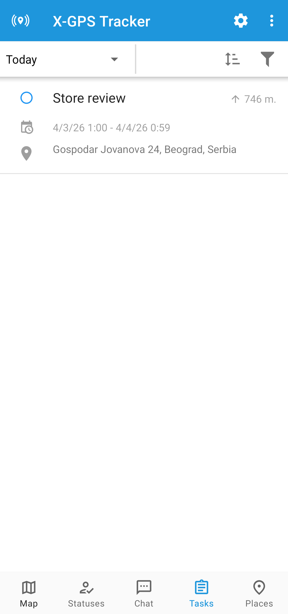
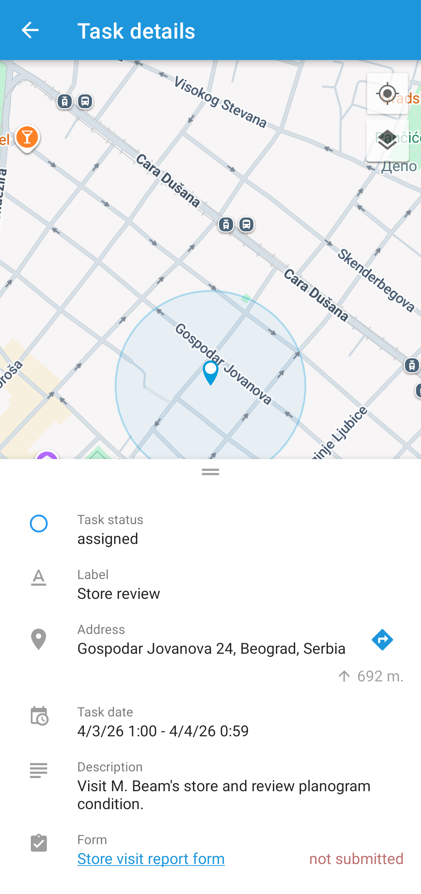
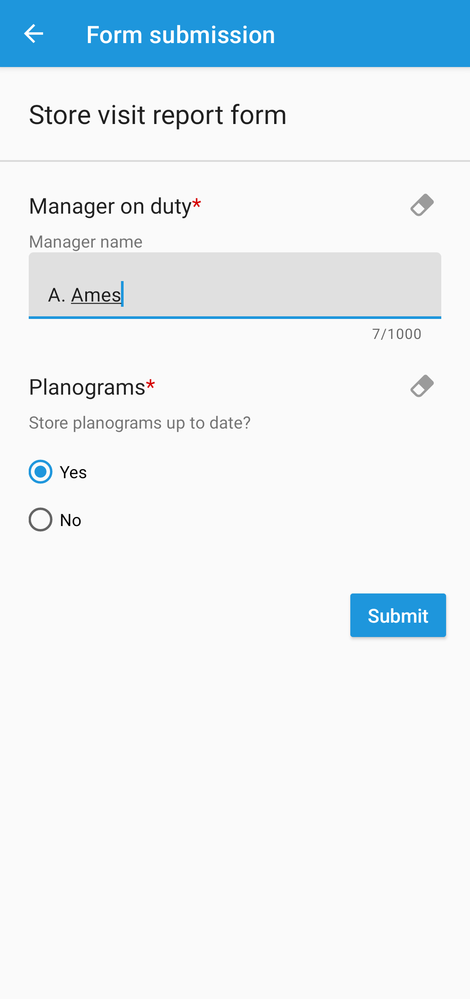

# Forms

**Forms** are electronic documents that can be attached to tasks, allowing employees to submit task results directly through the [X-GPS Tracker](../x-gps-mobile-apps/x-gps-tracker/) mobile app. These forms can include various types of fields such as text fields for client orders, inspection reports, and media sections for uploading photos and videos.

<figure><figcaption>
Forms page
</figcaption></figure>



## How to create a form

<figure><figcaption>
Creating a new form
</figcaption></figure>

To create a form in Navixy, follow the steps below. This process allows you to create as many forms as needed, ensuring they are tailored to the tasks your employees perform.



### Go to Forms

Open the **Field service** module from the main menu and select the **Forms** tab.



### Start creating a form

Click **+** to open the form creation dialogue.



### Configure a form

Choose the necessary components (e.g., text fields, checkboxes, dropdowns, date, rating, image, file attachment, signature, and section separators) from the left side of the screen. Customize the form to suit your company's specific workflow and tasks.



### Save the form



Two toggles are available when creating a form:

* **Use by default when creating a task**: If enabled, this form will be attached to new tasks by default unless another form is selected. In the form list, this form will be marked with a star.
* **Submit form only in the zone**: If enabled, the form can only be submitted when the employee is within a predefined geographic zone, ensuring that task reporting occurs at the correct location.

After saving, the created forms can be accessed through the form list.

.png>)

## How to attach a form to a task

<figure><figcaption></figcaption></figure>

To attach a form to a task, follow these steps:


For detailed information about creating a task, see [How to create a task](tasks.md#how-to-create-a-task).




### Open the Task creation window

Navigate to **Tasks** tab and click **+** to open the task creation dialogue.



### Select the employee responsible for completing the task

Select the driver who performs the task. You can add or configure drivers in **Fleet management → Drivers.**



### Select the task form

&#x20;Choose the form you created earlier from the dropdown list at the bottom of the window.



### Add task information

Provide other task details.



### Finalize task creation

Click **Save** to finish creating the task. The selected employee will receive the task with the attached form in the X-GPS Tracker mobile app, ensuring all necessary documentation is available during task execution.



## How to submit a form in X-GPS Tracker

Employees are required to fill out forms during or after completing a task. Follow these steps to complete and submit a form:



### Open X-GPS Tracker

Open the X-GPS Tracker app on your mobile device. If you don't have it set up, see [Invitation to X-GPS Tracker](../x-gps-mobile-apps/x-gps-tracker/invitation-to-x-gps-tracker.md) to learn how to receive access.



### Switch to Tasks

Switch to the **Tasks** screen to view the list of assigned tasks:\




### Select the task to open it

Tap the task to open its details:\




### Open the form

Tap the form attached to the task and fill in all mandatory fields:\




### Submit the form

Once all fields are filled, click **Submit** to send the form to the monitoring service. If your status is **Arrived**, the task status will automatically change to **Complete**.



## How to set up notifications for form submission

To ensure timely notifications when a form is submitted, configure alerts by following these steps:



### Go to Rules and alerts

Navigate to the [Rules and alerts](../events-and-notifications/) module.



### Go to **Alert rules**

Click **Set rules** to open the **Alert rules** section.



### Add a new rule

Start creating a new notification rule by clicking **+**.



### Select the objects

Select the objects to which the rule will apply.



### Select the rule type

Choose [Task performance](../events-and-notifications/scheduling-and-dispatching/task-performance.md) in the **Type** drop-down menu. You can also give the rule a name.



### Configure the rule

Check the **Form submitted** checkbox in the second alert group. You can also enable the **Form resubmitted** option that appears if **Form submitted** is checked.



### Configure notifications

Enter notification text, notification type (emergency or push), and notification recipients by SMS or email.



These settings ensure you stay informed about task progress and form submissions in real time.

## How to view completed forms

You can review and compare completed forms to assess employee performance and task outcomes by following these steps:



### Go to Forms

Open the **Field service** module from the main menu and select the **Forms** tab.



### Select the form

Select the form you wish to review and click **Submissions** on the right side or the **Submissions** button on the toolbar.

<figure><figcaption></figcaption></figure>



### View the submission page

<figure><figcaption></figcaption></figure>

The submission page allows you to review and download the submitted form or forms.&#x20;

To download the selected form in XLSX or PDF, click  next to the form name.  locks and unlocks form editing.

If multiple forms have been submitted, you can download the form list in XLSX, CSV, or PDF format. The forms table supports filtering submissions based on parameters like task creation date or employee name and customization by adding or hiding columns and form fields to focus on the most relevant data.



## How to create task form values report

The task form values report provides insights into employee performance based on completed forms.  It shows form statistics, including the frequency and types of components selected. This data helps you evaluate employee performance and task outcomes more effectively.

To generate this report, follow these steps:



### Go to Reports

Navigate to the [Reports](../reports/) module.



### Start creating the report

Click **Create report** to open the report generation dialogue.



### Choose the report type

Select **Task form values**.



### Configure the report

Check the objects for which you need the report and select the timeframe. You can also choose to hide empty tabs and show unselected options.



### Finish creating the report

Click **Build report** to generate the report. After it's ready, it will appear on the reports list. 


