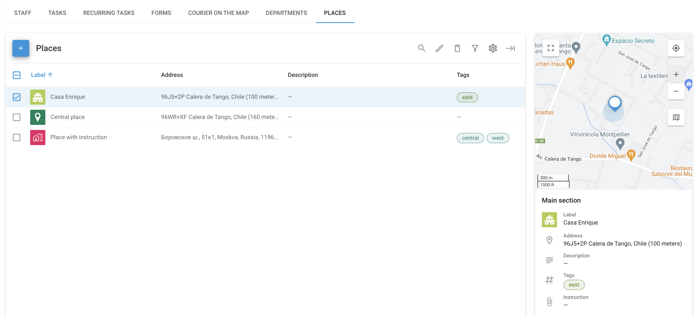
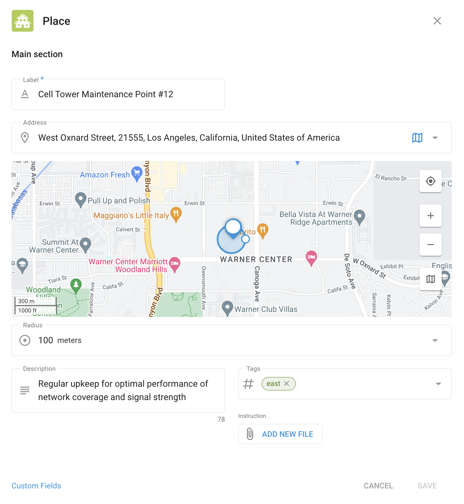

# Places

**Places (or POIs)** in the **Field service** module can be used for organizing and managing key locations that your field staff need to visit, such as customer addresses, company sites, or other important points of interest. This helps streamline task assignments, optimize routes, and ensure efficient field operations.

The page contains the list of all available Places along with their details, including custom fields you've added.

<figure><figcaption>
Places page
</figcaption></figure>

## How to create a Place



#### Go to Places

Open the **Places** page in the **Field service** module.



#### Start creating a Place

Click **+** to open the place creation dialogue.



#### Enter Place details

<figure><figcaption>
Creating a Place
</figcaption></figure>

Enter the Place's label, address, and radius. You can also add a description, tags, and a file.



#### (Optional) Add custom fields

Custom fields let you add extra details that aren't covered by the standard options. These fields are tailored to your business needs. They can include equipment type stored at the site, site maintenance schedule, security code, or manager contacts.

To manage custom fields, save the place, then reopen it and click **Custom fields** to open the **Custom fields** page for Places. Learn how to configure them in the [Custom fields](../account/custom-fields.md) article.



## How to use Places

Places are used as a map tool to help you track your objects in the **Tracking** module. To learn more about their use for monitoring the map, see [Places (POIs)](../tracking/map-tools/places-pois.md). The **Tracking** module also allows [importing them](../tracking/map-tools/places-pois.md#importing-places-from-an-excel-file).
