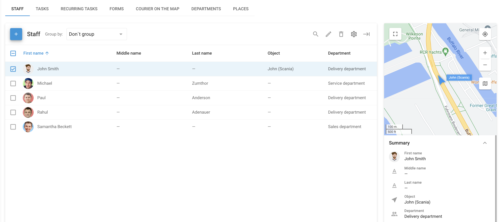

# Staff

The **Staff** page in the **Field service** module is designed to manage and organize information about your field staff. This tool ensures that you have everything you need to efficiently coordinate your mobile workforce.

<figure><figcaption>
Staff page
</figcaption></figure>

To access the **Staff** page, log in to the Navixy platform and click **Field service** in the main menu. From there, click the **Staff** tab. This section provides an overview of all employees in your organization, displaying their essential information in a list format.

## Employee list

The employee list is designed for fast and convenient management of your workforce. It is especially useful in conjunction with the [Tasks](tasks.md) page, where you can easily assign tasks, communicate with employees, and monitor their progress.

Each employee's information includes the following details:

* **Employee name:** Basic identification information for each employee.
* **Photo:** A profile picture for easy visual identification.
* **Phone and email:** Contact details that allow for quick communication directly through the app.
* **Location address:** The employee's primary location, which may differ from the office or branch address.
* **Driver license information:** Essential for employees who drive as part of their job.
* **Department:** Indicates the department or branch to which the employee belongs.

The list view can be customized by adding or removing columns to display the most relevant information, such as driver license details, employee ID, hardware key, and more.

## How to add a new employee

To add a new employee to the system, follow these steps:



#### Go to Staff

Go to the **Staff** page in the **Field Service** module.



#### Start employee creation

Click **+** to open the employee creation dialogue.



#### Fill in employee details

Enter the employee's name, contact information, location, and any other relevant details.



#### Assign employee to department

Select the appropriate department or branch from the dropdown menu.



#### Save

Once all the details have been entered, click **Save** to create the employee record.



## How to import employees

To add multiple employees to your staff list, follow these steps:



#### Go to Staff

Go to the **Staff** page in the **Field Service** module.



#### Start import

Hover your cursor over **+** and select XLS.



#### Prepare employee list

Download the template by clicking **Example file** and enter the required information.



#### Upload employee list

Click **Browse** to select your Excel file (XLS, XLSX, or CSV). Ensure the **Use file headers** box is checked if your file includes headers.



#### Complete import

Click **Continue** to finish the import process.



## How to manage employee records

Once employees are added to the system, you can easily manage and update their information as needed. The **Staff** page provides a summary view of each employee's details, allowing you to:

* **Edit employee information:** Update details such as contact information, department, or assigned tasks.
* **View employee location:** See the real-time location of employees who are assigned to a specific object or vehicle.
* **Customize employee list view:** Adjust the columns displayed in the list to show the most relevant information for your operations.
* **Search and delete employees**.
