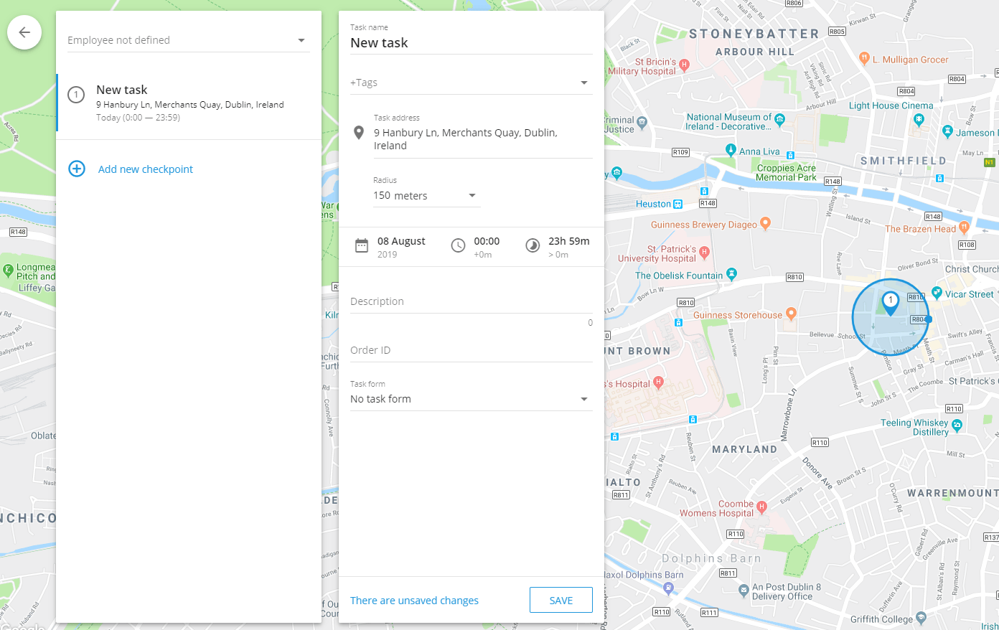
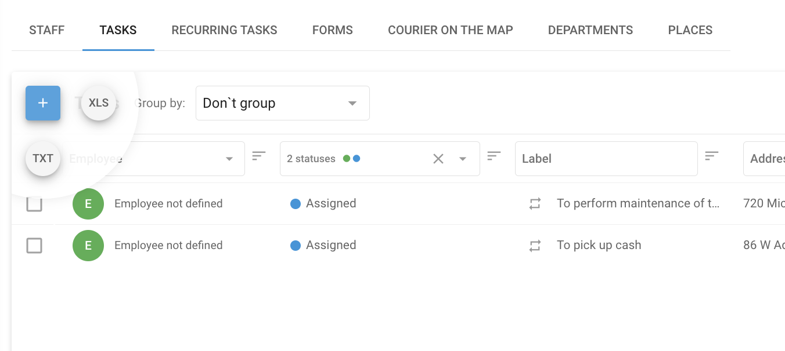
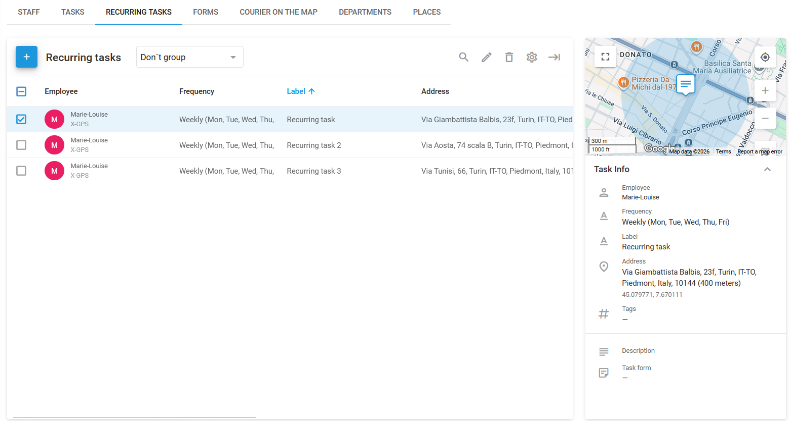

# Tasks

A **Task** in Navixy refers to a specific assignment or job that needs to be completed by an employee or field worker. It includes detailed instructions about what needs to be done, where it should be done, and within what timeframe. Tasks can range from simple one-off assignments, such as delivering a package to a single location, to more complex operations, like visiting multiple checkpoints along a route to perform inspections, installations, or other services.

Tasks are essential for managing and coordinating field operations, ensuring that employees are clear about their responsibilities, and allowing managers to monitor progress, optimize routes, and ensure that all jobs are completed efficiently. In the field, employees can view their task using the [X-GPS ](../x-gps-mobile-apps/x-gps-tracker/task-assignment.md)Tracker app.

<figure><figcaption>
Tasks page
</figcaption></figure>

## How to create a task

To create a task in Navixy, follow these steps:


The only required fields are task name and address.




#### Go to Tasks

Navigate to the **Tasks** tab in the **Field service** module.



#### Start creating a task

Click **+** to open the task creation dialogue.




#### Enter task name

Enter a descriptive task name that helps identify the purpose of the task. This could be the name of the customer or a brief description of the task, such as "Install Equipment" or "Inspect Communications."



#### Set task address

Manually enter the task address, select a point on the map, or use geographic coordinates. This will define the primary location for a single task or the first checkpoint for a route task.



#### Add checkpoints for route tasks

To create a route task (a task that consists of multiple subtasks), click **Add new checkpoint**. Each checkpoint represents an additional stop along the route, and they will be automatically connected in sequence. The employee must complete these checkpoints in the set order.



#### Set task date and time

Click **Task date** to open the **Execution period** window and define the date and time range during which the employee should complete the task. You can also configure additional options, such as admissible delay, visit duration, and ignore random visits with a set duration.



#### Select the employee responsible for completing the task

Select the driver who performs the task. You can add or configure drivers in **Fleet management → Drivers.**



#### Add task information

Provide other task details, including:

* **Task description:** Add any additional details that might be useful to the employee, such as contact information or special instructions.
* **Radius:** Defines the permissible deviation from the specified location. If the employee or vehicle arrives within this radius, their status will be set to **Arrived**, allowing them to complete the task.
* **Form:** Select the form that the employee needs to submit to complete the task. Forms can be filled out directly in the [X-GPS Tracker](../x-gps-mobile-apps/x-gps-tracker/) app.
* **Tags:** Add relevant tags to the task to facilitate easy searching and categorization later.
* **Order ID:** Assign an order ID that the client can use to track the status of the task via the **Courier on the map** feature.



#### Finalize task creation

Click **Save** to finish creating the task. The selected employee will receive the task with the attached form in the X-GPS Tracker mobile app, ensuring all necessary documentation is available during task execution.



## Single and route tasks

**Single tasks** are straightforward tasks where the employee visits a single location to perform the assigned duties. The task is completed once the employee has arrived at the specified address (status: **Arrived**) and performed the required actions, such as submitting the attached [form](forms.md).

**Route tasks** involve multiple checkpoints that the employee must visit in a specific order. This type of task is ideal for situations where the employee needs to visit several locations along a planned route, such as deliveries or inspections.

## Optimize route

**Optimize route** is a feature that helps couriers deliver packages efficiently by determining the best sequence for visiting multiple addresses across a city. It considers the location of each address, specific delivery time windows, and the starting point of the task to create the most optimal route. To use it, click **Optimize route** at the bottom of the left panel of a configured route task. You'll be prompted to enter the start address and time.

**Key benefits:**

* **Fuel savings:** Minimizes travel distance, reducing fuel consumption.
* **Faster deliveries:** Optimizes the sequence for quicker task completion.
* **Enhanced productivity:** Automates route planning, allowing couriers to focus on deliveries.

The platform can optimize up to 25 points in a single route task, ensuring all deliveries are made on time and in the most efficient order.

## How to import tasks

When managing a large workforce or numerous tasks, importing tasks from an Excel file is more efficient than manually creating and assigning them one by one. This is particularly useful when tasks are generated by external systems such as CRMs.

## How to import tasks from an Excel file

While developers can import tasks using [Navixy API](https://app.gitbook.com/o/YVLWhgAwCZPoU5vlRsCs/s/6dtcPLayxXVB2qaaiuIL/), there’s a simpler method: importing tasks from an Excel file. Follow these steps to import your tasks to the Navixy platform:



#### Start the import process

Hover your mouse over the **+** button in the tasks section and click **XLS**.



#### Prepare the file

In the **Tasks import** window, click **File example** template to download a template. Adjust your files to match it.



#### Upload the file

The only required field is the file itself. Max size is 10 Mb. Allowed formats are XLS, XLSX, and CSV.



#### Configure import settings

You can configure the following settings for uploaded tasks:

* **Default radius:** Defines the permissible deviation from the specified location. If the employee or vehicle arrives within this radius, the task will be considered completed even if they don’t reach the exact location.
* **Auto-assign tasks:**
  * **Do not assign:** Tasks are assigned to all employees.
  * **To employees:** Check the employees you want to be assigned the task or tasks.
    * **Ignore address:** Tasks are assigned without regard for the employee's address.
    * **Use employee address**: Tasks are assigned based on proximity to the employee's home address.
    * **Use department address:** Tasks are assigned according to the distance from the employee's department.
  * **To vehicles:**
    * **Ignore address:** Tasks are assigned without regard for the vehicle's address.
    * **Use garage address:** Tasks are assigned based on proximity to the garage.


The addresses of departments and employees should be specified on their respective profile cards.




#### Finalize import

Click **Next** to finish importing the task or tasks.



## How to import tasks from a TXT file



#### Start the import process

Hover your mouse over the **+** button in the tasks section and click **TXT.**



#### Enter your tasks

Paste your tasks directly from the spreadsheet into the large field on the left of the **Tasks import** window (the only required field). Pay attention to the column headers.



#### Configure import settings

Just like with importing from an Excel file, you can set the following options:

* **Default radius:** Defines the permissible deviation from the specified location. If the employee or vehicle arrives within this radius, the task will be considered completed even if they don’t reach the exact location.
* **Auto-assign tasks:**
  * **Do not assign:** Tasks are assigned to all employees.
  * **To employees:** Check the employees you want to be assigned the task or tasks.
    * **Ignore address:** Tasks are assigned without regard for the employee's address.
    * **Use employee address**: Tasks are assigned based on proximity to the employee's home address.
    * **Use department address:** Tasks are assigned according to the distance from the employee's department.
  * **To vehicles:**
    * **Ignore address:** Tasks are assigned without regard for the vehicle's address.
    * **Use garage address:** Tasks are assigned based on proximity to the garage.


The addresses of departments and employees should be specified on their respective profile cards.




#### Finalize import

Click **Next** to finish importing the task or tasks.



## Recurring tasks

Recurring tasks are tasks that are automatically repeated in set intervals. They are displayed on the **Recurring tasks** page of the **Field service** module.

<figure><figcaption></figcaption></figure>

## How to create a recurring task

To create a recurring task, follow these steps:


At the moment, recurring tasks aren't supported by [X-GPS Tracker](../x-gps-mobile-apps/x-gps-tracker/).




#### Go to Recurring tasks

Navigate to the **Recurring tasks** tab in the **Field service** module.



#### Start creating a recurring task

Click **+** to open the task creation dialogue.

<figure><figcaption></figcaption></figure>



#### Enter task name

Enter a descriptive task name that helps identify the purpose of the task. This could be the name of the customer or a brief description of the task, such as "Install Equipment" or "Inspect Communications."



#### Set task address

Manually enter the task address, select a point on the map, or use geographic coordinates. This will define the primary location for a single task or the first checkpoint for a route task.



#### Configure repeat frequency

Click the **Repeat** block to open the recurrence settings and choose a preset or manually configure the dates when the task will be performed.



#### Add checkpoints for route tasks

To create a route task (a task that consists of multiple subtasks), click **Add new checkpoint**. Each checkpoint represents an additional stop along the route, and they will be automatically connected in sequence. The employee must complete these checkpoints in the set order.



#### Set task time and duration

Define the date and time range during which the employee should complete the task. This ensures that the task is completed within the designated timeframe.

Click **Additionally** to display additional options, such as admissible delay, visit duration, and ignore random visits with a set duration.



#### Select the employee responsible for completing the task

Select the driver who performs the task. You can add or configure drivers in **Fleet management → Drivers.**



#### Add task information

Provide other task details, including:

* **Description:** Add any additional details that might be useful to the employee, such as contact information or special instructions.
* **Radius:** Defines the permissible deviation from the specified location. If the employee or vehicle arrives within this radius, their status will be set to **Arrived**, allowing them to complete the task.
* **Form:** Select the form that the employee needs to submit to complete the task.
* **Tags:** Add relevant tags to the task to facilitate easy searching and categorization later.
* **Order ID:** Assign an order ID that the client can use to track the status of the task via the **Courier on the map** feature.



#### Finalize task creation

Click **Save** to finish creating the task.


