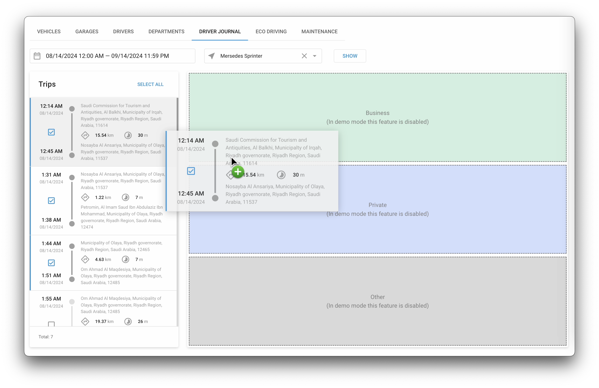

# Driver journal

## Overview

The **Driver journal** feature in Navixy is a powerful tool for fleet management, offering detailed tracking and classification of vehicle trips.

This feature allows fleet managers to monitor and classify trips, providing valuable insights into vehicle usage, trip purposes, and driver behavior. By accurately categorizing trips, organizations can improve reporting accuracy, optimize fleet operations, and ensure compliance with various regulations. This makes it possible to more easily identify when a device is used for business purposes or private.

## How to use the Driver journal

The Driver Journal feature is located in the Fleet Management application. To access it, navigate to the Driver Journal tab.

### Selecting trip status

The Driver journal allows you to assign statuses to trips to categorize them as business, private, or other types of journeys. This categorization is crucial for organizations that need to differentiate between work-related and personal use of vehicles.

To assign a status to trips, follow these steps:

1. **Select a trip time interval:** Begin by choosing the specific time frame you want to review. This allows you to focus on trips that occurred within that period.
2. **Select a vehicle:** Choose the object from the drop-down list. This selection will display all trips associated with that particular vehicle within the chosen time interval.
3. **Display Trips:** Click the **Show** button to generate the list of trips for the selected vehicle and time period.

### Assigning status to trips

Once the trips are displayed, you can assign a status in two ways:

1. **Single trip status assignment:** You can assign a status to an individual trip by dragging it to the appropriate status area on the right side of the screen. For instance, drag a trip to the "Business" area if it was work-related, or to "Private" if it was a personal trip.
2. **Multiple trips status assignment:** If you need to assign the same status to multiple trips at once, select the trips by marking the check-boxes next to each trip. After selecting the trips, click on the **Add to the Journal** button. This action will allow you to choose the desired status for all selected trips simultaneously.

### Managing and reviewing trip data

The Driver journal also provides a summary view that displays key information about each trip, such as distance traveled, duration, and start and end locations. This summary is crucial for fleet managers who need to analyze vehicle usage patterns and driver behavior.

By categorizing and managing trips effectively, fleet managers can generate accurate reports for tax purposes, billing, or internal audits. The Driver journal's ability to differentiate between business and private trips ensures compliance with company policies and regulatory requirements.
