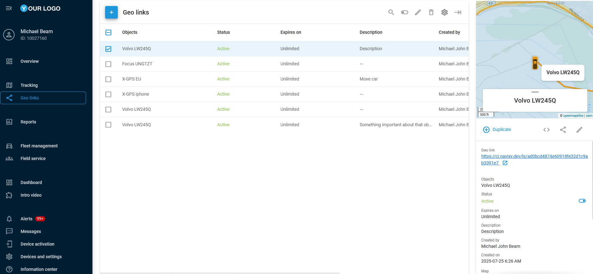

# Geo links

Geo links are platform-independent links for displaying tracked objects on the map. They enable sharing specific tracking data with end users through automatically generated URLs, offering flexible control over content visibility and access duration.

Geo links can be employed across a variety of business and industrial sectors. In logistics, they offer real-time tracking of deliveries and optimizing customer updates. Geo links can be set with a specified lifespan, making it ideal for temporary access to tracking information, such as during delivery. Afterward, the link automatically deactivates to ensure privacy and security. This feature is particularly important for the secure transport of high-value or sensitive items, providing visibility for a limited or permanent period.

A geo link can be associated with multiple objects, which will be displayed on the map when the generated link is clicked. You can configure both specific objects and the entire link at once. The options include map type (Google Maps, OSM, etc.), duration, object labels, tracked attributes (speed, address, sensor readings, etc.), geofences, POI, history, and other options.


Here is an example of a generated geo link URL: `https://tracking.example/ls/#ecdd8c083d52a396ecdd8c083d52a396`


## Working with geo links

The following sections provide step-by-step guides to the actions you can perform with geo links on our platform. Explore their functionality in detail and find your way to use them.

* [Creating geo links](creating-geo-links.md)
* [Updating and sharing geo links](updating-and-sharing-geo-links.md)
* [Embedding geo links](embedding-geo-links.md)
