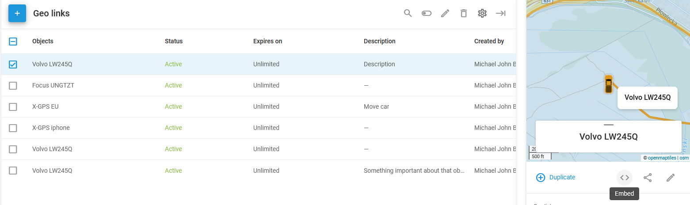

# Embedding geo links

Embedded links are a useful tool for interface integration and web development. Geo links allow generating and customizing embeddable iframe code that can be reused by creators and integrators.

To access the embed code, select a geo link and click  in the sidebar:

The width and height of the iframe element can be adjusted directly in the **Embed link** window.
