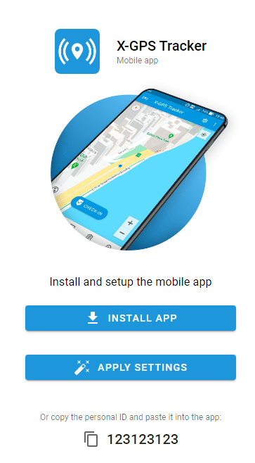

# Activate X-GPS tracker app

## What is X-GPS tracker app?

The [X-GPS Tracker app](https://x-gps.app) transforms a smartphone or tablet into a GPS tracker, providing real-time tracking for field staff such as drivers, couriers, service technicians, construction workers, sales representatives, and more. Utilizing a combination of satellite navigation signals (GPS), GSM, and Wi-Fi networks, the app accurately determines the device owner’s location while maintaining low energy consumption depending on settings.

Additionally, the app allows field employees to report their location, status, and task completion in real-time. It enables users to share their locations, upload photos, and fill out forms, making it easier for companies to track the progress of their workforce, manage tasks efficiently, and ensure that field operations run smoothly.

Activating the X-GPS Tracker app on the Navixy platform involves two general steps: [inviting an employee](activate-x-gps-tracker-app.md#step-1-send-an-invitation-to-an-employee) and [configuring the application on the employee’s side](activate-x-gps-tracker-app.md#step-2-accept-the-invitation-and-configure-the-app).

## Step 1: Send an invitation to an employee

Invite an employee to install the X-GPS Tracker App first. You can do that from the Navixy Web Interface or X-GPS Monitor App.



* Log in to your Navixy user account.
* In the left menu, click **Device activation.**
* Find and select the **X-GPS Tracker** option.
* Create a label for the device (e.g., "Driver John Smith") and, optionally, add it to a [group](../devices-and-settings/).
* Enter the phone number and/or email address of your employee where to send them an invitation.
* Go to the next step and click **Activate**.



* Open the X-GPS Monitor app on your mobile device.
* Select **Add object** from the menu.
* Choose the **Mobile App** option.
* Enter the phone number and/or email address of your employee where to send them an invitation.
* Tap **Add and invite**.






The new device will appear in Navixy with **Just registered** status waiting for the employee to complete the activation.

The employee will receive an invitation via text (SMS) or email depending on setup. The invitation includes:

* A 12-digit personal identifier
* A link to download the X-GPS Tracker app







## Step 2: Accept the invitation and configure the app

After the invitation is sent, employees should proceed on their end by downloading the app and configure it.&#x20;



#### Download and install the app

Download and install the app on their  mobile device from the related store:&#x20;

* [App Store (iOS)](https://apps.apple.com/app/x-gps-tracker/id1612047534)&#x20;
* [Google Play Store (Android)](https://play.google.com/store/apps/details?id=com.navixy.xgps.tracker)



#### Configure the app

Upon launching the app, the employee will need to enter the 12-digit identifier from the invitation to complete the setup. After that, just a few more steps to finish the configuration are needed:

1. Start the tracking function, to do it:
   1. Go to <i class="fa-gear">:gear:</i> -> General
   2. Toggle on Tracker On/Off
2. Ensure that the app has the necessary permissions to access your device’s location



## Help and support

By following the steps above, you can successfully activate and use the X-GPS Tracker app with the Navixy platform, allowing you to track and manage your mobile device efficiently. If you encounter any issues, please consult with your [service provider](about-service-providers.md).


If your employee has issues, please have them try hitting the “Apply Settings” option from the email.

