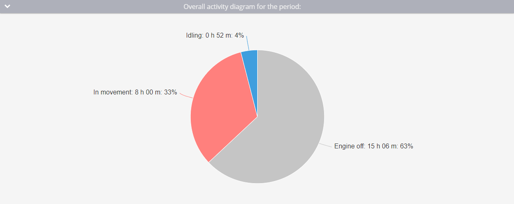

# Engine hours report

The **Engine hours report** in Navixy provides detailed insights into the duration your vehicle's engine was running, both while in motion and during idling periods. This report is essential for fleet managers who need to monitor engine usage, optimize operational efficiency, and plan maintenance schedules. This guide describes how this report works, the parameters involved, and how to interpret the data.

## Prerequisites for generating engine hours report

The report calculates engine hours based on data points received by the Navixy platform. For accurate calculations, the following configurations and conditions must be met:

* **Ignition sensor configuration:**\
  The ignition sensor must be correctly connected to the device and accurately register the ignition status. This can be a discrete ignition sensor or an ignition-based virtual sensor on the platform.
* **Ignition duration:**\
  The ignition must have been on for at least 60 seconds for the time to be recorded in the report. If a single engine-on period lasts less than 60 seconds before ignition goes off again, that entire period is excluded from the report. If it lasts 60 seconds or more, the full duration is counted.
* **Parking detection:**\
  The platform uses parking detection settings to differentiate between engine hours spent in motion and idling. For example, if the parking detection speed is set below 3 km/h and the vehicle remains at or below this speed for more than 5 minutes, this time will be recorded as idling, not motion.
* **Data point frequency:**\
  The frequency with which your device sends data points affects the accuracy of the report. Delays in data transmission can lead to inaccuracies, particularly if the ignition state changes but isn't immediately reported.

## Understanding engine hours report

While interpreting the **Engine hours report**, consider the following:

* **Discrepancies:** If you notice a discrepancy between the mileage in the trip report and the engine hours, check whether the smart filter is applied consistently across all reports and whether the ignition was correctly detected during motion.
* **Analyzing data:** The report allows you to analyze engine usage by employees, assess vehicle efficiency, estimate replacement timelines, calculate depreciation costs, and reconfigure fuel and lubricant costs based on idle time

### Example calculation

<table><thead><tr><th width="119.4444580078125">Point</th><th width="148.5555419921875">Time</th><th width="142.22216796875">Ignition State</th><th>Engine Hours</th></tr></thead><tbody><tr><td>1</td><td>16:00:00</td><td>Off</td><td>0 minutes</td></tr><tr><td>2</td><td>16:01:00</td><td>On</td><td>0 minutes (ignition was off at last point)</td></tr><tr><td>3</td><td>16:01:32</td><td>On</td><td>0 minutes (less than 60 seconds)</td></tr><tr><td>4</td><td>16:05:32</td><td>Off</td><td>4 minutes and 32 seconds</td></tr></tbody></table>

## Report parameters

The **Engine hours report** includes several configurable parameters that allow you to customize the output to meet your specific needs:

* **Hide empty tabs:** Hides tabs for devices with no engine-hours data in the selected period instead of showing **Not found** placeholders.
* **Shows seconds:** Controls whether durations include seconds (e.g., "4:32:15") or just hours and minutes (e.g., "4:32").
* **Show details:** Provides detailed information about the specific location and time when the engine was on.
* **Display summary:** Shows an overview of all devices. You can enable or disable this feature depending on whether you need a summary page.
* **Display only summary:** Aggregates data for multiple trackers into a single summary. This option requires at least two devices.
* **Use smart filter:** Excludes short or invalid trips from the report. A regular trip is excluded if it has fewer than 3 data points, covers less than 100 meters, or stays within a 200-meter diameter. Additionally, individual track points with suspicious mileage patterns (e.g. implausibly high or low speeds) are removed.

## How to read Engine hours report

### Overall activity diagram

This diagram provides a comprehensive view of the total time the engine was on during the selected period. It distinguishes between the time the engine was off, time spent in motion, and time spent idling.

### Daily activity histogram

<figure><figcaption>
Daily activity histogram
</figcaption></figure>

The histogram breaks down engine hours into daily segments, showing both motion and idle times. Hovering over each day provides a more detailed view of that day's engine activity.

### Engine hours reports table

The table presents detailed daily data, including:

* **Date:** The specific day for which the data is calculated.
* **Engine hours:** Total engine hours for the day.
* **In movement:** Time spent in motion and its percentage of total engine hours.
* **Idling:** Time spent idling and its percentage of total engine hours.
* **Average interval:** The average duration the engine was running after each ignition on event.
* **Mileage:** The distance traveled while the engine was running.
* **Average speed:** The average speed for the day.
* **Intervals:** The number of intervals during which the engine was on throughout the day.


If you notice a discrepancy between the mileage in the [Trips report](trip-report.md) and the Engine hours report:

* Ensure the smart filter setting is consistently applied across all reports. Inconsistencies in its use can cause discrepancies.
* Verify that the ignition was detected during all vehicle movements by comparing trip start and end times with the engine hours data.


### Engine hours report details

If you enable the **Show details** option when generating the report, it will contain the **Engine hours (details)** block with the following table:

<table><thead><tr><th width="229.111083984375">Column</th><th>Description</th></tr></thead><tbody><tr><td>Engine hours</td><td>How long the engine was on during this specific period</td></tr><tr><td>In movement</td><td>Time in motion within the period, and its percentage</td></tr><tr><td>Engine start</td><td>When and where the engine was started</td></tr><tr><td>Engine stop</td><td>When and where the engine was stopped</td></tr></tbody></table>

### Engine hours report summary

When the report is generated for multiple devices, an additional **Summary** tab is added, showing aggregated engine-hours data across the whole selection. It contains two tables:

* Per-device table: Ane row per tracker, with columns for engine hours, movement time, idling time, average interval, mileage, average speed, and intervals. Devices with no data for the period appear as empty rows, and devices whose report failed to generate are marked as errors.
* Grand total: A compact summary table aggregating the same metrics across all devices in the report.

The **Summary** tab is controlled by two parameters:

* **Display summary** adds the **Summary** tab alongside individual device tabs.
* **Display only summary** generates the **Summary** tab and omits the individual device tabs. Requires at least two devices to be selected. 

 
