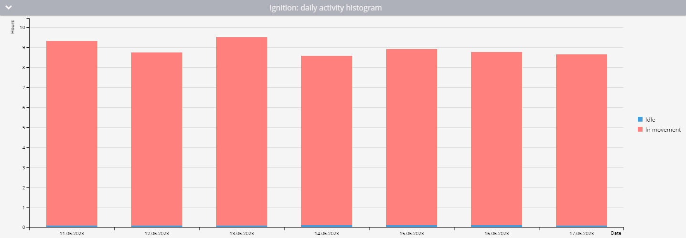
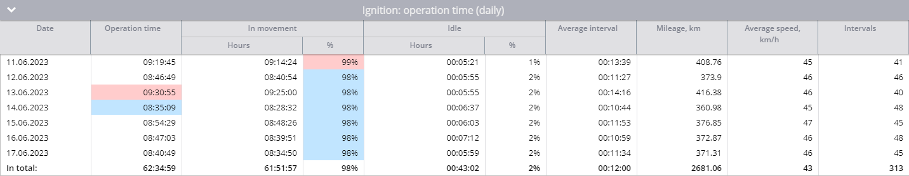

# Equipment working time report

The **Equipment working time** report provides essential data on the uptime of any equipment connected to your vehicles via discrete or virtual inputs. This report is crucial for fleet managers who need to monitor the operational efficiency of equipment, analyze idle times, and ensure optimal usage of assets. This guide describes how this report works, the parameters involved, and how to interpret the data effectively.

<figure><figcaption>
Equipment working time report
</figcaption></figure>

## Equipment working time report use cases

The report tracks the operational time of equipment, distinguishing between periods of activity while in motion and during idling. It includes detailed statistics, daily activity data, and visual representations such as activity diagrams and histograms to help you understand and analyze the data.

You can use it for the following purposes:

* **Analyzing data:** Use the report to monitor how frequently and efficiently equipment is used. Identify patterns of excessive idling or underutilization.
* **Operational efficiency:** Assess the balance between active and idle times to determine the operational efficiency of your equipment.
* **Maintenance planning:** The report helps in planning maintenance by identifying periods of high usage or frequent starts and stops, which can wear down equipment faster.
* **Cost management:** Recalculate fuel and lubricant costs by considering idle times along with active usage, which is especially relevant for heavy machinery.

## Prerequisites for Equipment working time report

The report calculates equipment working time based on data points received by the Navixy platform. It considers the state of discrete inputs or virtual sensors and the parking status to accurately distribute working time between motion and idle periods. For accurate calculations, the following configurations and conditions must be met:

* **Discrete input configuration:**\
  The discrete input on the device must be correctly wired and capable of registering the input state accurately.
* **Virtual sensor configuration:**\
  You can use [virtual sensors](../../devices-and-settings/vehicle-sensors/virtual-sensors/) whose values can be interpreted as on/off: booleans, numeric values (0 = off, any non-zero value = on), or the strings "true"/"false"/"on"/"off". Values that cannot be interpreted this way cause the report to display an "Invalid sensor data" message.
* **Parking detection settings:**\
  Parking detection settings are crucial in differentiating between operating time in motion and idle time. If the input state is "on" while the platform detects the vehicle as parked (e.g., moving at less than 3 km/h for over 5 minutes), this time is recorded as idle.
* **Minimum on-time:**\
  The platform calculates the operating time only if the equipment is on for a minimum duration, which you can specify (e.g., 60 seconds).

### Example calculation

<table><thead><tr><th width="86.5555419921875">Point</th><th width="109.77783203125">Time</th><th width="104.333251953125">Input state</th><th>Equipment uptime</th></tr></thead><tbody><tr><td>1</td><td>10:00:00</td><td>Off</td><td>0 minutes</td></tr><tr><td>2</td><td>10:01:00</td><td>On</td><td>0 minutes (input was off at last point)</td></tr><tr><td>3</td><td>10:01:32</td><td>On</td><td>0 minutes (less than 60 seconds)</td></tr><tr><td>4</td><td>10:05:32</td><td>Off</td><td>4 minutes and 32 seconds</td></tr></tbody></table>


If a single on-period lasts less than the minimum working period duration before switching off, that entire period is excluded from the report. If it lasts at least that long, the full duration is counted.


## Report parameters

The **Equipment working time report** includes several configurable parameters that allow you to tailor the output to meet your specific needs:

* **Sensor selection (required)**: for each selected device, choose one discrete input or virtual sensor to analyze. Devices with no discrete input or two-state virtual sensor configured cannot be used in this report.
* **Hide empty tabs:** Omits tabs for devices that have no trips in any configured shift during the selected period.
* **Show seconds:** Shows durations with second precision (`hh:mm:ss`) instead of `hh:mm`.
* **Minimum working period duration:** The minimum number of seconds a discrete input or virtual sensor must remain in the "on" state for that period to be included in the report. Default: 60 seconds. Minimum: 1 second.
* **Show idle percent:** Tracks the parking status and distributes the equipment operating time between motion and idling.
* **Use smart filter:** Excludes short or invalid trips from the report. A regular trip is excluded if it has fewer than 3 data points, covers less than 100 meters, or stays within a 200-meter diameter. Additionally, individual track points with suspicious mileage patterns (e.g. implausibly high or low speeds) are removed.

## How to read Equipment working time report

### Overall activity diagram

This diagram provides an overview of the total working time of the equipment for the selected period. It shows how long the equipment was off, on, and if idle percentage tracking is enabled, it differentiates between time spent in motion and idle time.

By default, the "off" state is shown in gray and the "on" state in red. When **Show idle percent** is enabled, the "on" state is further split into two segments, red for time in motion and blue for idle time. For virtual sensors, the segment labels use the state names defined in the sensor's configuration instead of the generic "on/off".

### Daily activity histogram

The histogram breaks down the equipment's working time into daily segments. If idle percentage is tracked, it also shows the division between motion and idle time. Hovering over each day provides a more detailed view of that day’s activity.

### Daily sensor operation time table

This table presents daily statistics on equipment operation, including:

* **Date:** The specific day for which the information is calculated.
* **Operation time:** The total operational time (duration of virtual sensor state) for the day.
* **Average interval:** The average duration the equipment was operational after each switch-on.
* **Mileage:** The distance traveled with the equipment turned on.
* **Average speed:** The average speed for the day.
* **Intervals:** The number of times the equipment was turned on during the day.
* **In movement** (if **Show idle percent** is enabled): The duration of work in motion and its percentage of the total work time.
* **Idle** (if **Show idle percent** is enabled): The operation time without motion and its percentage of the total operation time.

### Detailed sensor operation time table

<table><thead><tr><th width="301.20001220703125">Column</th><th>Description</th></tr></thead><tbody><tr><td>Operation time</td><td>How long the equipment was on during this interval</td></tr><tr><td>In movement time / % (only when <strong>Show idle percent</strong> is enabled)</td><td>Time in motion within the interval, and its percentage</td></tr><tr><td>Engine start time / place</td><td>When and where the equipment was switched on</td></tr><tr><td>Engine stop time / place</td><td>When and where the equipment was switched off</td></tr></tbody></table>

For virtual sensors, the column titles and "on/off" labels throughout the report are replaced with the state names configured on the virtual sensor. 
