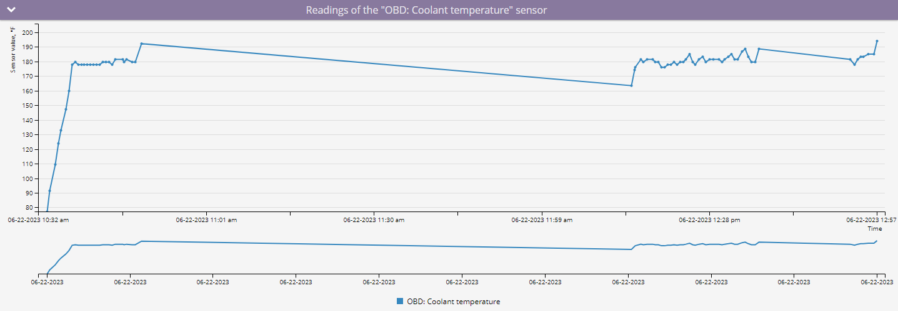
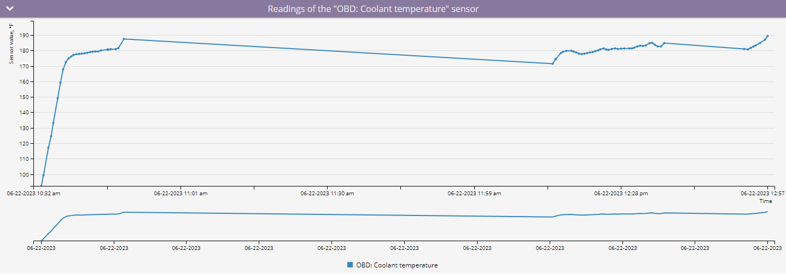
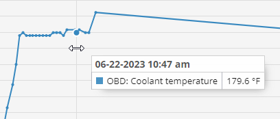
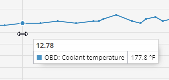

# Vehicle sensors report

The **Vehicle sensors report** offers detailed insights into the data received from your vehicle’s instruments through CAN/OBD sensors or [virtual sensors](../../devices-and-settings/vehicle-sensors/virtual-sensors/) over a selected period. This report includes information such as mileage, engine RPMs, speed, fuel consumption, coolant temperature, and other critical metrics, helping fleet managers and vehicle operators monitor and optimize vehicle performance.

<figure><figcaption>
Vehicle sensors report
</figcaption></figure>

## Prerequisites for generating Vehicle sensors report

To generate the **Vehicle readings report**, the following prerequisites must be met:

* The device must support CAN/OBD readings on the platform. You can check if a specific type of sensor is supported by reviewing the list of supported inputs for your [device model](https://www.navixy.com/devices/).
* The vehicle must be capable of transmitting the required CAN/OBD data to the installed device model. This can be confirmed with the vehicle manufacturer.
* The device and sensors must be configured to transmit data and actively sending it to the platform.
* The CAN/OBD or virtual sensors must be properly configured on the platform.

## Vehicle sensors report parameters

The report uses several parameters to customize the output:

* **Hide empty tabs:** Omits tabs for devices that have no trips in any configured shift during the selected period.
* **Details time range:** Displays the received readings in the data detail table in increments of 30 minutes, 1 hour, 3 hours, or 6 hours. The graph will display all points received from the sensor.
* **X-axis:** Choose whether to display the information on the graph relative to time or mileage.
*   **Smooth data:** Apply smoothing to average sensor readings on the graph, providing a cleaner view of trends.

    

Smoothing may reduce accuracy when analyzing sudden changes such as fuel refills or drains.

For each device, you need to select the sensor for which to generate a report. Only devices with configured CAN/OBD or virtual sensors will appear in the list.If the selected sensor is not a metering sensor or a virtual sensor (for example, a state sensor), the report will display the message: "The sensor is not a measuring sensor"

## How to read Vehicle sensors report

### Sensor readings graph

The **graph** displays CAN/OBD or virtual sensor readings in a visual format, providing a clear view of data trends over time or distance.

When you hover over a point on the graph with the X-axis set to time, you will see the exact time and sensor value recorded. If the X-axis is set to mileage, you will see the sensor value along with the mileage at which it was recorded.











### Statistics data

A statistical data table that provides daily summaries of the sensor readings. The **In total** row at the bottom of the table summarizes the minimum, maximum, and average values across the entire report period.

<table><thead><tr><th width="195.33331298828125">Column</th><th>Description</th></tr></thead><tbody><tr><td>Date</td><td>The specific date for the recorded data</td></tr><tr><td>Minimum</td><td>The lowest value recorded by the sensor on that date in set units</td></tr><tr><td>Maximum</td><td>The highest value recorded by the sensor on that date in set units</td></tr><tr><td>Average value</td><td>The average of all sensor readings for that date in set units</td></tr></tbody></table>


The units of measure will vary depending on the sensor settings.


### Data breakdown

The **data breakdown table** presents sensor readings over specified time intervals. It provides a detailed view of sensor data, helping to identify trends or issues during specific periods.

<table><thead><tr><th width="238">Column</th><th>Description</th></tr></thead><tbody><tr><td>Time</td><td>The timestamp for the interval</td></tr><tr><td>Value</td><td>A representative sensor reading for the bucket in set units</td></tr><tr><td>Minimum</td><td>Lowest reading in the interval in set units</td></tr><tr><td>Maximum</td><td>Highest reading in the interval in set units</td></tr><tr><td>Average value</td><td>Average reading in the interval in set units</td></tr></tbody></table>


If the "No data" message appears, it means no readings were received during that time. Possible reasons include:

* The device didn't send CAN/OBD or virtual sensor data during that period due to sensor settings.
* The device wasn't transmitting data at all, possibly due to being turned off or disconnected from the object.

