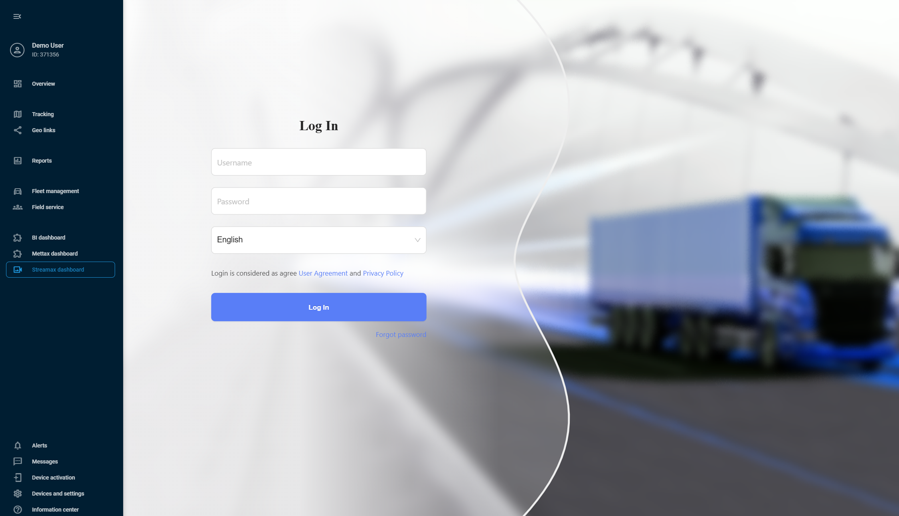

# Streamax

Streamax is a leading MDVR manufacturer, well-proven in the global market. With their devices, you can enable 24/7 video recording from your vehicles, collect telematics data, remotely access video footage, and monitor driving safety using ADAS (Advanced Driver Assistance Systems) and DSM (Driver Status Monitoring) technologies.

By integrating Streamax with Navixy, you get comprehensive video monitoring combined with advanced fleet management in a single interface. Let's take a closer look at how to implement this powerful combination and embed Streamax daashboard into Navixy interface.



### **Establishing integration**

To establish the integration, you'll need to obtain API credentials from your Streamax account and request integration setup from our support team.

**Get API credentials from Streamax**

1. **Obtain API Key and Secret**: Follow the authentication process as described in the [Streamax Sign Authentication documentation](https://ftcloud.streamax.com:20002/DOC/Sign%20Authentication) to obtain your API key and secret.
2. **Contact Navixy**: Once you have your API credentials, contact your Customer Success Manager or use [this form](https://www.navixy.com/contact/). Send a request to integrate Streamax with your Navixy account, containing the following information:

* Your API key
* Your API secret
* Your Navixy account details
* Request for Streamax integration activation

3. **Wait for confirmation**: Our specialists will configure the integration in 1-3 days on our side and confirm when it's ready for use.


After you receive the confirmation from our support, your Streamax account is ready for the integration!




### **Adding a Streamax device to Navixy**

After receiving confirmation from our support team that the integration is ready, you can add your Streamax device to the platform. To do it, follow the usual device activation procedure:

1. Go to **Device activation**.
2. Select your Streamax device from the list.
3. Select **SIM card purchased separately** option and go to the next step.
4. Enter a correct **Device ID** (device IMEI)
5. Complete the device configuration

For detailed instructions on how to activate a device in Navixy, see [Activate GPS device](../quick-start/activate-gps-device.md).


Your device and Navixy account are ready for the integration!




### **Embedding Streamax in Navixy UI**

At this step, we perform the actual integration by embedding the Streamax dashboard into your Navixy interface.\
Navixy offers [User applications](../account/user-applications/) functionality that allows embedding 3rd-party apps directly in the platform’s interface. We will use it to embed Mettax.


### **Navigation**

**User applications** section is accessible to account **Owners** in the **Account Settings** section. To find it:

* Click the profile icon in the top-left corner of the screen to open your account settings
* In the settings sidebar, select **User applications**


1. Create new application\
   Start by clicking the  button in the **User applications** list.
2. Configure the new application
   1. Put the link to your Streamax account in the **App URL** field, for example: `https://{your_instance}.ifleetvision.com/ftv/ft/dashboard#`.
   2. Enter a **Label** for the application (e.g., Streamax dashboard).
   3. Select **Embedded** in the **Show as** field to display Streamax functionality within Navixy.
3. Click **Save** to complete the configuration.


Your new application appears automatically in Navixy's left sidebar. Open it and log in with your Streamax credentials to access your comprehensive video telematics dashboard with 360° monitoring, AI-powered event detection, and multi-channel video feeds - all integrated with your existing Navixy fleet management tools.




