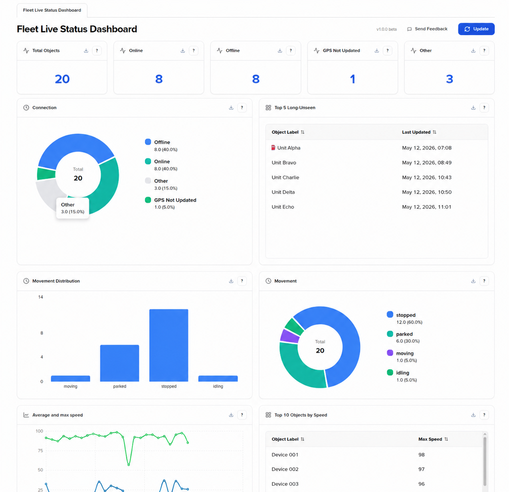

# Fleet live status dashboard

The fleet live status dashboard answers the questions you ask first thing in the morning and last thing before closing the platform: how many vehicles are working right now, which ones haven't reported in a while, where they are, and how the fleet is behaving as a whole. Instead of opening the Objects list, scrolling through statuses, switching to the map, and cross-referencing geofences, you get one screen that brings these signals together and refreshes itself while you watch.


The dashboard is currently in beta (v1.0.0). It's an early version released so we can shape it based on real feedback. If something is missing, confusing, or could be more useful, please tell us through the Send Feedback button at the top of the page. Dashboards have been a long-requested feature, and your input directly influences what we build next.


You'll find it as the **Dashboard** item in your sidebar. It complements the [Objects list](objects-list/) and [History view](history-view/) rather than replacing them: use the dashboard for fleet-wide situational awareness, and the existing views when you need to drill into an individual object.

<figure><figcaption></figcaption></figure>

## What you can do with it

The dashboard groups your fleet data into themed sections so you can scan each area of concern independently. Several practical workflows it supports:

* **Start-of-shift check:** see at a glance whether your expected number of devices are online and reporting GPS, and spot any that have gone silent overnight.
* **Investigate quiet devices:** the long-unseen list surfaces the five objects with the oldest last contact, so you can start troubleshooting before a customer or driver flags the problem.
* **Confirm fleet activity:** the movement breakdown shows how many vehicles are actively moving, parked, stopped, or idling, which is useful for verifying that an operational shift is on schedule.
* **Spot speeding or unusual behavior:** the speed chart and the top objects by speed table make it easy to identify outliers without building a report.
* **Verify presence at locations:** the geofence panel lists which of your zones currently contain objects and how many, helping you confirm that vehicles have reached customer sites, depots, or warehouses.
* **Capture a snapshot for sharing:** any panel can be exported as a CSV file for a quick handover, email, or follow-up.

## Where the data comes from

Everything on the dashboard is computed from your account's own telemetry and configuration, the same data that drives the Objects list, the map, and reports. No external sources, no filtering by region or sample: if a device is in your account, it's reflected here.

The dashboard is designed to stay current without manual refreshing:

* **Auto-refresh every 60 seconds** while the browser tab is in focus. Switch away, and updates pause until you return, so the dashboard isn't pulling data when no one is looking at it.
* **Manual refresh** through the **Update** button in the top-right corner whenever you want the latest numbers immediately.
* **Near real-time status updates.** Connection and movement states are computed as new telemetry arrives, typically within seconds of a device reporting.
* **Geofence membership updates within a few minutes** of an object entering or leaving a zone. This is slightly slower than the connection status because zone calculations involve checking each object's position against your defined polygons.

This combination keeps the view fresh enough for live monitoring without flooding your browser with constant requests.

## What is on the dashboard

### Connection status at a glance

The top of the dashboard answers the most basic operational question: how many of my devices are working right now? Five summary tiles give you the total and the breakdown by connection state, and the **Connection** chart shows the same numbers as proportions, which makes it easier to see at a glance whether you're in a healthy state or whether a significant share of the fleet is offline.

The connection states (**Online**, **Offline**, **GPS not updated**, **Other**) follow the same definitions used elsewhere in the platform. If you need a refresher on what each state means and why a device might be in it, see [Connection state](objects-list/connection-state.md).

The **Top 5 long-unseen** table next to the chart is where this section earns its keep operationally. It lists the five objects with the oldest **Last Updated** timestamps, sorted from longest gap to shortest. These are typically the devices most likely to need attention: dead batteries, vehicles parked indoors, SIM card issues, or units that have been moved without you knowing. Catching them here is faster than scrolling through a sorted Objects list.

### Movement

While the connection section tells you whether devices are reporting, the movement section tells you what they're actually doing. The **Movement** chart and **Movement Distribution** bar chart present the same data in two complementary forms, one proportional and one absolute, across four states:

* **Moving:** the object is travelling.
* **Stopped:** the object is stationary but recently active.
* **Parked:** the object has been stationary for an extended period.
* **Idling:** the object is stationary with the ignition on. Idling is one of the most common sources of hidden fuel and maintenance cost in a fleet, and seeing it on the live dashboard lets you act on it the same day rather than discovering it in a weekly report.

Seeing this distribution at a glance helps you confirm whether your operation matches expectations. A 9 AM dashboard showing most of the fleet still parked might mean drivers haven't started their routes, while a 2 AM view showing several vehicles moving might warrant a closer look.

### Speed

Two panels cover speed, with different purposes.

The **Average and max speed** line chart shows fleet-wide average and maximum speed over the last 24 hours. The average line tells you the typical pace your fleet is moving at, useful for spotting operational patterns. The maximum line surfaces the single highest speed recorded across all vehicles at each point in time, which is where you'll see spikes worth investigating.

The **Top 10 Objects by Speed** table ranks individual objects by their maximum recorded speed. This makes it straightforward to identify which specific vehicles are responsible for the peaks in the chart, without needing to write a query or build a custom report.

### Geofences

The **Geofences** panel lists zones that currently contain at least one of your objects, along with the count and labels of the objects inside.

It's worth being explicit about the scope: this is **not** a full list of your geofences. Empty zones don't appear. The panel is designed to answer "where are my vehicles right now?", not "what zones do I have configured?". For the complete list of zones, use [Map tools → Geofences](map-tools/geofences.md).

This presentation is most useful for confirming presence at expected locations: a logistics team can verify that drivers have reached customer sites, a yard manager can confirm vehicles are back at the depot, and a field service dispatcher can see at a glance which sites are currently being serviced.

### Fleet details

The **Fleet Details** table at the bottom of the dashboard is the detail layer beneath the summary views. It lists every object in your account with its current state across the dimensions covered above, plus position and address information.

Columns include the object's label, last update timestamp, last connection and moving status, current speed, altitude, satellite count, hdop, heading, current geofence (if any), coordinates, and resolved address. Every column is sortable, so you can quickly reorganize the table around whatever question you're trying to answer: sort by **Last Updated** to bring the most recently active objects to the top, by **Speed** to find the fastest, or by **Address** to group objects by location.

If you've ever wanted "the Objects list plus a few more fields, sortable however I want", this is that table.

## Exporting panel data

Every panel on the dashboard, both charts and tables, has a download icon in its top-right corner. Click it to export that panel's current data as a CSV file. The export reflects the state of the panel at the moment you click, so it's a useful way to capture a snapshot for an email, a handover, or further analysis in a spreadsheet.

The dashboard does not currently support global filters, custom time ranges, or shared links. The view you see is the same view every user of the dashboard sees, with their own account's data. If filtering or time range control would be valuable for your work, the **Send Feedback** button is the right place to tell us.

## Sending feedback

The **Send Feedback** button in the top-right corner opens a short form. You can:

1. Select the **widget** your feedback relates to (the specific panel you have a comment about, or the dashboard as a whole).
2. Write a **message** up to 399 characters describing your feedback, a problem, or a request.
3. Click **Send feedback** to deliver it directly to the product team.

During the beta, this is the most direct channel for influencing how the dashboard evolves. Specific, contextual feedback ("the geofence panel would be more useful if it also showed empty zones we expect to be occupied") is more actionable than general comments, but both are welcome.
