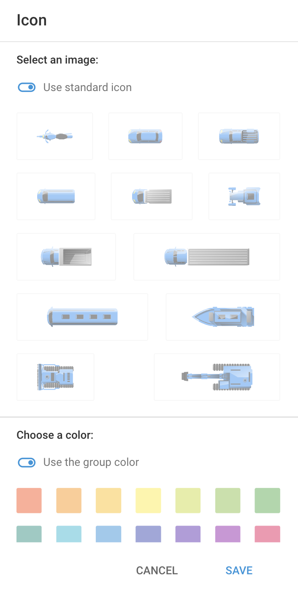

# Object icons

The icons associated with each object provide important visual cues about the object’s current state, such as moving, stopped, or parked.

In addition to the standard icons, you can also choose from our curated selection of icons. These icons are particularly useful when managing many objects, as they enhance visual identification and organization, allowing you to quickly differentiate between objects and still efficiently monitor their statuses.

## Standard icons

Depending on the current state of the object (moving, stopped, parked), its icon on the map will change accordingly. The transition from one status to another is closely related to the **Parking detection** settings of the GPS device assigned to the object.

Below are the different icons and their meanings:

<table><thead><tr><th width="102.18182373046875">Icon</th><th>Moving status and description</th></tr></thead><tbody><tr><td></td><td><strong>Moving</strong> The tracker is moving, and the trip is being recorded.</td></tr><tr><td></td><td><strong>Stopped (not parked yet)</strong> The object has stopped moving, its speed is zero, but the trip is not yet complete.</td></tr><tr><td></td><td><strong>Parked</strong> The trip is over, and the object is parked.</td></tr><tr><td></td><td><strong>Approximate location ( no GPS signals</strong>, <strong>using LBS)</strong> No GPS signal. The location is determined by cellular base stations and/or Wi-Fi access points. Route, parking, and stops aren’t recorded in this status due to low coordinate accuracy.</td></tr></tbody></table>

## Curated icons

Your choice of icon can improve visual identification, allowing for quick differentiation between various objects on the map, and enhance organization through specific icons for different types of assets. They also facilitate efficient monitoring by enabling immediate recognition of an object’s type, leading to faster decision-making and response times.

To change the icon of an object in the Navixy platform, follow these steps:

1. Go to the **Tracking** module from the main menu.
2. In the **Objects list**, select the object whose icon you want to change.
3. Click  to open the menu.
4. Select **Change icon** to open the icon selection window.
5.  Choose a new icon from the available options:

    

6. Confirm your selection to apply the new icon to the object.

If you choose to use one of our curated icons, the object’s state will be displayed next to the object’s label.

