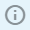
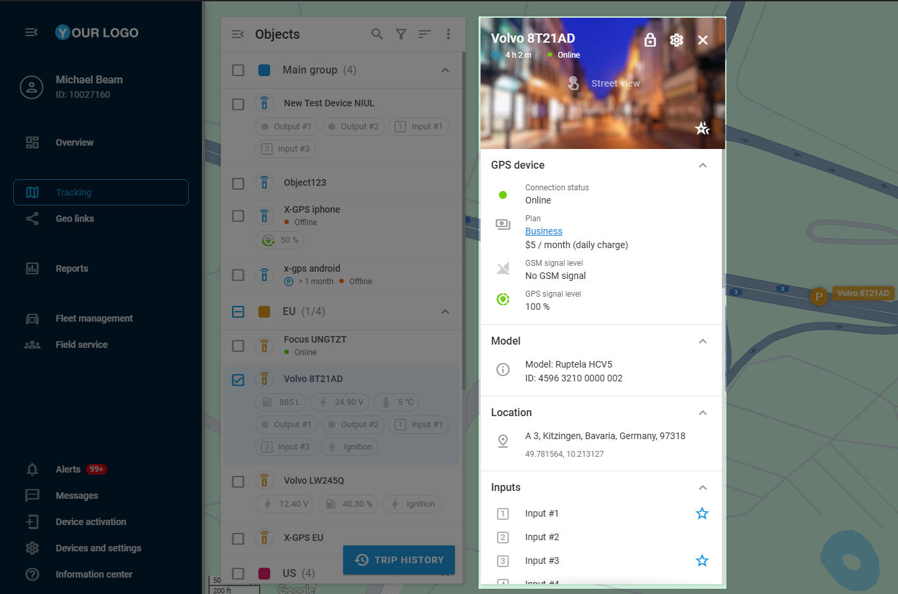
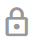

# Object widget

In Navixy, **Object widget** serves as a comprehensive collection of telematics data blocks for monitoring and managing your fleet. It provides an in-depth look at your business assets, GPS devices, and the sensors connected to them.


**Navigation**

* By default, to access the detailed view of a specific object, either click the object’s icon on the map or hover your mouse over it and click the appearing  button.
* If the **Show info by click** option is enabled in the [Additional settings](./#additional-settings), clicking on an object also opens the **Object widget**.


Once opened, the panel displays extensive information about the selected object, including current status, GPS location, and further telematics data. All operational management tools are conveniently located in one place, allowing for efficient fleet management and quick response to any arising issues.

## Structure

The top section of the widget panel contains essential details about the object, including its name, movement status, and connection status. It also includes the following options:

* **Customization options**\
  The widget layout provides robust customization capabilities to help you organize information according to your needs:
  * **Data blocks**: Click  to open widget settings and select which data blocks you want to display. By default, all blocks available to the objects are selected. This menu also enables the display of the update time below each sensor.
  * **Layout management**: Click  to switch into layout management mode. When it’s enabled, you can drag data blocks to your preferred positions. In this mode, you can also change the order of information inside the blocks manually in the same drag-and-drop manner.
* **Street view access**\
  Clicking the widget enables **Street view**, displaying the real-world imagery of the object’s position on the map for improved context and navigation.
* **Video monitoring**\
  The  button, available only for GPS devices with this functionality, opens the **Video monitoring** window. Here, you can watch a live stream from your camera or review past recordings stored in the device’s memory or the cloud. To learn more about this feature, see [Video monitoring](object-widget.md#video-monitoring).
* **Apply pins to all vehicles**\
  The  button allows you to instantly mark all data blocks as **Favorites**, ensuring their information is shown under the object’s name in the **Objects list**. For details on this feature, see [Favorites](object-widget.md#favorites).

## Data blocks

The **Object widget** organizes crucial information through specialized data blocks. Each component serves a specific purpose in providing comprehensive monitoring and management capabilities.


The blocks' availability and content depend on the GPS device assigned to the selected object. They display only the information transmitted by the device or sensors connected to it. You can also customize their appearance. For details, see [Customization options](object-widget.md#customization) above.


Here's a detailed overview of the available blocks:

<table><thead><tr><th width="170.3636474609375">Block</th><th>Description</th></tr></thead><tbody><tr><td><strong>Location</strong></td><td>Delivers precise positioning data, including the latest known location with either a street address or GPS coordinates, accompanied by timestamps. The widget also tracks current speed and altitude measurements.</td></tr><tr><td><strong>GPS device</strong></td><td>Provides basic information about the GPS device, including its connection status, GPS/GSM signal level, and subscription plan.</td></tr><tr><td><strong>Status</strong></td><td>Provides movement status, speed, and direction.</td></tr><tr><td><strong>OBD2 &#x26; CAN</strong></td><td>Connects to the vehicle's onboard systems to provide real-time diagnostic data, such as fuel level, engine speed, coolant temperature, and any diagnostic trouble codes when the GPS device is properly connected to the vehicle's CAN bus or OBD2 port.</td></tr><tr><td><strong>Sensor readings</strong></td><td>Monitors and displays data from all configured device sensors, providing recent readings with timestamps. Separate sensors can be marked as <strong>Favorites</strong> for quick access to critical measurements.</td></tr><tr><td><strong>Odometer</strong></td><td>Tracks the device's total mileage. This data can be adjusted manually via the  button, ensuring accurate distance records.</td></tr><tr><td><strong>Engine hours</strong></td><td>Monitors the total running time of the engine. This data can be adjusted manually via the  button for accurate usage tracking.</td></tr><tr><td><strong>Inputs</strong></td><td>Monitors the current state of various connected sensors, including the ignition status and other vehicle sensors such as door sensors, providing real-time feedback on vehicle status.</td></tr><tr><td><strong>Outputs</strong></td><td>Enables active control over devices connected to the GPS device, including features such as remote vehicle immobilization, allowing for direct intervention when necessary.</td></tr><tr><td><strong>Driver</strong></td><td>Displays the vehicle’s driver and allows you to assign them directly through the widget. Also displays their phone number, key, and the time the driver was assigned.</td></tr><tr><td><strong>Working statuses</strong></td><td>Manages operational states by displaying and enabling changes to the object's current status, helping track its working history.</td></tr><tr><td><strong>Recent events</strong></td><td>Tracks and displays alerts related to the object. By default, you can see three recent events with an option to view all of them. Click  next to the event to open its details.</td></tr><tr><td><strong>Electronic padlock</strong></td><td>Provides security management for devices equipped with smart lock features, enabling remote control over the lock state, including both locking and unlocking capabilities.</td></tr></tbody></table>

## Favorites

The **Object list** can display not only the objects' names and connection status but also specific telematics data from GPS devices and connected sensors. To achieve that, you need to mark the data blocks as **Favorites** by following these steps:

1. Hover the cursor over the desired data block inside the **Object widget**.
2. Click the appearing  button to mark it as **Favorite**.

Once marked as **Favorite**, the selected data entry will appear under the corresponding object in the **Object list**, ensuring quick and easy access. To remove a block from the list display, click 

again.

## Video monitoring

The **Video monitoring** window provides real-time and historical video access for GPS devices with camera support. This feature enables visual monitoring capabilities through a dedicated interface accessible from the **Object widget**. The system supports both live streaming and recorded video playback from multiple camera sources.

### Live stream monitoring

The live stream functionality delivers real-time video feeds from installed dash cams or MDVR devices directly to your monitoring interface.

To use the live stream feature, follow these steps:

1. Click  to initiate the live stream.
2. Use the player controls to navigate through the recent footage.
3. Select the **Live** button to return to real-time viewing.


Video streaming consumes significant data traffic. To conserve bandwidth, the platform automatically stops the stream when you close the video window or navigate to another module. For most browsers, closing the tab will also stop the stream, though some browser extensions may interfere with this function.


### Video playback

The playback functionality enables review of historical video footage stored either on the device or in the cloud platform. This capability supports event analysis, driver behavior monitoring, and incident investigation.

To use the playback feature, follow these steps:

1. Open the date selection menu to choose the date for the video you want to watch.
2. Depending on your history, the following icons will be displayed under the date:
   1. **Gray dot**: Information is stored in the device's memory. Viewing it requires uploading it from the device to the cloud. This is done while you’re playing the video.
   2. **Blue dot**: Content already available in cloud storage.
   3. **No dot**: No video content available for selected date
3. Select your desired date to access the hourly timeline.
4. Choose specific time segments from the fragment line for playback


Consider data usage implications when downloading multiple fragments

