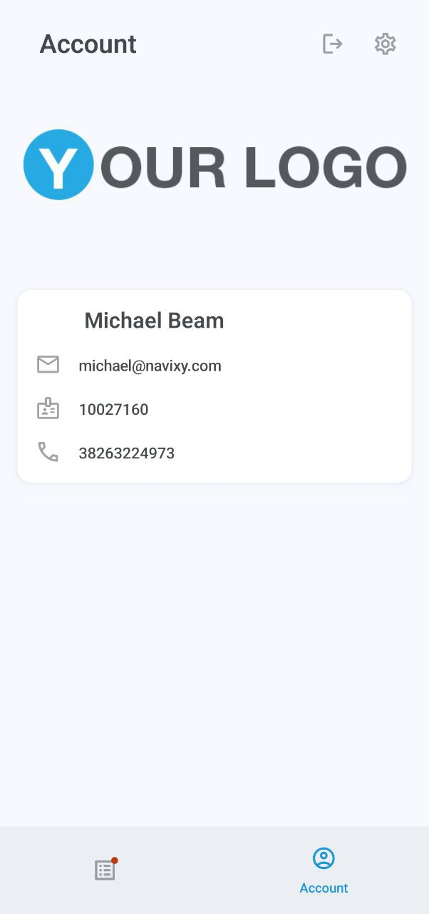

# Account and settings

### Account



The Account screen displays your logo, name, email, and phone number.



<figure><figcaption>
Account
</figcaption></figure>



### Settings



The Settings screen allows you to configure the application and quickly access your device’s notifications settings.



<figure><figcaption>
Settings
</figcaption></figure>


