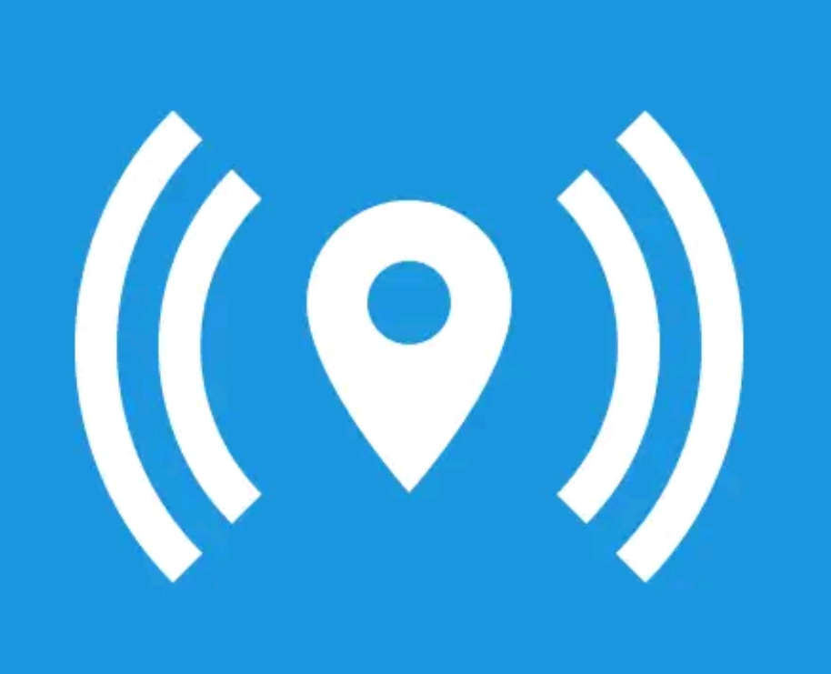

# X-GPS Tracker



**X-GPS Tracker** is a mobile application that allows you to turn your smartphone or tablet into a GPS tracker. This section describes the process of setting up and using a mobile application. You can read about how to download the application and add it to your account [here](invitation-to-x-gps-tracker.md).




<strong>Download Links</strong>

<a href="https://play.google.com/store/apps/details?id=com.navixy.xgps.tracker">Google Play</a> <a href="https://apps.apple.com/app/x-gps-tracker/id1612047534">App Store</a>



