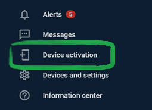
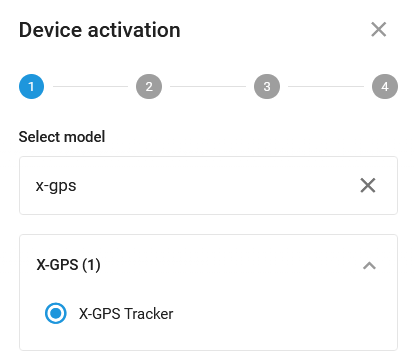
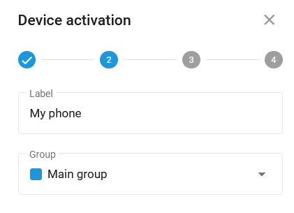
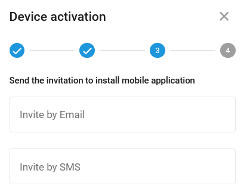
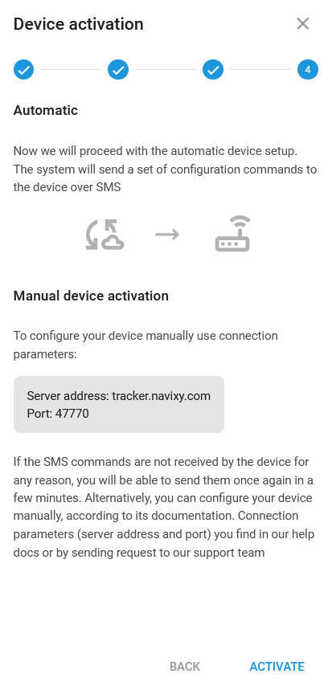

# Invitation to X-GPS Tracker

You can turn a smartphone or a tablet into a GPS tracking device by installing our **X-GPS Tracker** app. Our app is available to download on the Google Play and iOS App Store and is absolutely free.

The activation process is the same for both iOS and Android devices.

## X-GPS Tracker activation



1. Log in to the user account.









2. Click the **Device activation icon** in the application bar.



<figure><figcaption></figcaption></figure>





3. Enter **X-GPS Tracker** into the **Select model** field and select it. Click **Next.**



<figure><figcaption></figcaption></figure>





3. Enter the name of the object you're creating. Click **Next**.



<figure><figcaption></figcaption></figure>





4. Enter the email address or phone number to receive an invitation with the download link.



<figure><figcaption></figcaption></figure>





5. You will receive instructions for automatic and manual setup. Click **Activate.**



<figure><figcaption></figcaption></figure>





6. After installing **X-GPS Tracker,** the app will be configured, and the cell phone or tablet will be turned into a **tracking device** displayed on the platform. Alternatively, enter the ID you've received by email.



<figure><figcaption></figcaption></figure>


