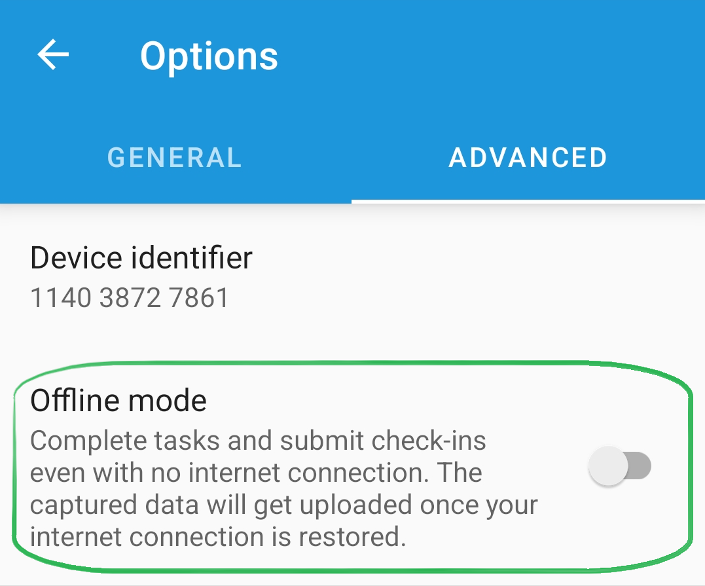

# Offline mode

**X-GPS Tracker** has the ability to send a Check-in or Form during a task even when the device is not connected to the internet.\
Employees can finish their tasks without having to worry about a good GSM connection. Files and forms will be uploaded as soon as connection restores.

### Enabling the offline mode

To enable the offline mode, go to the application settings, open the **Advanced settings** tab, and toggle the **Offline mode** switch (disabled by default).

### Offline mode performance details

1. If there is no network connection, data gets placed into a queue. As soon as the network is restored, the application will start uploading files to the server.
2. If the files could not be transferred after reconnection, they will be deleted from the queue and won't be sent.
3. If a photo/file in the Check-in or Form could not be uploaded, it will be removed from the queue and won't be sent, and as a result, the task may not be completed.
4. If the user's file storage runs out of space when transferring files and the **Automatically delete files** option is not enabled, the files will not be sent to the server, the Check-ins will not be saved, and the tasks will not be executed.


If the Check-in or Form has been declined by the server or removed from the queue, the notification "Check-In on \[date and time] has been declined" will be shown in the notification bar.

