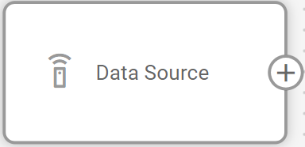
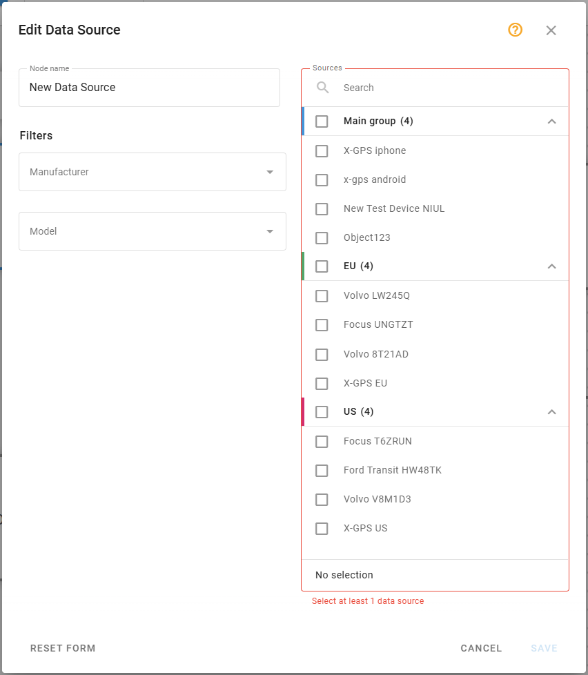
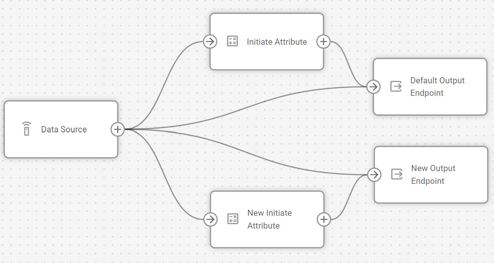

# Data Source node

## Technical overview and capabilities

**Data Source** node is an entry point for telemetry data from IoT devices and OEM platforms in the IoT Logic system. It functions as a universal translator, receiving data via TCP/UDP/HTTP protocols on network interfaces and through MQTT queues, then decoding incoming data streams according to the selected protocol. The node transforms device messages into a standardized format that can be further processed in your flow.

### Flow architecture integration

**Data Source node** functions as the entry point for data in an IoT Logic flow. A single flow can contain multiple source nodes, each with independent configurations. This architecture enables:

* Initial data acquisition from multiple device types and protocol formats
* Standardized data transformation from various manufacturers into unified formats
* Parallel processing paths by connecting one data source to multiple downstream nodes
* Selective device filtering to include only relevant data sources in your flow

### Node capabilities

The **Data Source node** by itself offers:

* **Protocol diversity**: Supports multiple device manufacturers, including Teltonika, Queclink, Suntech, Jimi, and others, through inherited Navixy parsers and decoders
* **Transport flexibility**: Accommodates TCP, UDP, HTTP protocols and MQTT broker connections
* **Unified data transformation**: Converts device-specific messages to standardized format for consistent processing
* **Device filtering**: Provides filtering capabilities to select specific models or protocols
* **Real-time processing**: Handles incoming telemetry data streams in real-time for immediate processing

## Configuration options

**Data source node** requires configuration to establish which devices will send data to your flow. You'll need to specify the protocol, transport protocol, and select the specific devices you want to include.

Let's see what elements this node uses and what you can configure when working with it:

### Configuration steps

1. Specify **Node name**: Enter a descriptive name for this data source

* Use a name that helps you identify the manufacturer, models, or other relevant information
* This name will be displayed in the flow diagram for easy identification

2. Select **Manufacturer**: Choose the communication protocol used by your devices

* Select from available manufacturer protocols (Teltonika, Queclink, Suntech, Jimi, etc.)
* The protocol selection will filter the available device models in the next step
* Protocols are typically associated with specific manufacturers

3. Choose **Model**: Specify how data is transmitted

* Available options include HTTP, TCP, UDP, or MQTT
* This selection must match how your devices are configured to communicate

4. Select **Sources**: From the filtered list on the right side of the interface, select the devices to include

* Only devices registered in your Navixy user account will be available for selection
* The list is automatically filtered based on your protocol and model selections
* Devices already used in other flows will be marked with an exclamation mark "!" icon

> \[!INFO] If you change the manufacturer or model settings after selecting devices, the system will notify you if any selected devices don't match the new parameters but won't automatically remove them from your selection.

### Data processing specifics

**Data source node** inherits all parsers and decoders from Navixy, providing compatibility with a wide range of IoT devices. When data arrives at this node, it goes through the following process:

1. The incoming data stream is received through the specified transport protocol
2. The data is passed to the appropriate protocol decoder based on your configuration
3. Device messages are transformed into a standardized format that IoT Logic can process
4. The unified data is passed to the next node in your flow

This standardization process enables you to build consistent processing flows regardless of the original data format from various device manufacturers.

## Frequently asked questions

### Can I use multiple Data source nodes in one flow?

Yes, you can use several **Data source nodes** in one workspace. This is useful when you need to process data from different types of devices in different ways or want to merge several data streams after specific transformations.

### What happens if a device is already used in another flow?

Devices that are already used in other flows are not listed, so you cannot select same device twice in different flows.

### Are all my Navixy devices automatically available in IoT Logic?

Yes, all devices from your Navixy user account can be used in IoT Logic processing. This includes GPS devices, OEM platforms, MQTT devices and gateways, and MQTT/Kafka connectors.

### How do I know which manufacturer to select for my devices?

The protocol should match the communication protocol used by your device manufacturer. Most devices use a protocol associated with their manufacturer (e.g., Teltonika devices use the Teltonika protocol). Check your device documentation or consult with your device provider if you're unsure.

### Can I connect a Data Source node to multiple downstream nodes?

Yes, you can connect a **Data Source node** to multiple processing nodes to create parallel processing paths. This allows you to apply different transformations to the same data stream. Here’s an example:

