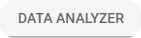

# Displaying new calculated attributes on the Navixy platform

New attributes calculated within **Initiate Attribute** node can be monitored just like the actual data attributes coming from devices in **Data Stream Analyzer (DSA)** and the **Tracking** module. While DSA shows them natively, to display the new attributes in the **Tracking** module, you need to add them as custom attributes to the devices first.

After creating calculated attributes in the **Initiate Attribute** node, you can make further use of them on the Navixy platform in two main ways:

* Through the **Data Stream Analyzer (DSA)** for troubleshooting
* By adding them as **custom attributes** to your devices for ongoing tracking

> \[!INFO] To produce actual values, calculated attributes should meet the following prerequisites:
>
> 1. The flow containing them should be saved with an up-to-date configuration of the **Initiate Attribute** node.
> 2. The **Initiate Attribute** node must be connected to at least 1 **Output Endpoint** node.
> 3. The device must be actively sending data through the flow.

## Monitoring calculated attributes in Data Stream Analyzer

All new data attributes calculated within a flow appear automatically in Data Stream Analyzer (DSA) as soon as actual data is received and processed through the flow. This allows you to verify calculations and troubleshoot issues in real time.

To monitor calculated attributes in DSA:

1. Create an attribute in an **Initiate Attribute** node.\
   For this example, let’s take a simple formula to convert temperature from C° to F° and save it to an attribute with the name _temperatureF_.
2. Make sure to connect this **Initiate Attribute** to an **Output Endpoint** node.
3. Click  to open DSA.
4. Select a device that sends data to the **Initiate Attribute** node containing the attribute of interest from the **Devices** list.
5. Find the attribute in the table and monitor its values. For our example, it should look like this:

> \[!NOTE] If your calculated attribute doesn't appear in DSA, verify that:
>
> * The flow is enabled and properly saved
> * The device is sending data (check for other attributes updating)
> * The **Initiate Attribute** node's connections are correct
> * The attribute name is spelled correctly in the node configuration

For more details on troubleshooting with real-time data, see [Data Stream Analyzer](https://squaregps.atlassian.net/wiki/spaces/USERDOCSOLD/pages/3037332703/Data+Stream+Analyzer?atlOrigin=eyJpIjoiMjBlMzdkMjgwYTJlNDBiYzlkOGI0YzEwYjY3ZDA0NjEiLCJwIjoiYyJ9).

## Adding custom attributes to objects on the Navixy platform

New calculated data attributes from IoT Logic flows can be used as virtual sensors for actual devices in your account and displayed on [Object widget](https://squaregps.atlassian.net/wiki/spaces/USERDOCSOLD/pages/2909015126/Object+widget?atlOrigin=eyJpIjoiNzZmYmU4ZDljMmFhNDE3Mzg3YjJmY2YwYTVlZDYwZjciLCJwIjoiYyJ9) and [Object list](../../../../../gps-tracking/gps-tracking/objects-list.md). This enables you to monitor aggregated metrics along with actual device readings in one place, which significantly expands your [Tracking](../../../../../gps-tracking/) possibilities.

To make calculated attributes visible in the [Tracking](../../../../../gps-tracking/) module alongside regular device data, you need to add them as virtual sensors to your devices. This allows you to:

* Monitor calculated metrics in the [Object widget](https://squaregps.atlassian.net/wiki/spaces/USERDOCSOLD/pages/2909015126/Object+widget?atlOrigin=eyJpIjoiNzZmYmU4ZDljMmFhNDE3Mzg3YjJmY2YwYTVlZDYwZjciLCJwIjoiYyJ9)
* Add important calculations to the [Object list](../../../../../gps-tracking/gps-tracking/objects-list.md) for quick access
* Include calculated values in [reports](https://squaregps.atlassian.net/wiki/spaces/USERDOCSOLD/pages/2909015437/Reports?atlOrigin=eyJpIjoiYjMxMmM0NGM3NmRkNGM0OWJiNjFmOTE4YWNmODAyNjAiLCJwIjoiYyJ9)
* Create [rules and notifications](https://squaregps.atlassian.net/wiki/spaces/USERDOCSOLD/pages/2909014412/Rules+and+notifications?atlOrigin=eyJpIjoiNGVkN2ZmYTRlMDkyNGRmMWJhYTlmZDY4ZGQ2OTcwM2UiLCJwIjoiYyJ9) based on calculated values

### Creating a custom attribute for a device

> \[!INFO] A custom sensor must be added individually to each device. To add the same attribute to multiple devices, repeat these steps for each of them.

1. Go to **Devices and Settings** menu in the left sidebar.
2. Select the device you want to add a new sensor to.
3. Click  In **Sensors and buttons** section, then select one of the options:
4. **Measurement/IoT Logic sensor** - for numeric attributes only, like speed, temperature, etc.
5. **Virtual/IoT Logic sensor** - for any other non-numeric attribute values.
6. Fill in the following fields in the **Main** tab:
7. **Label**\
   Enter a name for your sensor. It will be displayed in **Object widget**. The label can be the same as the attribute name in IoT Logic.
8. **Parameter**\
   Find and select the needed custom attribute from the list of available parameters. IoT Logic attributes are visually separated from the standard Navixy list of parameters by adding “IoT: {attribute}“ prefix (Like “CAN:” or “OBD:”)
9. **Sensor type**\
   Find and select the appropriate type according to the nature of the attribute: **Fuel**, **Temperature**, etc. You can use **Custom** if there’s no fitting type for your attribute.
10. **Units**\
    Select the appropriate measurement units according to the nature of your attribute. The options in this list vary depending on your selected **Sensor type**. You can use **Custom** if there’s no fitting unit for your attribute.
11. (Optional) Go to the **Calibration** tab and set up calibration if needed.\
    For instruction on this tab’s setting, see [Calibration](../../../../../devices-and-settings/devices-and-settings/vehicle-sensors-1/measurement-sensors.md).
12. Click **Save** to complete the configuration process.

> \[!TIP] After saving, the new custom parameter appears automatically in the **Sensor readings** data block of **Object widget**. For example, we added a custom **TempDelta** parameter: 

### Adding a custom attribute to Object list

**Object widget** offers a **Favorites** mechanism that allows displaying a selection of data block entries in the **Object list**, right under an object’s label. It also applies to custom parameters from the **Sensor readings** data block.

To directly display your calculated attributes in the **Object list**:

1. Open the **Object widget** containing your custom attribute.
2. Find your custom attribute in the **Sensor readings** data block.
3. Click the star icon next to the attribute to add it to **Favorites**.
4. The attribute will now appear in the **Object list** under the object name.

For instructions on how to display a parameter in **Object list**, see [Object widget - Favorites](../../../../../gps-tracking/gps-tracking/objects-list-1/object-widget.md).
