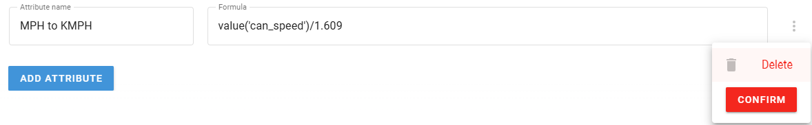

# Managing attributes

The **Initiate Attribute** node allows you to create, edit, and manage data attributes throughout your IoT Logic flow. This guide covers the basic attribute management actions (create, edit, delete) and essential operations, including autofill functionality for formula creation.

## Creating attributes

Here's how to create a new attribute in the Initiate attribute node:

1. Click the **Add attribute** button
2. Enter a name for your attribute (e.g., "Speed mph")
3. Define the value expression (e.g., `value('can_speed')/1.609`)
4. Optionally configure generation time and server time, to do it, enable the **Specify time attributes** toggle\
   For details, see [Time settings for attributes](https://squaregps.atlassian.net/wiki/spaces/USERDOCSOLD/pages/3216933191/Managing+attributes#Time-settings-for-attributes)
5. Click **Save** to confirm the node configuration

The new attribute is saved in the node and the configured calculation is applied immediately in the flow.

> \[!NOTE] Short syntax is also supported for attribute names in formulas. When referencing only the latest valid value of an attribute, you can omit the full `value()` function syntax and quotation marks. For example, the temperature conversion formula can be written as `temperature*1.8 + 32` instead of `value('temperature', 0, 'valid')*1.8 + 32`.

### Time settings for attributes

Time settings give you control over timestamps associated with your attributes:

* **Generation time**: When the data was created
  * Use `now()` to set the current time in milliseconds
  * Use `genTime('parameter_name', 0, 'valid')` to use the parameter's own generation time
* **Server time**: When the data was received by IoT Logic
  * Use `now()` to set the current time in milliseconds
  * Use `srvTime('parameter_name', 0, 'valid')` to use the parameter's server time
  * Add offsets to adjust for time zones (e.g., `srvTime('can_speed', 0, 'valid') + 120000` adds 2 minutes)

> \[!INFO] Time settings are important for data analysis and synchronization. Proper time configuration ensures that your data maintains chronological integrity throughout the flow.

### Autofill attribute names

When creating calculation formulas, you need to reference existing attribute names from physical devices or calculated attributes from other nodes. To simplify this process and prevent misspellings, IoT Logic provides autofill functionality for attribute names.

To use autofill when building formulas:

1. Click  in the **Formula** field.
2. Select the desired attribute from the appeared list, it supports manual text input for search purposes.
3. Click on the attribute name to insert it into your formula.

The selected attribute is automatically inserted in the ready-to-use format, with the highlighted attribute name: _value('attribute\_name', 0, ‘valid')_. For your convenience, here’s the breakdown of autofilled elements:

* `value` - a syntax element of [Navixy IoT Logic Expression Language](https://www.navixy.com/docs/iot-logic-api/technologies/navixy-iot-logic-expression-language).
* `'attribute_name'` - the actual name of the data attribute coming from a physical device or another **Initiate Attribute** node.
* `0` - depth index, defining the exact historical value from 0 (the latest) to 12 (the oldest). It reflects the indexes shown in [Data Stream Analyzer](https://squaregps.atlassian.net/wiki/spaces/USERDOCSOLD/pages/3037332703/Data+Stream+Analyzer?atlOrigin=eyJpIjoiNTlmZWQyNTk1MTY4NDI4NTg5NDhmOTE1NTY0NTMyODEiLCJwIjoiYyJ9).
* `‘valid'` - validity flag forcing only the non-null values to be considered.

> \[!NOTE] When `'valid'` is specified, the system automatically skips any `null` (empty) hiustoric values. This means the depth index will point to the most recent **valid** value rather than the most recent chronological value. For example, if your most recent reading (index `0`) is `null` but the previous reading (index `1`) contains actual data, the formula will use the index `1` value instead of the null value at index `0`.

You can modify the parameters as needed - change the index number for historical values or adjust the validity flag.

The list is filtered based on your flow's data sources and matches what's visible in [Data Stream Analyzer](https://squaregps.atlassian.net/wiki/spaces/USERDOCSOLD/pages/3037332703/Data+Stream+Analyzer?atlOrigin=eyJpIjoiYjBhMTVhOTkwM2NjNDdlM2JmNjE3NjdiZWVhNWIyMDIiLCJwIjoiYyJ9).

> \[!INFO] The autofill list displays only attributes that meet **all** of the following criteria simultaneously:
>
> * **Supported by devices** - The attribute must be supported by at least one device currently added to your flow
> * **Actually transmitted** - The device must have sent real data for this attribute (not just support it theoretically)
> * **Available in flow** - This includes both device parameters and calculated attributes from other **Initiate Attribute** nodes within the same flow **Example**: If your device supports both speed and temperature sensors but has only transmitted speed data (perhaps due to a faulty temperature sensor), the autofill list will show the 'speed' attribute but not 'temperature'. The temperature attribute will only appear once the device actually sends temperature readings, even though the device technically supports it.

#### Indexed attributes in autofill

Some data attributes contain multiple values indexed within a single attribute, such as readings from multiple analog sensors connected to a main telematics device. To use these attributes in calculations, you need to specify the exact index number corresponding to the specific sensor or input you want to reference.

For example, if you need to work with voltage readings from the third analog input on your device, this data comes through the attribute `analog_2` (using zero-based indexing where the first input is index 0). In your formula, this would appear as `value('analog_2', 0, 'valid')`.

Autofill handles this scenario for you as well:

* Indexed attributes are marked with icon in the autofill list.
* These entries display the available index range in square brackets, such as `analog_[1..4]` for attributes supporting five indexed values (indexes 1 through 4).
* When you select an indexed attribute, the cursor automatically positions at the end of the attribute name within the quotes, allowing you to immediately type the specific index number you need.

## Editing existing attributes

To modify an existing attribute:

1. Open the node configuration window by hovering your mouse over the node to display quick actions, or double-clicking the node
2. Find the attribute you wish to edit in the attribute list
3. Make the needed changes in the text fields of the attribute properties: **Attribute name**, **Formula** or time settings
4. If you need to edit other attributes in this node, repeat step 3 for them
5. Click **Save** to apply your changes to the node configuration

> \[!INFO] When you edit an attribute, the changes will only apply to new data received after saving. Historical data already collected will not be recalculated.

## Deleting attributes

To remove an attribute that is no longer needed:

1. Open the node configuration window by hovering your mouse over the node to display quick actions, or double-clicking the node
2. Find the attribute you wish to delete in the attribute list and hover your mouse over it to display a  menu
3. Click the appeared menu and select **Delete**
4. **Confirm** your decision to delete the attribute
5. Click **Save** to apply your changes to the node configuration

> \[!INFO] When you delete an attribute, it will no longer be calculated for new data, but historical data containing this attribute will remain unchanged in the database.
