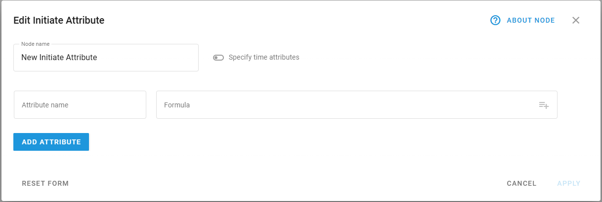
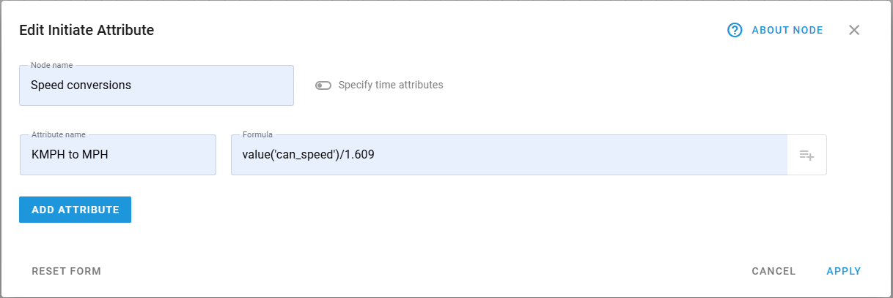

# Initiate Attribute node

## Technical overview and capabilities

In IoT Logic, **Initiate Attribute** node transforms device readings by creating new data attributes based on incoming telemetry. This node enables you to manipulate data through mathematical formulas, rename existing parameters, and perform bit-level operations using the [Navixy Expression Language](https://www.navixy.com/docs/iot-logic-api/technologies/navixy-iot-logic-expression-language). The node serves as a key component in a flow, allowing you to enrich data before sending it to your target systems.

**Initiate Attribute** node is configured for each flow in the Navixy platform UI. For specific syntax options and detailed expression language reference, see [Navixy Expression Language](https://www.navixy.com/docs/iot-logic-api/technologies/navixy-iot-logic-expression-language) in the user documentation.

### Flow architecture integration

**Initiate Attribute** node functions within the flow architecture by providing data transformation capabilities and enabling:

* Processing raw telemetry data into meaningful business metrics
* Creating calculated fields based on multiple parameter values
* Converting units of measurement (e.g., kilometers to miles)
* Computing differences between current and previous readings
* Generating time-based analytics on device behavior

> \[!INFO] The Initiate attribute node requires at least one **Data Source** node to be connected to it. No calculations will be performed without input data connections.

### Node capabilities

The **Initiate Attribute** node by itself offers:

* **Data attribute transformation**: Create completely new attributes by applying mathematical operations to the ones coming from data sources
* **Unit conversion**: Convert measurement units (e.g., speed from _km/h_ to _mph_, or temperature from _°C_ to _°F_)
* **Time-based calculations**: Compare current readings with previous values to determine changes
* **Time manipulation**: Customize timestamps for when attribute was generated on a device and when it was received by the server to avoid timeline inconsistencies and unify time formats

## Configuration options

**Initiate Attribute** node allows you to define how device parameters are transformed into attributes, which will be available for further processing in your data flow.

Let's see what elements this node uses and what you can configure when working with it:

### Configuration steps

1. Specify **Node name**: Enter a descriptive name to highlight the node’s purpose. Use a name that helps you identify the calculations that will be made within this node, it will be displayed in the flow diagram for easy identification.
2. Toggle on **Specify time attributes** if you need to manipulate event timestamps, it enables two more options:

* **Generation time**: When the data was created (defaults to `now()`)
* **Server time**: When the data was received by IoT Logic (defaults to `now()`)

3. Define **Attribute name**: A distinctive identifier of the attribute.
4. This name will be displayed in [Data Stream Analyzer](https://squaregps.atlassian.net/wiki/spaces/USERDOCSOLD/pages/3037332703/Data+Stream+Analyzer?atlOrigin=eyJpIjoiYjUxMTliZDI3ZmYzNGFkN2JiMDJkMTEwNTkwNmEzYTgiLCJwIjoiYyJ9),
5. You can also use this name to create custom sensors in the [Tracking](https://squaregps.atlassian.net/wiki/spaces/USERDOCSOLD/pages/2909012294/GPS+Tracking?atlOrigin=eyJpIjoiN2NkNTczYmNjN2EyNDYxNThjMDA4ZDVkNTA4YWUwNWIiLCJwIjoiYyJ9) module. To do it, the **Initiate Attribute** node containing this attribute must be connected to the **Default Output Endpoint** node.
6. Define **Formula**: Use mathematical expressions to calculate attribute values.

* Use `value('parameter_name' 0, 'valid')` format to reference existing device parameters.\
  **Note**. Click inside the **Formula** field to open the list of available attributes and select the needed one. It will be added to the field automatically in the ready-to-use format. For details on autofilling attribute names, see [Autofill attribute names](initiate-attribute-node-1/managing-attributes.md).
* Apply mathematical operations based on [Navixy IoT Logic Expression Language](https://www.navixy.com/docs/iot-logic-api/technologies/navixy-iot-logic-expression-language) to transform values.
* Use different depth index values to access historical values (the default is 0).

5. (optional) Click **Add Attribute**: opens a new attribute configuration dialog. Here you can create a new data attribute if you need multiple calculations to be performed within the same node.

Let's look at a practical example of configuring attributes:

In this example, we're creating an attribute that converts speed from kilometers to miles per hour by dividing the CAN speed parameter by 1.609.

For details on calculations for new attributes, see [Calculation examples](https://squaregps.atlassian.net/wiki/spaces/USERDOCSOLD/pages/3216933220/Calculation+examples?atlOrigin=eyJpIjoiNzQyYzllN2E0Mzk0NDkwMmFkN2I5YzdjY2JhMTIwYjAiLCJwIjoiYyJ9).

Also, you can find a detailed example of using calculated attributes in a flow in [Flow configuration example → steps 3 and 4](flow-configuration-example.md).

## Display options

New attributes calculated within **Initiate Attribute** node can be monitored just like the actual data attributes coming from devices in **Data Stream Analyzer (DSA)** and the **Tracking** module.

For more information on the display options, see [Displaying new calculated attributes on the Navixy platform](initiate-attribute-node-1/displaying-new-calculated-attributes-on-the-navixy-platform.md).

## Data flow considerations

After configuring your **Initiate Attribute** node, make sure to:

1. Connect the node to at least one **Data Source** node as input
2. Connect the output to an **Output Endpoint** node to send the transformed data

Inside the **Initiate Attribute** node, parameter values are processed according to your expressions each time the device provides data. On output, you'll receive:

* All original device parameters
* All calculated attributes with their values
* Updated generation time and server time values as configured

If you use the same name for a calculated attribute as an existing parameter, the attribute will replace the original parameter in the output data packet.

## Frequently asked questions

### Can I reference non-latest values in my calculations?

Yes. Use the index parameter in the value function to access historical values. For example, `value('temperature', 1, 'valid')` refers to the previous valid value of the temperature parameter.

### How do I perform calculations involving time?

Use the `genTime()` and `srvTime()` functions to work with timestamps. You can calculate time differences, add time offsets, or format timestamps for display.

### What happens if I delete an attribute?

The attribute will no longer be calculated for newly received data, but historical data remains unchanged. The attribute will not appear in any new data packets after deletion.

### Can I use attributes created in one Initiate attribute node in another?

Yes. Attributes created earlier in the flow can be referenced in subsequent **Initiate Attribute** nodes, allowing for multi-stage calculations. All created attributes are also available using the [autofill feature](initiate-attribute-node-1/managing-attributes.md) to ensure correct naming.

### **How do I avoid typos when referencing attribute names in formulas?**

Use the autofill feature in the Formula field to select from available attributes. For detailed instructions, see [Autofill attribute names](initiate-attribute-node-1/managing-attributes.md).
