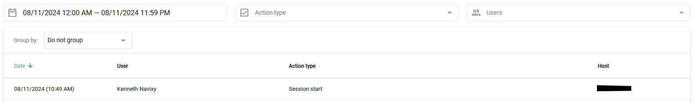

# Activity log

Using the **Activity log**, the account owner can track the activity of all [users on the team](users-and-roles/) added via **Users and roles**. This feature provides detailed insights into user actions, helping to monitor and manage system usage effectively.

Navigate to **Account settings → Activity log**.

## Type of actions

**Activity log** tracks a variety of actions performed by users:

* **Session start:** When a user logs into an account without using authorization
* **Authorization:** When a user logs in using their username and password
* **Session end:** When a user logs out of the monitoring system
* **Login from the owner’s account:** When a customer logs in from the main account
* **Geofence created/edited/deleted**
* **POI created/edited/deleted**
* **Rule created/edited/deleted**
* **Object bound to the rule:** When an object is specified for the rule
* **Object deleted from the rule:** When an object is removed from the rule settings
* **Device replacement**
* **API key shown/create/deleted**
* **Device: output update/batch output update/command execute:** When outputs are managed

## Generating Activity log

1. Enter the **Activity log** section
2. **Specify parameters:** Select action types and users
3. **Set time frames:** Define the time frames and click the **Apply** button

### List grouping and filtering

Use grouping and filtering to structure the list according to your criteria:

* **By date:** Group records by date
* **By user:** Get a list of users who logged into the account
* **By action type:** See the types of actions performed in the account
