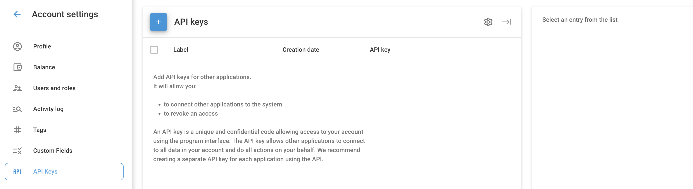

# API keys

API keys are unique and confidential codes that allow access to your Navixy account and data through the application program interface. They enable third-party or personal applications to connect to your account, access data, and perform actions on your behalf.

## How to View and Create API Keys

Navigate to **Account Settings** → **API Keys** from the menu.

1. **Viewing Existing API Keys:** In the API Keys section, you will see a list of existing keys with the following details:
  - **Label:** The name of the API key.
  - **Creation Date:** When the API key was created.
  - **API Key:** The unique key itself.
2. **Creating a New API Key:**
  - Click the **"+"** button to add a new API key.
  - Enter a label for the new key.
  - Click **Save**.

## How to delete API Keys

1. **Deleting a single API Key:**
  - Hover over the key you want to delete.
  - Click the trash can icon that appears on the right.
2. **Deleting multiple API keys:**
  - Select the checkboxes next to the keys you wish to delete.
  - Click the trash can icon in the upper right corner to remove the selected keys.

## Tips for security

- **Do not publish API keys:** Keep your API keys confidential to prevent unauthorized access. These keys can perform almost any action within your account.
- **Separate keys for each application:** It is recommended to create a separate API key for each third-party application or service to enhance security and manage access more effectively.